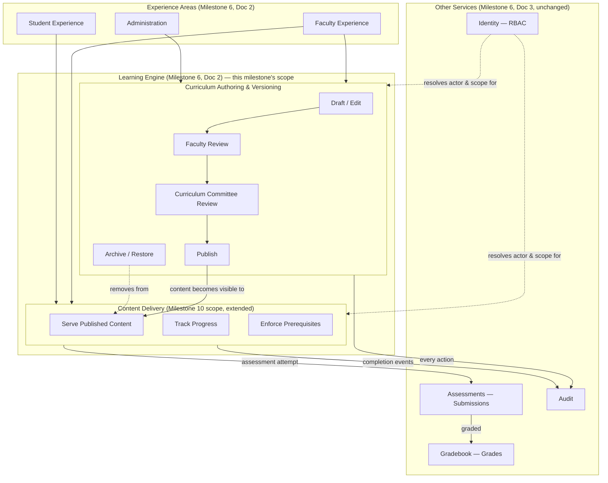

# Academic Content Architecture

**Status:** Draft
**Milestone:** 11 — Curriculum Management & Content Engine
**Date:** 2026-08-07

## Purpose

This document places the Content Engine within the architecture already
established in [Milestone 6](../milestone-6-technical-architecture/README.md)
and built on in [Milestone 10](../../../README.md) — it does not
introduce a new service, a new deployable unit, or a new bounded
context. It answers *where this lives*, not *what it contains* (that is
[Curriculum Domain Model](./03-curriculum-domain-model.md)).

## The Content Engine Is the Learning Engine, Grown Up

[Application Architecture](../milestone-6-technical-architecture/02-application-architecture.md)
already named a **Learning Engine** — an Engine Area, consumed by both
the Student and Faculty Experience Areas, drawing on the **Learning**
service. That document described it narrowly, at the time: "Delivers
curriculum content (authored in Minara-Curriculum) and tracks Course
Progress." [Service Boundaries](../milestone-6-technical-architecture/03-service-boundaries.md)
already listed **Module**, **Learning Object**, **Competency**, and
**Learning Outcome** among the Learning service's owned entities —
before Milestone 10 chose, deliberately, to build none of them yet.

**The Content Engine is not a fourteenth service.** It is the Learning
service's authoring half, finally being designed in detail, alongside
the delivery half Milestone 10 already partially built. This is
consistent with [ADR-004](../../architecture/adr/ADR-004-domain-driven-module-boundaries.md)
by construction — the entities this milestone adds all belong to
domain concepts the Learning service already owned on paper.

## Two Responsibilities, One Service

The Learning service now has two clearly separated internal
responsibilities. This mirrors how the Gradebook service already
carries an internal Draft → Submitted → Approved lifecycle
([Grade lifecycle](../../../prisma/schema.prisma)) without being split
into two services — a lifecycle distinction inside one service, not a
boundary between services.

| Responsibility | Concern | Primary Actors |
|---|---|---|
| **Curriculum Authoring & Versioning** | Draft, review, approve, publish, version, and archive curriculum content — Programs, Courses, Modules, Lessons, Learning Objects, Assessment *definitions* | Faculty (author), Program Director (Faculty Review / Curriculum Committee Review — see [Publishing Workflow](./05-publishing-workflow.md)), Administrator (publish, archive, restore) |
| **Content Delivery** | Serve *published* curriculum content to enrolled Students and assigned Faculty, and track their progress against it — the Milestone 10 vertical slice's existing behavior | Student (consume), Faculty (view as delivered) |

A single piece of curriculum content — a Lesson, say — moves from the
Authoring responsibility to the Delivery responsibility at exactly one
point: the moment it is Published (see
[Publishing Workflow](./05-publishing-workflow.md)). Before that point,
only Faculty, Program Director, and Administrator can see it, through
Authoring screens
([Faculty Content Management Portal](./10-faculty-content-management-portal.md),
[Curriculum Administration Portal](./09-curriculum-administration-portal.md)).
After that point, it is what Students see, through Delivery screens
([Student Learning Delivery Model](./11-student-learning-delivery-model.md)),
and it becomes immutable per
[Versioning Strategy](./04-versioning-strategy.md).

## Where Assessment *Definitions* Live vs. Where Submissions Live

Milestone 10 already implemented `Assessment` and `Submission` as
delivery-time entities (an Assessment a Faculty member creates directly
under a Course, and Submissions Students make against it) — appropriate
for a first vertical slice with no review workflow. This milestone
separates that concern the same way
[Service Boundaries](../milestone-6-technical-architecture/03-service-boundaries.md)
already separates Learning from Assessments generally:

- **Assessment definitions** — an Assessment's questions, instructions,
  rubric, Question Bank membership, and version history — are
  Curriculum content, authored and versioned inside the Content Engine
  (this milestone's Learning-service responsibility), because an
  Assessment is exactly as much "deliverable curriculum content" as a
  Lesson is. See [Assessment Architecture](./08-assessment-architecture.md).
- **Submissions, Grades, and the grading workflow** remain owned by the
  existing **Assessments** and **Gradebook** services, unchanged from
  Milestone 10 — a Student's answer to a question is not curriculum, it
  is student work, and stays exactly where
  [Service Boundaries](../milestone-6-technical-architecture/03-service-boundaries.md)
  already put it.

This is additive, not a rename: Milestone 10's `Assessment` model
becomes the *delivered instance* of an authored, versioned Assessment
definition, the same relationship this milestone establishes between
Lesson definitions and what Students see (see
[Curriculum Domain Model §Relationship to the Milestone 10 Schema](./03-curriculum-domain-model.md#relationship-to-the-milestone-10-vertical-slice-schema)).

## Layered View

## SSR-First Applies Without Exception

Per [ADR-002](../../architecture/adr/ADR-002-ssr-first-web-architecture.md)
and Milestone 10's existing public/authenticated split
([Public SSR Foundation](../../../README.md)), nothing in this milestone
changes the rendering model:

- Any newly public-facing curriculum surface (for example, a public
  course catalog page showing a Program's published Course list, or an
  accreditation-facing competency summary) is server-rendered, exactly
  like the existing `(public)` route group's Program pages.
- Authoring screens (Draft editing, Review, Publish) and Delivery
  screens (a Student's Lesson view) both live in the authenticated
  `(portal)` route group, following the same Server Component +
  Server Action pattern Milestone 10 already established — no new
  client-side rendering framework, state library, or SPA behavior is
  introduced. Interactive authoring affordances (e.g., a rich-text
  Lesson editor) are the one place client-side interactivity is
  expected, scoped narrowly per
  [Guiding Principles §5](../milestone-1-product-vision-platform-strategy/03-guiding-principles.md)'s
  existing allowance for necessary interactivity — not a reversal of
  SSR-first.

## Current / Planned / Future

| Element | Status |
|---|---|
| Learning service split into Authoring / Delivery responsibilities | **Current** — this milestone's architectural clarification |
| Content Delivery (Course → Lesson, no versioning) | **Current** — implemented in Milestone 10 |
| Curriculum Authoring & Versioning (Draft/Review/Approve/Publish) | **Planned** — designed in this milestone, not yet implemented |
| Assessment definitions as versioned curriculum content | **Planned** |
| Public-facing competency/accreditation pages | **Future** — no such page exists yet; SSR requirement documented in advance |

## ⚠️ Needs Verification

- Whether Assessment definitions should eventually move into a
  dedicated sub-module of Assessments rather than living entirely
  inside Learning's Authoring responsibility, once Question Banks
  (per [Assessment Architecture](./08-assessment-architecture.md)) grow
  large enough to warrant their own ownership conversation — not decided
  here.
