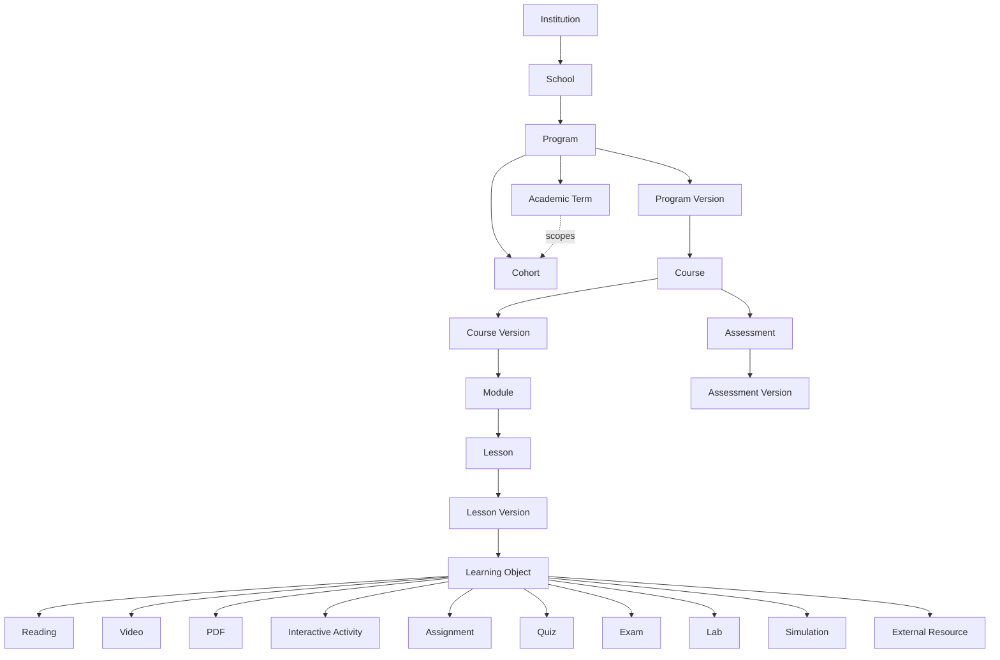
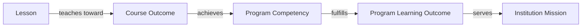

# Curriculum Domain Model

**Status:** Draft
**Milestone:** 11 — Curriculum Management & Content Engine
**Date:** 2026-08-07

## Purpose

This document is the full entity model for the Content Engine's
Curriculum Authoring & Versioning responsibility (per
[Academic Content Architecture](./02-academic-content-architecture.md)).
It extends, rather than replaces, the
[Academic Domain Model](../milestone-5-domain-model-data-architecture/02-academic-domain-model.md)
from Milestone 5 — every entity that document already named (Institution
through Certificate) keeps its meaning here; this document adds the
depth Milestone 5 left conceptual (Module was named but not detailed;
Competency and Learning Outcome were named `Planned` with no mapping
chain; versioning was named `Future`) and resolves two of that
document's own ⚠️ Needs Verification items:

- *"The exact hand-off mechanism between Minara-Curriculum's authored
  content and Minara-LMS's delivery-time representation... is not yet
  defined"* — resolved by
  [Curriculum Management Vision §Resolving Minara-Curriculum's Relationship](./01-curriculum-management-vision.md#resolving-minara-curriculums-relationship-to-this-engine):
  Minara-Curriculum authors Program-level design (Competencies, Program
  Learning Outcomes, required sequence); Minara-LMS's Content Engine
  authors the deliverable Course/Module/Lesson/Learning Object/Assessment
  *content* natively, checked against Minara-Curriculum's design at
  Curriculum Committee Review.
- *"Whether Competency and Learning Outcome are truly two distinct
  levels of granularity"* — resolved below in
  [Competency Mapping Entities](#competency-mapping-entities), which
  adds a third and fourth level (Course Outcome, Institution Mission)
  per this milestone's required chain.

## Full Curriculum Hierarchy

*Cohort continues to belong to Program (per Milestone 5), not to
Academic Term directly — a Cohort typically progresses through several
Academic Terms over its lifetime. Academic Term is introduced here as a
scoping/scheduling concept a Course Offering and Cohort both reference,
not a container Cohorts belong to permanently.*

## Structural Entities (Unchanged from Milestone 5)

These carry the same meaning as
[Academic Domain Model](../milestone-5-domain-model-data-architecture/02-academic-domain-model.md);
listed here only to anchor what's new against what's already decided.

| Entity | Change in This Milestone |
|---|---|
| **Institution** | None. |
| **School** | None. |
| **Program** | Gains a `requiresExternship` flag (already implemented, Milestone 10) and now has many **Program Versions** (new, below) rather than being versioned as a whole row. |
| **Cohort** | None structurally; now additionally scoped by **Academic Term** for scheduling (new, below). |
| **Course Offering** | None — remains the delivery-time instance of a Course for a Cohort/Term, exactly as Milestone 5 defined it and Milestone 10 implemented it. |

## New Structural Entities

| Entity | Purpose | Key Relationships | Lifecycle |
|---|---|---|---|
| **Program Version** | A versioned snapshot of a Program's curriculum design — which Courses it requires, in what sequence, at a point in time. Introduced because a Program's requirements legitimately change year over year (e.g., an accreditation-driven update) without invalidating what a prior Cohort already completed under the old requirements. | Belongs to Program; has many Course associations (via the version's required-course list); a Cohort is anchored to the Program Version in effect when it started | Draft → Faculty Review → Curriculum Committee Review → Approved → Published → Archived (same lifecycle as [Publishing Workflow](./05-publishing-workflow.md), applied at Program scope) |
| **Academic Term** | A scheduling period (e.g., "Fall 2026") that a Course Offering and Cohort activity are scoped to. Distinct from Cohort: one Cohort moves through several Academic Terms over its Program; one Academic Term hosts Course Offerings for several Cohorts. | Course Offering belongs to an Academic Term (Milestone 10's `CourseOffering.term` free-text field is this concept's first, unversioned expression — see [Relationship to the Milestone 10 Schema](#relationship-to-the-milestone-10-vertical-slice-schema)) | Planned → Open → Active → Closed |

## Versioned Curriculum Content Entities

Per [Versioning Strategy](./04-versioning-strategy.md), every entity in
this section is **never overwritten**: an edit to Published content
creates a new version rather than mutating the existing row. The
distinction between an entity (Course, Lesson, Assessment) and its
Version (Course Version, Lesson Version, Assessment Version) is the same
pattern used consistently throughout: the entity is the stable identity
Students enroll in / complete / are assessed against; the Version is the
specific, immutable content in effect at a point in time.

| Entity | Purpose | Key Relationships | Lifecycle |
|---|---|---|---|
| **Course** | The stable identity of a unit of curriculum (e.g., "Pharmacology Fundamentals") — unchanged in meaning from Milestone 5/10 | Belongs to Program; has many Course Versions; delivered via Course Offering | Persists across all its Versions |
| **Course Version** | An immutable, versioned set of Modules/Lessons/Assessments for a Course, at a point in time | Belongs to Course; has many Modules; one Course Version is "current" per Course at a time (the Published one Course Offerings deliver) | Draft → Faculty Review → Curriculum Committee Review → Approved → Published → Archived |
| **Module** | A mid-level grouping of Lessons within a Course Version — named but not detailed in Milestone 5; detailed here per this milestone's required hierarchy | Belongs to Course Version; has many Lessons; orderable | Inherits its parent Course Version's lifecycle state |
| **Lesson** | The stable identity of the smallest addressable teaching unit — unchanged in meaning from Milestone 5/10 | Belongs to Module; has many Lesson Versions | Persists across all its Versions |
| **Lesson Version** | An immutable, versioned instance of a Lesson's full structure (see [Lesson Framework](./06-lesson-framework.md) for the complete field list) | Belongs to Lesson; has many Learning Objects | Draft → Faculty Review → Curriculum Committee Review → Approved → Published → Archived |
| **Learning Object** | An individual piece of content within a Lesson Version — one of Reading, Video, PDF, Interactive Activity, Assignment, Quiz, Exam, Lab, Simulation, or External Resource | Belongs to Lesson Version; orderable; a Learning Object of subtype Assignment/Quiz/Exam links to an **Assessment** (below) for the graded portion | Inherits its parent Lesson Version's lifecycle state |
| **Assessment** | The stable identity of a graded/evaluative activity — unchanged in meaning from Milestone 5; Milestone 10 implemented its delivery-time shape directly (see [Relationship to the Milestone 10 Schema](#relationship-to-the-milestone-10-vertical-slice-schema)) | Belongs to Course; has many Assessment Versions; delivery-time Student Submissions (owned by the existing Assessments service, per [Academic Content Architecture](./02-academic-content-architecture.md#where-assessment-definitions-live-vs-where-submissions-live)) reference the Published Assessment Version in effect at submission time | Persists across all its Versions |
| **Assessment Version** | An immutable, versioned set of questions/instructions/rubric/max score for an Assessment (full detail in [Assessment Architecture](./08-assessment-architecture.md)) | Belongs to Assessment; may draw Questions from one or more Question Banks | Draft → Faculty Review → Curriculum Committee Review → Approved → Published → Archived |

## Competency Mapping Entities

The full traceability chain required by this milestone:
**Lesson → Course Outcome → Program Competency → Program Learning
Outcome → Institution Mission.** This both details Milestone 5's
`Planned` Competency/Learning Outcome entities and resolves that
document's open question about their granularity — the chain below
shows they are not two interchangeable levels but four distinct ones.

| Entity | Purpose | Key Relationships | Owner (per [Curriculum Management Vision](./01-curriculum-management-vision.md)) |
|---|---|---|---|
| **Institution Mission** | The Institution's top-level statement of educational purpose | Every Program Learning Outcome maps to at least one Institution Mission statement | Minara-Curriculum (authoritative institutional record) |
| **Program Learning Outcome (PLO)** | A statement of what a graduate of the Program can do, tied to the Institution's mission | Belongs to Program (via Program Version); maps to one or more Program Competencies | Minara-Curriculum |
| **Program Competency** | A defined skill or capability the Program is designed to develop — the accreditation-significant unit named in Milestone 5 | Belongs to Program (via Program Version); maps to one or more Program Learning Outcomes; achieved via one or more Course Outcomes | Minara-Curriculum |
| **Course Outcome** | A specific, measurable statement of what a Student should know or do after a Course — Milestone 5's "Learning Outcome," renamed here for precision now that Program Learning Outcome exists at a different level | Belongs to Course Version; maps to one or more Program Competencies; achieved via one or more Lessons | Minara-LMS Content Engine (Faculty draft Course Outcomes as part of authoring a Course Version, checked against the Program Competencies they claim to serve) |
| **Lesson-to-Outcome Mapping** | The join between a Lesson Version and the Course Outcome(s) it teaches toward | Lesson Version maps to one or more Course Outcomes | Minara-LMS Content Engine |

This chain is why Curriculum Committee Review (see
[Publishing Workflow](./05-publishing-workflow.md)) exists as a distinct
step from Faculty Review: Faculty Review checks that a Lesson or Course
Version is well-built; Curriculum Committee Review checks that its
claimed Course Outcomes genuinely trace up to Program Competencies
Minara-Curriculum has on record — the human check behind the WHAT vs.
HOW division in
[Curriculum Management Vision](./01-curriculum-management-vision.md).

## Assessment-Related Entities

Named here for completeness; fully detailed in
[Assessment Architecture](./08-assessment-architecture.md).

| Entity | Purpose |
|---|---|
| **Question Bank** | A reusable, versioned pool of Questions, scoped to a Course (or shared across Courses within a Program) |
| **Question** | A single question, with type, prompt, answer key/rubric criteria; belongs to a Question Bank |
| **Rubric** | A structured scoring guide attachable to an Assessment Version, an Assignment-type Learning Object, or a Competency Checklist |
| **Competency Checklist** | A Rubric specialized for observed/practical skills (e.g., a Lab or Practical Skills check), scored against discrete criteria rather than a single numeric score |

## Prerequisite Entities

| Entity | Purpose | Scope |
|---|---|---|
| **Prerequisite** | A directed, configurable requirement: entity X must be completed (or a Grade/score threshold met) before entity Y becomes available | Supports Program→Program, Course→Course, Module→Module, Lesson→Lesson, and Assessment→Assessment relationships — a generic join, not five separate tables, so new prerequisite types don't require schema changes |

## Student Progress Entities

Mostly already named in the
[Student Domain Model](../milestone-5-domain-model-data-architecture/03-student-domain-model.md)
and implemented narrowly in Milestone 10 (`LessonCompletion`); this
milestone extends the *shape* of what's tracked, not the ownership.

| Tracked Fact | Milestone 10 Today | This Milestone's Fuller Shape |
|---|---|---|
| Lesson Started / Completed | `LessonCompletion` (completed only, no started-but-incomplete state) | Adds a Started state and references the specific **Lesson Version** completed against (see [Versioning Strategy](./04-versioning-strategy.md#why-completions-reference-a-version)) |
| Time Spent | Not tracked | New field on Lesson progress |
| Assessment Attempts, Scores | `Submission` (single, upsertable) | Multiple Attempts per Assessment Version where configured (see [Assessment Architecture](./08-assessment-architecture.md)) |
| Competencies Achieved | Not tracked | Derived from approved Grades against Assessment Versions mapped to Course Outcomes, rolled up per the [Competency Mapping](#competency-mapping-entities) chain |
| Course Progress, Program Progress | Not tracked (student-facing course page lists Lessons directly) | Rollup across Module/Lesson completion within the Student's enrolled Course Version / Program Version |
| Certificate Eligibility | Not tracked (Certificates out of scope, per Milestone 10's Out of Scope list) | Remains **Future** — this milestone documents where the signal would come from (Program Progress + Grade approval) but does not build Certificates, consistent with Milestone 10's Out of Scope list continuing to apply |

## Relationship to the Milestone 10 Vertical Slice Schema

Milestone 10's `prisma/schema.prisma` is explicit, in its own comments,
that it implements "a deliberately narrow subset" with "no Module layer
between Course and Lesson, no Question Bank, and no
Competency/Learning Outcome modeling yet." Every model below maps
forward cleanly — nothing in Milestone 10 is contradicted or would need
to be removed; each existing table either keeps its exact meaning or
becomes the "current version" special case of a more general versioned
model.

| Milestone 10 Model (implemented) | This Milestone's Model | Relationship |
|---|---|---|
| `Course` | Course + Course Version | Milestone 10's `Course` row is unversioned — equivalent to a Course with exactly one, permanently-Published Course Version. Adding Course Version does not change `Course`'s meaning, only adds a layer beneath it. |
| `Lesson` (flat under Course) | Module → Lesson → Lesson Version | Milestone 10's `Lesson.courseId` is equivalent to a Module-of-one per Course. Introducing Module is additive: existing Lessons can be understood as already belonging to an implicit single default Module. |
| `Assessment` (flat under Course, delivery fields inline) | Assessment (definition) + Assessment Version | Milestone 10's `Assessment` row already carries `title`/`instructions`/`maxScore` — those fields become the first Assessment Version's content; the `Assessment` row itself becomes the stable identity, unchanged. |
| `CourseOffering.term` (free-text string) | Academic Term (structured entity) | Milestone 10's free-text `term` field is this concept's first, simplest expression — promoting it to a structured entity is additive and does not change `CourseOffering`'s existing relationships. |
| `LessonCompletion` | Lesson Started/Completed against a specific Lesson Version | Additive: add a `lessonVersionId` reference and a `startedAt` alongside the existing `completedAt`. |
| *(none — Program had no versioning)* | Program Version | New; a Program with no Program Version rows yet is equivalent to "still on its original, unversioned design," matching every Program Milestone 10 seeded. |
| *(none — no competency modeling)* | Institution Mission, PLO, Program Competency, Course Outcome | Entirely new; no existing entity changes meaning. |

**No Milestone 10 migration is required by this document.** Per
[ADR-011](../../architecture/adr/ADR-011-vertical-slice-development-strategy.md)
and this milestone's own Approval section, extending the schema to add
any of the above happens in a future, separately-scoped implementation
phase — this section exists so that future phase can be planned as
additive migrations against a known-good mapping, not as a redesign.

## Current / Planned / Future

| Element | Status |
|---|---|
| Institution, School, Program, Cohort, Course Offering | **Current** — implemented, Milestone 10 |
| Course, Lesson, Assessment (flat, unversioned) | **Current** — implemented, Milestone 10 |
| Program Version, Academic Term (structured), Module, Course Version, Lesson Version, Assessment Version | **Planned** — designed in this milestone |
| Institution Mission, Program Learning Outcome, Program Competency, Course Outcome | **Planned** |
| Question Bank, Question, Rubric, Competency Checklist | **Planned** |
| Prerequisite (generic, cross-entity) | **Planned** |
| Time Spent, Started state, multiple Assessment Attempts, Competencies Achieved, Program Progress rollup | **Planned** |
| Certificate Eligibility signal | **Future** — Certificates themselves remain out of scope |
| Randomized/Adaptive Assessment delivery | **Future** — see [Assessment Architecture](./08-assessment-architecture.md) |

## ⚠️ Needs Verification

- Whether Module should be allowed to nest (a Module containing
  Sub-Modules) for programs with deeper curricular structure, or whether
  the single Course → Module → Lesson depth specified in this milestone
  is sufficient for every current and future program — not decided
  here; the requested hierarchy is taken as given.
- Whether Academic Term should become a first-class entity Cohorts are
  formally scoped to over time (a Cohort's term-by-term progression
  record), beyond the Course-Offering-level scoping documented here —
  left for a future milestone once real scheduling requirements are
  known.
- The exact granularity at which Prerequisites are evaluated (e.g.,
  whether a Course prerequisite requires completion of the prior Course
  entity in general, or specifically its Published Course Version at
  time of enrollment) is not fully specified — flagged for the future
  implementation phase that builds this.
