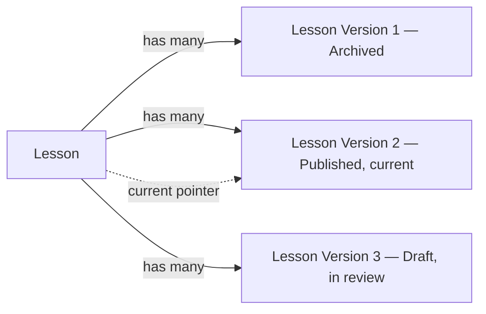

# Versioning Strategy

**Status:** Draft
**Milestone:** 11 — Curriculum Management & Content Engine
**Date:** 2026-08-07

## Purpose

This document specifies how Program, Course, Lesson, and Assessment
versioning works: when a new version is created, what "current" means,
and — the requirement this milestone states most emphatically —
how published academic content is guaranteed never to be silently
overwritten.

## The Core Rule

**A Published version is immutable.** Once a Course Version, Lesson
Version, or Assessment Version reaches Published status (per
[Publishing Workflow](./05-publishing-workflow.md)), its content never
changes again. Any further edit — a typo fix, a new reading, a
corrected question — creates a **new** version that starts back at
Draft and moves through the full review cycle again. The old, Published
version is retained, unmodified, forever (or until formally Archived,
which changes visibility, not content).

This rule exists because of a specific failure mode this milestone's
instructions name directly: a Student completes a Lesson, is graded on
an Assessment, or has a Grade Approved against a specific piece of
curriculum — and later, that curriculum silently changes underneath the
already-recorded academic fact. Immutability makes that impossible by
construction.

## Entity vs. Version

Every versioned type in
[Curriculum Domain Model](./03-curriculum-domain-model.md#versioned-curriculum-content-entities)
follows the same two-row shape:

| Row | Purpose | What Changes |
|---|---|---|
| **The entity** (Course, Lesson, Assessment, Program) | The stable identity Students enroll in, complete, and are assessed against; what appears in a catalog or roster | Only metadata that isn't content — e.g., which Program a Course belongs to. Never its versioned content. |
| **The version** (Course Version, Lesson Version, Assessment Version, Program Version) | The actual content, at a point in time | Nothing, once Published. A new edit is always a new row. |

The entity always has a **current Published version** pointer — the one
version, among possibly several Approved-but-superseded ones, that is
actually delivered to Students today. This is the only place "current"
is decided; every Delivery-side read (per
[Academic Content Architecture](./02-academic-content-architecture.md#two-responsibilities-one-service))
goes through this pointer, never by picking "the newest row."

## When a New Version Is Created

| Trigger | Result |
|---|---|
| Faculty begins editing a Draft that has never been Published | No new version — the existing Draft row is edited in place. Nothing academic depends on a Draft yet. |
| Faculty edits content that is currently Published | A new version is created, starting at Draft, with the Published version's content copied as the starting point. The Published version is untouched and keeps serving Students until the new version completes the full workflow and is itself Published. |
| Faculty clones/reuses an existing Lesson or Learning Object into a different Course (per [Faculty Content Management Portal](./10-faculty-content-management-portal.md)) | A new, independent version chain is created for the new location — cloning is a copy, not a reference; each copy versions independently thereafter. |
| Administrator restores a previously Archived version (per [Curriculum Administration Portal](./09-curriculum-administration-portal.md)) | The restored version becomes a *new* Draft seeded from the archived content — restoring never resurrects the old row as "current" directly, preserving the rule that only one path (Draft → ... → Published) ever sets the current pointer. |

## Why Completions Reference a Version

[Curriculum Domain Model — Student Progress Entities](./03-curriculum-domain-model.md#student-progress-entities)
notes that Lesson completion, Assessment attempts, and Grades reference
the specific **version** a Student engaged with, not just the parent
entity. This is what makes the immutability guarantee meaningful in
practice: if a Lesson Version is later superseded, every Student who
already completed the old version has a permanent, accurate record of
*which* version they completed — their transcript-relevant history
never silently reinterprets itself against content they never saw. A
Student who enrolls after the new version publishes sees, and completes
against, the new one. Both are simultaneously true and both remain
correct, because each completion is anchored to a specific version, not
a resolved-at-read-time "whatever Lesson X currently contains."

## Program Versioning and Cohorts

A Program Version is the versioned unit at the top of the hierarchy
(per [Curriculum Domain Model](./03-curriculum-domain-model.md#new-structural-entities)).
A Cohort is anchored to the Program Version in effect when that Cohort
began — so a curriculum requirement change (e.g., a new required Course
added for an accreditation update) affects newly-starting Cohorts
without retroactively changing what an in-progress Cohort is required to
complete. This mirrors, at Program scope, the same guarantee Course/
Lesson/Assessment versioning provides at content scope.

## Version Numbering and Identification

Each version carries a simple, monotonically increasing integer
(`versionNumber`) scoped to its parent entity (Lesson Version 1, 2, 3...
for a given Lesson) — human-readable in version history UI (per
[Faculty Content Management Portal](./10-faculty-content-management-portal.md)),
and sufficient for this milestone's needs. Semantic versioning
(major.minor) is not adopted here: curriculum content doesn't have the
same "breaking vs. non-breaking change" distinction software does, and
a strict sequence is simpler to reason about for Faculty and reviewers.

## Current / Planned / Future

| Element | Status |
|---|---|
| Immutable-once-Published rule | **Current** — this milestone's binding design decision |
| Entity/Version split across Program, Course, Lesson, Assessment | **Planned** |
| Version-anchored Lesson completion and Assessment attempts | **Planned** |
| Program Version anchoring per Cohort | **Planned** |
| Simple integer version numbering | **Planned** |
| Version diff/comparison tooling (viewing what changed between two versions) | **Future** — [Faculty Content Management Portal](./10-faculty-content-management-portal.md) requires "view version history," not diffing; diffing is a natural but unrequested future enhancement |

## ⚠️ Needs Verification

- Whether a Published version, once superseded, should ever be allowed
  to be re-designated "current" directly (a rollback short-circuiting
  the Draft → Review → Publish cycle) for urgent corrections (e.g., a
  factual error discovered post-publish) is not decided — this document
  currently requires even an urgent fix to go through the same workflow,
  which may prove too slow in practice and should be revisited once
  real operational experience exists.
- How many superseded versions are retained indefinitely vs. eventually
  moved to cold storage is a data-retention/cost question out of this
  milestone's scope, not decided here.
