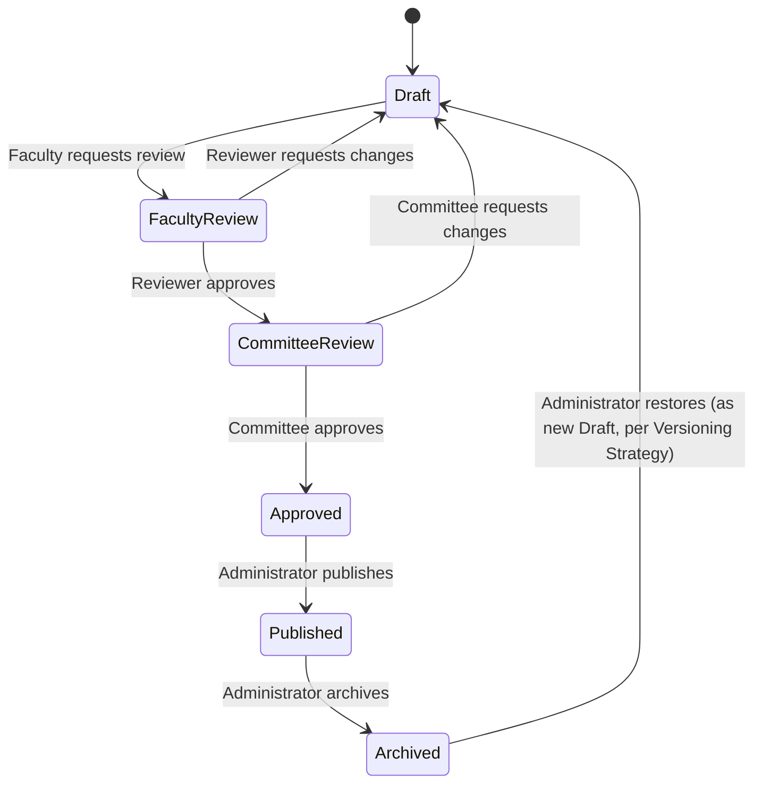

# Publishing Workflow

**Status:** Draft
**Milestone:** 11 — Curriculum Management & Content Engine
**Date:** 2026-08-07

## Purpose

This document specifies the required content workflow — **Draft →
Faculty Review → Curriculum Committee Review → Approved → Published →
Archived** — including exactly who holds authority at each step, given
[ADR-005](../../architecture/adr/ADR-005-rbac-and-audit-first-security-model.md)'s
fixed set of seven Roles, and how each transition is audited per this
milestone's explicit requirement.

## The Workflow

This state machine applies uniformly to every versioned entity in
[Curriculum Domain Model](./03-curriculum-domain-model.md#versioned-curriculum-content-entities) —
Program Version, Course Version, Lesson Version, and Assessment Version
all move through the identical six states. A Lesson Version cannot be
Published while its parent Course Version is still in Draft (a Lesson
can be authored ahead of time, but nothing reaches Students until its
whole containing chain, up to the Course Version, is Published) — the
precise cascade rules are an implementation detail for the future
build phase, not specified further here.

## Who Holds Authority at Each Step

| Step | Actor | Authority Source |
|---|---|---|
| **Draft** | Faculty (author/edit); may be initiated by Faculty or, for a brand-new Course/Program, by Administrator | Faculty's existing `FACULTY` Role, scoped to the Course Offering (per [ROLE_SCOPE](../../../src/domain/roles.ts)) extended to the Course/Course Version it teaches — see [⚠️ Needs Verification](#-needs-verification) below on scope widening |
| **Faculty Review** | A peer Faculty member or the Program Director reviews for instructional quality, clarity, accuracy | `FACULTY` (peer review) or `PROGRAM_DIRECTOR` |
| **Curriculum Committee Review** | Program Director (default) or Administrator (for cross-program content) — see [No New Role](#no-new-role-curriculum-committee-review-uses-existing-authority) below | `PROGRAM_DIRECTOR` scoped to the Program, or `ADMINISTRATOR` |
| **Approved** | Terminal state reached by Curriculum Committee Review's approval — not a separate actor action | — |
| **Published** | Administrator (institution-wide publishing authority, consistent with Milestone 10's existing Administrator-only `institution`-scoped actions) | `ADMINISTRATOR` |
| **Archived** | Administrator | `ADMINISTRATOR` |
| **Restore** | Administrator | `ADMINISTRATOR` |

## No New Role: Curriculum Committee Review Uses Existing Authority

[ADR-005](../../architecture/adr/ADR-005-rbac-and-audit-first-security-model.md)
fixed the platform's Role set, and this milestone's own instructions say
not to contradict prior architecture. [Role Hierarchy §Current/Planned/Future](../milestone-2-user-roles-permission-architecture/03-role-hierarchy.md)
already flagged this exact gap: *"Committee-based approvals (e.g., an
academic standards committee rather than a single approver) — **Future**,
pending Minara-Master-Plan governance model."*

This milestone does not resolve that flag by inventing an eighth Role.
Instead, **Curriculum Committee Review authority is attributed to the
existing `PROGRAM_DIRECTOR` Role** (already scoped to a Program, per
[ROLE_SCOPE](../../../src/domain/roles.ts)) for within-program content,
and to `ADMINISTRATOR` for content spanning multiple Programs or Schools.
A future Curriculum Committee — a genuinely multi-person, possibly
cross-role body — remains exactly the **Future** item Milestone 2 already
named, unchanged by this milestone. This is a deliberate interim
mechanism, documented as such, not a silent redesign of RBAC.

## Every Transition Is Audited

Per this milestone's explicit Audit requirement and consistent with
[Curriculum Audit Framework](./12-curriculum-audit-framework.md), every
state transition above emits an Audit Log entry through the same single
write path Milestone 10 already established
(`recordAuditEvent()` in `src/services/audit/audit.ts`), recording actor,
timestamp, the entity/version affected, and the transition taken. This
extends Milestone 10's existing `AuditAction` union
(`GRADE_SUBMITTED_FOR_APPROVAL`, `GRADE_APPROVED`, `GRADE_REJECTED` are
the direct precedent for this pattern) rather than introducing a
separate audit mechanism.

| New Audit Action (naming convention matches Milestone 10's existing actions) | Emitted When |
|---|---|
| `CURRICULUM_DRAFT_CREATED` | A new Draft version is created |
| `CURRICULUM_SUBMITTED_FOR_FACULTY_REVIEW` | Draft → Faculty Review |
| `CURRICULUM_RETURNED_TO_DRAFT` | Faculty Review or Committee Review sends content back |
| `CURRICULUM_SUBMITTED_FOR_COMMITTEE_REVIEW` | Faculty Review → Committee Review |
| `CURRICULUM_APPROVED` | Committee Review → Approved |
| `CURRICULUM_PUBLISHED` | Approved → Published |
| `CURRICULUM_ARCHIVED` | Published → Archived |
| `CURRICULUM_RESTORED` | Archived → Draft (restore) |

## Rejection Reasons Are Required, Not Optional

Consistent with Milestone 10's Grade rejection flow (`rejectGrade`
requires no reason field today, but Faculty Review/Committee Review
handle higher-stakes, less time-sensitive content), sending content back
from Faculty Review or Committee Review **requires** a reason — Faculty
authoring the content need an actionable explanation, and the reason
itself is audit-logged as part of `CURRICULUM_RETURNED_TO_DRAFT`'s
metadata. This is a stricter requirement than Milestone 10's Grade
rejection and is called out explicitly because it is new, not inherited.

## Current / Planned / Future

| Element | Status |
|---|---|
| Draft → Faculty Review → Committee Review → Approved → Published → Archived state machine | **Planned** — designed in this milestone |
| Curriculum Committee Review attributed to Program Director / Administrator | **Planned** — interim mechanism |
| A true, multi-person Curriculum Committee body/Role | **Future** — unchanged from [Milestone 2](../milestone-2-user-roles-permission-architecture/03-role-hierarchy.md) |
| Audit logging of every transition | **Planned** |
| Required rejection reasons at Faculty/Committee Review | **Planned** |
| Cascade rules between parent/child version states (e.g., Lesson cannot publish ahead of its Course Version) | **Future** — flagged here, not fully specified |

## ⚠️ Needs Verification

- Whether Faculty's Draft/edit authority should be scoped by Course
  Offering (today's teaching-assignment scope) or needs a
  Course-level authoring scope independent of any specific Offering
  (so Faculty can author ahead of being assigned to teach a given
  term's Offering) is not decided — likely needs a scope model addition
  beyond what [ROLE_SCOPE](../../../src/domain/roles.ts) currently
  supports, flagged for the future implementation phase.
- Whether Faculty Review should be mandatory for every edit, however
  small (e.g., a single typo fix to Published content), or whether a
  lightweight "minor edit" path skipping straight to Committee Review
  is warranted, is not decided — this document currently assumes every
  edit follows the full cycle uniformly.
