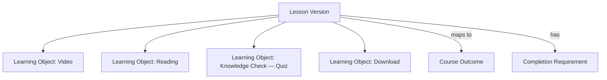

# Lesson Framework

**Status:** Draft
**Milestone:** 11 — Curriculum Management & Content Engine
**Date:** 2026-08-07

## Purpose

This document specifies the full structure of a Lesson Version — every
field this milestone requires, how it relates to Learning Objects and
Competency Mapping, and how "Completion Requirements" stay configurable
rather than hard-coded per Lesson type.

## Lesson Version Field Structure

| Field | Purpose | Required? |
|---|---|---|
| **Title** | The Lesson's display name | Required |
| **Description** | A short summary of what the Lesson covers, shown before a Student opens it | Required |
| **Learning Objectives** | Plain-language statements of what a Student should be able to do after completing the Lesson — the Faculty-facing draft that, once reviewed, becomes the basis for the Lesson's [Course Outcome mapping](./07-competency-mapping-framework.md) | Required |
| **Competencies** | Direct links to the Program Competencies / Course Outcomes this Lesson contributes to (see [Competency Mapping Framework](./07-competency-mapping-framework.md)) | At least one, enforced at Faculty Review |
| **Estimated Time** | Expected time to complete, shown to Students and used in Program Progress estimates | Required |
| **Required Resources** | Materials a Student needs before starting (e.g., a textbook chapter, lab equipment) — free-text/list, not itself a Learning Object | Optional |
| **Videos, Readings, Downloads, Assignments, Knowledge Checks** | The Lesson's content body — each is a **Learning Object** (see [below](#lesson-content-as-learning-objects)), not a separate field on the Lesson itself | At least one Learning Object |
| **Discussion** | An optional discussion prompt/space attached to the Lesson | Optional |
| **Faculty Notes** | Guidance visible only to Faculty (teaching notes, common student misconceptions, timing tips) — never shown to Students | Optional |
| **Student Notes** | A Student's own private notes taken while working through the Lesson — Student-authored, not Faculty-authored content; conceptually closer to [Student Progress](./03-curriculum-domain-model.md#student-progress-entities) than to curriculum content, but named as part of the Lesson's structure per this milestone's instructions | N/A — created per-Student at delivery time, not part of the authored Lesson Version |
| **Completion Requirements** | The configurable rule(s) that determine when a Student's Lesson is marked Completed (see [below](#completion-requirements-are-configurable-not-hard-coded)) | Required |

## Lesson Content as Learning Objects

Videos, Readings, Downloads, Assignments, and Knowledge Checks are not
five different Lesson fields — they are five of the ten
[Learning Object](./03-curriculum-domain-model.md#versioned-curriculum-content-entities)
subtypes this milestone names (the other five — PDF, Interactive
Activity, Lab, Simulation, External Resource — are equally available to
any Lesson). A Lesson Version has an ordered list of Learning Objects;
each carries its own subtype, content, and (for Assignment/Quiz/Exam
subtypes) a link to an [Assessment](./08-assessment-architecture.md).
This keeps "what kinds of content can a Lesson contain" a single,
extensible list rather than a fixed set of Lesson fields that would need
a schema change every time a new content type is needed.

## Completion Requirements Are Configurable, Not Hard-Coded

Per this milestone's instruction that "Completion requirements should
be configurable," a Lesson Version's Completion Requirement is a
configuration choice from a small set of strategies, not a fixed rule:

| Strategy | Lesson Marked Complete When |
|---|---|
| **View-based** (Milestone 10's current, implicit behavior) | Student opens/marks the Lesson as done — no sub-requirement on individual Learning Objects |
| **All Learning Objects** | Every Learning Object in the Lesson has been engaged with (viewed, for content types; attempted, for Knowledge Check/Assignment types) |
| **Required Learning Objects only** | Only Learning Objects explicitly flagged `required: true` must be engaged with; others are supplementary |
| **Minimum score** | A specific Knowledge Check Learning Object within the Lesson must be passed at or above a configured threshold |

Faculty choose the strategy per Lesson Version at authoring time; the
choice is stored as data on the Lesson Version (an enum plus, for
Minimum score, a threshold value), not as separate code paths per
Lesson — consistent with this milestone's "configuration-driven, not
program-specific" principle applied down to the Lesson level.

## Faculty Notes vs. Student Notes: Two Different Kinds of Field

These two fields look similar but belong to different parts of the
architecture:

- **Faculty Notes** are authored content, versioned along with the rest
  of the Lesson Version, and subject to the same
  [Publishing Workflow](./05-publishing-workflow.md) — but flagged
  `facultyOnly: true` so Delivery never renders them to a Student, the
  same visibility distinction already used for Grade `feedback` vs.
  score in Milestone 10.
- **Student Notes** are not curriculum content at all — they are
  per-Student, per-delivery data created after a Lesson is Published,
  owned by the Content Delivery responsibility
  ([Academic Content Architecture](./02-academic-content-architecture.md#two-responsibilities-one-service)),
  not the Authoring & Versioning responsibility. They are private to
  the Student who wrote them and are never subject to Faculty Review or
  Publishing.

## Current / Planned / Future

| Element | Status |
|---|---|
| Title, Description, content body (via Learning Objects) | **Current** — Milestone 10's `Lesson.title`/`Lesson.content` are this framework's minimal, unversioned first expression |
| Learning Objectives, Competencies, Estimated Time, Required Resources | **Planned** |
| Faculty Notes, Discussion | **Planned** |
| Student Notes | **Planned** — Delivery-side, not Authoring-side |
| Configurable Completion Requirements (all four strategies) | **Planned** |
| Ten Learning Object subtypes | **Planned** — Milestone 10 has none of these; its `Lesson.content` is a single text field, not yet decomposed into Learning Objects |

## ⚠️ Needs Verification

- Whether Discussion should be its own Learning Object subtype (closer
  to the ten named types) rather than a separate Lesson-level field —
  this document follows the milestone's literal field list, but the two
  representations are functionally similar and worth reconciling in a
  future document once the Messaging/Communication domain
  ([Platform Services Domain Model](../milestone-5-domain-model-data-architecture/06-platform-services-domain-model.md))
  is extended to curriculum-scoped discussion.
- The precise engagement signal for "attempted" (for non-Knowledge-Check
  Learning Objects, under the "All Learning Objects" completion
  strategy) — e.g., whether opening a Download counts, or only an
  explicit Student action — is not specified here.
