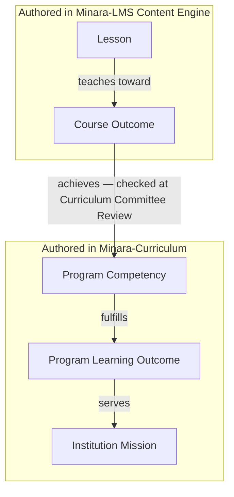

# Competency Mapping Framework

**Status:** Draft
**Milestone:** 11 — Curriculum Management & Content Engine
**Date:** 2026-08-07

## Purpose

This document specifies how the required traceability chain — **Lesson
→ Course Outcome → Program Competency → Program Learning Outcome →
Institution Mission** — is maintained, who is authoritative for each
link, and how that traceability surfaces throughout the platform, not
just as data at rest.

## Why This Chain Matters

Health-sciences programs are accreditation-driven; every named entity
in this chain exists so that, at any time, the institution can answer
"which Lessons, across every Course, teach toward Program Competency X,"
and conversely, "which Institution Mission statement does completing
this Lesson ultimately serve." [Guiding Principles §11](../milestone-1-product-vision-platform-strategy/03-guiding-principles.md)
already established this as a platform value; this milestone is where
it becomes a concrete, buildable model.

## The Chain, and Who Authors Each Link

Per [Curriculum Management Vision's WHAT vs. HOW division](./01-curriculum-management-vision.md#resolving-minara-curriculums-relationship-to-this-engine):

The chain crosses the WHAT/HOW boundary at exactly one link — Course
Outcome → Program Competency — and that is precisely why
[Curriculum Committee Review](./05-publishing-workflow.md#who-holds-authority-at-each-step)
exists: it is the human checkpoint verifying a Faculty-authored Course
Outcome genuinely maps to a Program Competency Minara-Curriculum has on
record, not a rubber stamp on Faculty's own claim.

## Mapping Is Many-to-Many at Every Link

A single Lesson may teach toward more than one Course Outcome; a single
Course Outcome may be achieved by several Lessons across a Course
(reinforcement is expected and desirable); a single Program Competency
is typically fulfilled by Course Outcomes from multiple Courses; a
single Program Learning Outcome typically aggregates several Program
Competencies. Every arrow in the diagram above is a many-to-many join,
not a strict one-to-one tree — consistent with how real curricula are
actually built.

## Where This Surfaces in the Platform

| Surface | What It Shows | Portal |
|---|---|---|
| Lesson authoring screen | The Course Outcome(s) a Lesson is mapped to, editable by Faculty | [Faculty Content Management Portal](./10-faculty-content-management-portal.md) |
| Course Version review screen | A rollup: which Program Competencies this Course Version's Course Outcomes collectively serve — the primary artifact Curriculum Committee Review inspects | [Faculty Content Management Portal](./10-faculty-content-management-portal.md), [Curriculum Administration Portal](./09-curriculum-administration-portal.md) |
| Program-level competency map | Every Program Competency and which Courses/Course Outcomes currently serve it — an accreditation-readiness view | [Curriculum Administration Portal](./09-curriculum-administration-portal.md) |
| Student competency progress | Which Program Competencies a Student has achieved so far, derived from approved Grades against mapped Assessments (see [Curriculum Domain Model — Student Progress Entities](./03-curriculum-domain-model.md#student-progress-entities)) | [Student Learning Delivery Model](./11-student-learning-delivery-model.md) |

"Track curriculum status," named among this milestone's required
Faculty capabilities, includes this mapping view — a Faculty member can
see, for any Lesson or Course they own, whether its competency mapping
is complete before submitting for review.

## AI's Role: Suggestion Only

Per [ADR-006](../../architecture/adr/ADR-006-human-reviewed-ai-governance.md)
and this milestone's explicit AI boundary, AI may **suggest** Learning
Objective language or a plausible Course Outcome mapping based on a
Lesson's content (grouped with the other named-permitted uses in
[Curriculum Management Vision — Vision Principles](./01-curriculum-management-vision.md#vision-principles)
and detailed in every relevant document's AI section) — but the mapping
is not effective until a human (Faculty, then Curriculum Committee
Review) accepts it. AI never writes a Course Outcome → Program
Competency mapping directly into a Published version, and never
resolves a Curriculum Committee Review on its own; this is the same
"AI must never approve or publish curriculum" rule, applied to this
document's specific concern.

## Current / Planned / Future

| Element | Status |
|---|---|
| Four-level chain (Lesson → Course Outcome → Program Competency → PLO → Mission) | **Planned** — designed in this milestone |
| Many-to-many mapping at every link | **Planned** |
| Course Outcome → Program Competency check at Curriculum Committee Review | **Planned** |
| Program-level competency map view (accreditation-readiness) | **Planned** |
| Student competency progress view | **Planned**, depends on [Assessment Architecture](./08-assessment-architecture.md) and Grade approval already implemented in Milestone 10 |
| AI-suggested Learning Objective / mapping drafts | **Planned**, bounded per [ADR-006](../../architecture/adr/ADR-006-human-reviewed-ai-governance.md) |

## ⚠️ Needs Verification

- Whether "Competencies Achieved" should require every mapped
  Assessment to be passed, or a weighted/aggregate threshold across
  multiple Assessments mapped to the same Program Competency, is an
  academic-policy decision outside this document's scope — Minara's own
  Program Director/Curriculum Committee would set this per Program.
- Whether the Program-level competency map view should be exportable in
  a format accreditation bodies expect (a specific report template) is
  not addressed here — likely a [Reporting](../milestone-6-technical-architecture/02-application-architecture.md)
  Engine Area concern, out of this milestone's scope.
