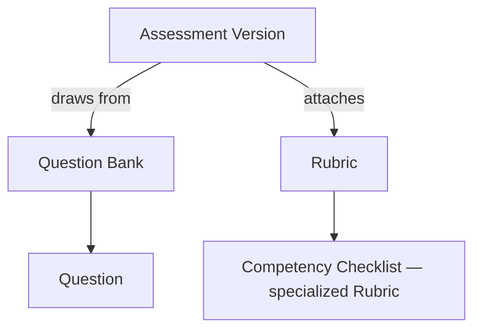

# Assessment Architecture

**Status:** Draft
**Milestone:** 11 — Curriculum Management & Content Engine
**Date:** 2026-08-07

## Purpose

This document specifies how Assessments, Question Banks, and Rubrics
are structured to support every assessment relationship this milestone
names — Practice Questions, Quizzes, Assignments, Midterms, Final Exams,
Practical Skills, Competency Checklists, Rubrics, and (future-ready,
not built) Randomized and Adaptive Assessments.

## Assessment as a Configurable Type, Not Separate Entities

Practice Question, Quiz, Assignment, Midterm, Final Exam, and Practical
Skills check are not six different tables. They are all instances of
the same **Assessment** entity
([Curriculum Domain Model](./03-curriculum-domain-model.md#versioned-curriculum-content-entities)),
distinguished by an `assessmentType` field and a small set of
type-specific settings — the same "configuration over code" principle
this milestone applies throughout:

| Assessment Type | Distinguishing Configuration |
|---|---|
| **Practice Question** | Ungraded (does not produce a Grade); unlimited attempts by default; immediate feedback |
| **Quiz** | Graded; typically auto-gradable questions from a Question Bank; multiple attempts configurable |
| **Assignment** | Graded; free-response/file submission; requires Faculty review (Milestone 10's existing Submission → Grade flow) |
| **Midterm / Final Exam** | Graded; typically single-attempt; time-limited (a setting, not yet enforced in Milestone 10's implementation); highest-stakes, so subject to the same Publishing Workflow rigor as any other content |
| **Practical Skills / Competency Checklist** | Graded against a **Competency Checklist** Rubric (below) rather than a numeric score alone — an in-person or simulation-based observation, recorded by Faculty |

An Assessment's `assessmentType` does not change which service owns it:
per [Academic Content Architecture](./02-academic-content-architecture.md#where-assessment-definitions-live-vs-where-submissions-live),
every type's *definition* is Content Engine (Learning service)
territory; every type's *submission and grading* stays with the
existing Assessments and Gradebook services, unchanged from Milestone 10.

## Question Banks

A **Question Bank** is a reusable, versioned pool of Questions, scoped
to a Course (default) or shared across Courses within a Program (for
content Faculty want to reuse, e.g., a set of pharmacology terminology
questions used in multiple Courses). Each **Question** carries a type
(multiple choice, true/false, short answer, matching — the common set;
exact type list is an implementation detail deferred to the future
build phase), prompt, and answer key or rubric criteria.

A Quiz or Exam's Assessment Version draws a configured selection of
Questions from one or more Question Banks — either a fixed list (every
Student sees the same questions) or, once
[Randomized Assessments](#randomized-and-adaptive-assessments-future-ready-only)
are built, a randomized subset.

## Rubrics and Competency Checklists

A **Rubric** is a structured scoring guide: a set of named criteria,
each with a scoring scale and description of what each level of
performance looks like. A Rubric attaches to:

- An Assessment Version (any type, most commonly Assignment, Midterm,
  Final Exam, or Practical Skills)
- An Assignment-type Learning Object directly, when the graded activity
  lives inside a Lesson rather than as a Course-level Assessment

A **Competency Checklist** is a Rubric specialized for observed/practical
skills: instead of producing a single numeric score, each criterion is
scored as met/not-met (or a small ordinal scale), and the checklist as
a whole maps directly to the [Competencies](./07-competency-mapping-framework.md)
it verifies — the artifact that produces "Competencies Achieved" signals
for [Student Progress](./03-curriculum-domain-model.md#student-progress-entities).

## AI's Role: Drafting Only

Per this milestone's AI boundary — "AI may assist with... Question
drafting, Rubric suggestions" — AI may draft candidate Questions for a
Question Bank or suggest Rubric criteria, always landing as an unapproved
Draft a Faculty member must accept, edit, or discard, exactly as
[ADR-006](../../architecture/adr/ADR-006-human-reviewed-ai-governance.md)
requires elsewhere. AI never adds a Question directly to a Published
Question Bank and never assigns a Grade — restated from
[Curriculum Management Vision](./01-curriculum-management-vision.md)
because grading is the single most sensitive surface this document
touches.

## Randomized and Adaptive Assessments (Future-Ready Only)

Per this milestone's explicit instruction — "future-ready" fields, "do
not build adaptive algorithms yet" — this document names two future
capabilities and reserves a place for them without designing or
building either:

| Capability | What It Would Do | What This Milestone Does |
|---|---|---|
| **Randomized Assessments** | Each Student's attempt draws a different (but equivalent-difficulty) subset of Questions from a Question Bank | Names the Question Bank ↔ Assessment Version relationship such that adding a "randomize selection" configuration flag later is additive — no schema redesign needed |
| **Adaptive Assessments** | Question difficulty adjusts in real time based on the Student's prior answers | Names the concept and confirms it depends on Question-level difficulty metadata this milestone does not yet require — no algorithm, difficulty model, or scoring logic is designed here |

Both remain **Future**, consistent with
[Curriculum Management Vision — Vision Principle 4](./01-curriculum-management-vision.md#vision-principles)
("build narrow, prove it, then expand").

## Current / Planned / Future

| Element | Status |
|---|---|
| Assessment (unversioned, single type behavior) | **Current** — implemented, Milestone 10 |
| Assessment as a configurable type (Practice Question through Practical Skills) | **Planned** |
| Question Bank, Question | **Planned** |
| Rubric | **Planned** |
| Competency Checklist | **Planned** |
| AI-drafted Questions/Rubric suggestions | **Planned**, bounded per [ADR-006](../../architecture/adr/ADR-006-human-reviewed-ai-governance.md) |
| Randomized Assessments | **Future** |
| Adaptive Assessments | **Future** — explicitly, no algorithm work happens under this milestone |

## ⚠️ Needs Verification

- The exact enumerated list of supported Question types (multiple
  choice, true/false, short answer, matching, and any others Minara's
  programs specifically need) is not finalized here — deferred to the
  future implementation phase, informed by Minara-Curriculum's actual
  question bank practices.
- Whether time-limited Assessments (a named setting above) need
  server-enforced timing or a simpler client-displayed countdown with
  server-side attempt-window validation is an implementation decision,
  not made here.
