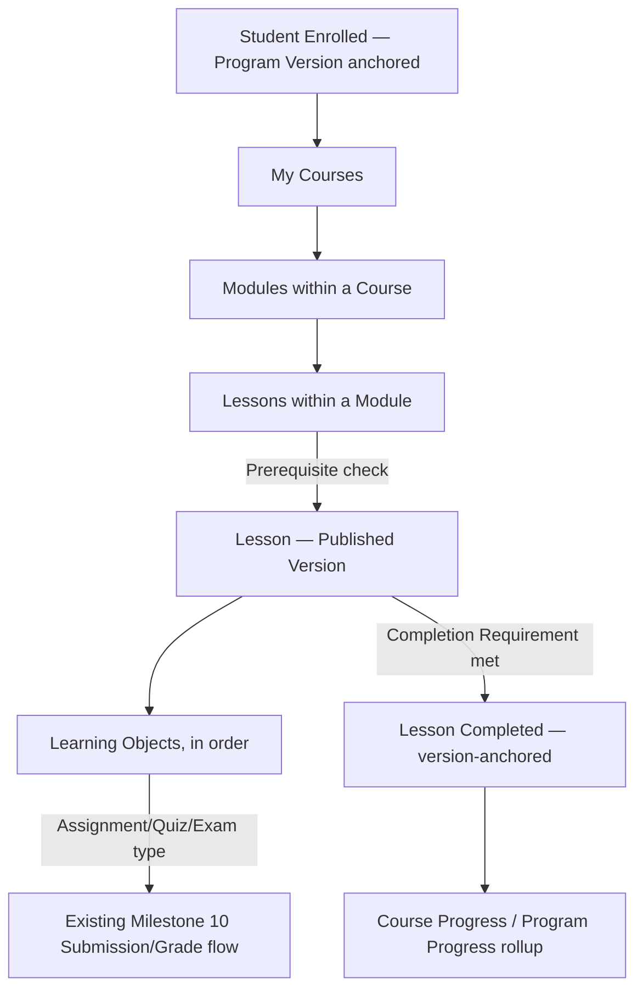

# Student Learning Delivery Model

**Status:** Draft
**Milestone:** 11 — Curriculum Management & Content Engine
**Date:** 2026-08-07

## Purpose

This document specifies how the Content Engine's Content Delivery
responsibility ([Academic Content Architecture](./02-academic-content-architecture.md#two-responsibilities-one-service))
reaches Students: how published, versioned content is navigated,
how Prerequisites gate access, and how Student Progress is tracked and
rolled up — extending the existing
[Student Portal](../milestone-4-information-architecture/02-student-portal.md)
and Milestone 10's implemented Student Experience, not replacing either.

## What Changes for the Student, Concretely

Milestone 10's Student Experience already lets a Student view a Course
Offering's flat Lesson list, open a Lesson, mark it complete, and submit
an Assessment. Every one of those interactions continues to work
exactly as built. This milestone adds three things on top:

1. **Module-aware navigation** — Lessons are grouped under Modules
   (per [Curriculum Domain Model](./03-curriculum-domain-model.md#versioned-curriculum-content-entities)),
   so "My Courses → Current Lesson" (per
   [Student Portal §Primary Navigation](../milestone-4-information-architecture/02-student-portal.md))
   gains one level of grouping.
2. **Prerequisite gating** — a Lesson, Course, or Assessment configured
   with a Prerequisite (per [Curriculum Domain Model — Prerequisite Entities](./03-curriculum-domain-model.md#prerequisite-entities))
   is visible but not accessible until the Prerequisite is satisfied,
   surfaced as a clear "locked, requires X" state rather than a hidden
   item.
3. **Progress rollups** — Course Progress and Program Progress (per
   [Curriculum Domain Model — Student Progress Entities](./03-curriculum-domain-model.md#student-progress-entities))
   appear on the existing **Progress** primary navigation item, which
   Milestone 4 already named but Milestone 10 did not yet implement.

## What a Student Always Sees Is the Published Version

Every screen in this document reads through the current-Published-
version pointer described in
[Versioning Strategy](./04-versioning-strategy.md#entity-vs-version) —
a Student never sees a Draft, a version in review, or a superseded
version. When Faculty publish a new Lesson Version mid-term, a Student
who already completed the prior version keeps their completion record
intact (anchored to the version they completed, per
[Versioning Strategy §Why Completions Reference a Version](./04-versioning-strategy.md#why-completions-reference-a-version));
a Student who hasn't reached that Lesson yet sees the new version.

## Delivery Flow

## Screens (Extending the Existing Student Portal)

| Screen | Purpose | Key Information | Relationships | Future Expansion |
|---|---|---|---|---|
| **My Courses** (existing, extended) | Entry point to enrolled Courses | Now grouped by Module beneath each Course, rather than a flat Lesson list | Extends Milestone 10's implemented `student/courses/[courseOfferingId]` page | — |
| **Lesson View** (existing, extended) | Viewing a single Lesson's content and marking progress | Now renders the full [Lesson Framework](./06-lesson-framework.md) field set (Learning Objectives, Estimated Time, ordered Learning Objects, Discussion) rather than a single content field; Faculty Notes never rendered here | Extends Milestone 10's implemented Lesson page; enforces the Lesson Version's configured [Completion Requirement](./06-lesson-framework.md#completion-requirements-are-configurable-not-hard-coded) | — |
| **Progress** (existing primary nav item, newly implemented) | Course- and Program-level completion rollups | Modules/Lessons completed vs. total, Program Competencies achieved | Implements the [Student Progress Entities](./03-curriculum-domain-model.md#student-progress-entities) rollup; surfaces the same data [Competency Mapping Framework](./07-competency-mapping-framework.md#where-this-surfaces-in-the-platform) describes at Student scope | Certificate Eligibility indicator — **Future**, depends on Certificates remaining out of scope |
| **Locked content indicator** (inline, wherever Prerequisites apply) | Communicating why a Lesson/Course/Assessment isn't yet accessible | The unmet Prerequisite, in plain language | Implements Prerequisite gating per [Curriculum Domain Model](./03-curriculum-domain-model.md#prerequisite-entities) | — |

## Current / Planned / Future

| Element | Status |
|---|---|
| My Courses, Lesson View, Assessment submission (flat, unversioned) | **Current** — implemented, Milestone 10 |
| Module-aware navigation | **Planned** |
| Prerequisite gating | **Planned** |
| Progress screen (Course/Program rollups) | **Planned** |
| Full Lesson Framework field rendering | **Planned** |
| Certificate Eligibility indicator | **Future** |

## ⚠️ Needs Verification

- Whether a Prerequisite violation should be enforced purely at the UI
  level (hiding/locking navigation) or also at the server-action layer
  (rejecting an attempt to directly submit an Assessment whose
  Prerequisite isn't met) — this document assumes both, consistent with
  Milestone 10's existing fail-closed authorization pattern
  (`requireSessionUserWithRole`, `hasRoleForCourseOffering`), but the
  specific enforcement point for Prerequisites is not yet designed.
