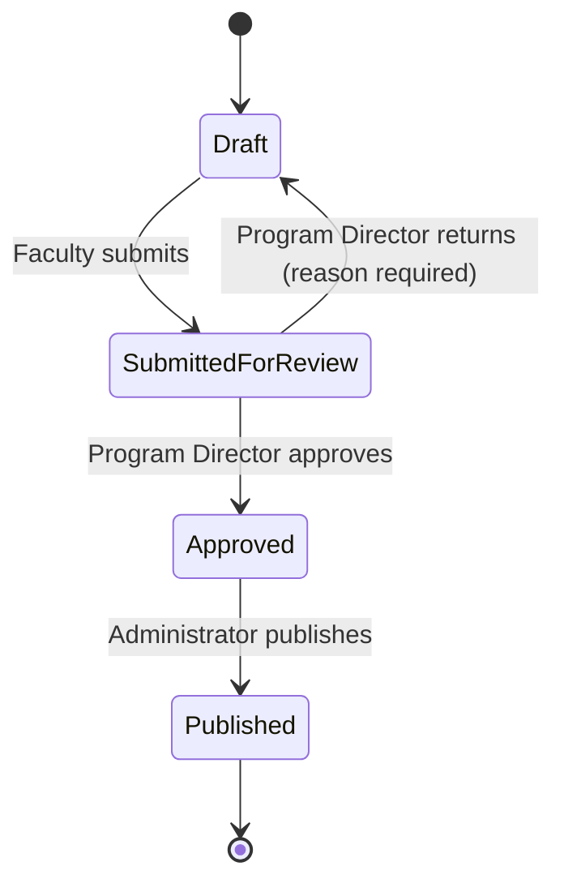
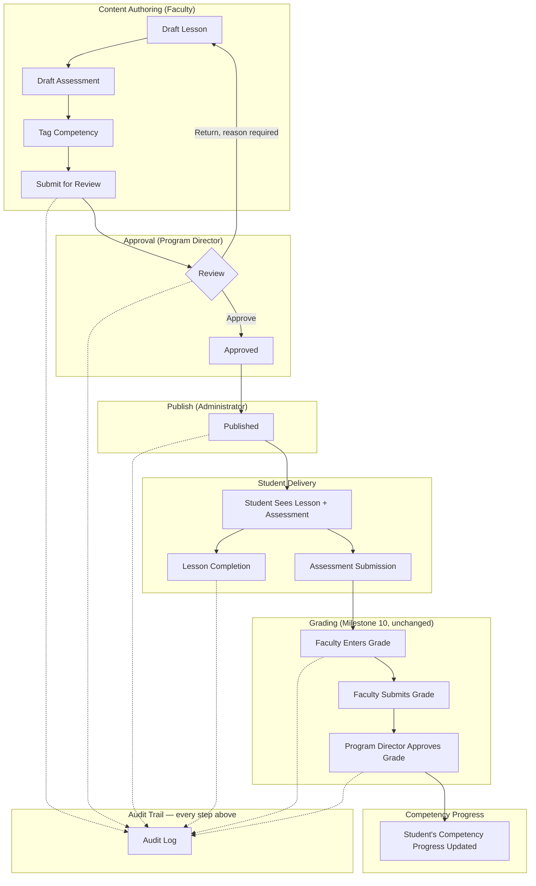

# Content Lifecycle Workflow

**Status:** Draft
**Milestone:** 12 — Curriculum Delivery Vertical Slice
**Date:** 2026-08-07

## Purpose

This document specifies the exact lifecycle this slice proves — **Draft
Content → Faculty Review → Approval → Publish → Student Access →
Completion → Assessment → Grade → Competency Update** — with the state
machine, the actors and audit events at each step, and how it maps back
to Milestone 11's fuller design.

## Content Status State Machine

Both Lesson and Assessment definitions (the two content types this
slice covers, per [Domain Impact Review](./03-domain-impact-review.md))
share one status field and one state machine — deliberately mirroring
Milestone 10's already-proven Grade lifecycle (`DRAFT → SUBMITTED →
APPROVED`) rather than inventing a new pattern.

This is a deliberate narrowing of
[Milestone 11's six-state Publishing Workflow](../milestone-11-curriculum-management-content-engine/05-publishing-workflow.md)
(Draft → Faculty Review → Curriculum Committee Review → Approved →
Published → Archived) down to four states, collapsing Faculty Review
and Curriculum Committee Review into a single Review → Approval step
held by Program Director, and omitting Archive entirely — see
[README §Scope Boundaries](./README.md#scope-boundaries) for why.

## End-to-End Flow

## Step-by-Step Detail

| Step | Actor | Role Authority | Precondition | Audit Event (new, extends `AuditAction`) |
|---|---|---|---|---|
| Draft Lesson / Assessment | Faculty | `FACULTY`, scoped to the Course Offering (existing scope, per [ROLE_SCOPE](../../../src/domain/roles.ts)) | Faculty is assigned to the Course | `CONTENT_DRAFT_CREATED` |
| Tag Competency | Faculty | Same as above | At least one Competency link before submission | *(captured as metadata on `CONTENT_DRAFT_CREATED` / a later edit, not a separate event)* |
| Submit for Review | Faculty | Same as above | Content is in Draft status; at least one Competency tagged (Lesson only) | `CONTENT_SUBMITTED_FOR_REVIEW` |
| Review & Return | Program Director | `PROGRAM_DIRECTOR`, scoped to the Program (existing `hasRoleForProgram`) | Content is Submitted for Review | `CONTENT_RETURNED_TO_DRAFT` (reason required in metadata) |
| Review & Approve | Program Director | Same as above | Content is Submitted for Review | `CONTENT_APPROVED` |
| Publish | Administrator | `ADMINISTRATOR` (institution-wide, existing) | Content is Approved | `CONTENT_PUBLISHED` |
| Student Access | Student | `STUDENT`, via existing Enrollment/`studentCanAccessCourseOffering` check | Content is Published; Student is enrolled in the Course Offering | *(read access, not itself an audited write — consistent with Milestone 10's existing pattern of auditing writes, not reads)* |
| Lesson Completion | Student | Same as above | Lesson is Published | `LESSON_COMPLETED` *(existing action, unchanged)* |
| Assessment Submission | Student | Same as above | Assessment is Published | `ASSESSMENT_SUBMITTED` *(existing action, unchanged)* |
| Grade Entry / Submission / Approval | Faculty, then Program Director | Existing Milestone 10 Grade lifecycle, entirely unchanged | Submission exists | `GRADE_ENTERED`, `GRADE_SUBMITTED_FOR_APPROVAL`, `GRADE_APPROVED` *(existing actions, unchanged)* |
| Competency Progress Update | System (derived, not a direct actor step) | N/A — a read-time or event-driven rollup, not a new authorization surface | Grade for a Competency-linked Assessment reaches Approved | *(no new audit event required — the underlying `GRADE_APPROVED` event is sufficient provenance; the rollup itself is a derived view, per [Domain Impact Review](./03-domain-impact-review.md))* |

## Why Competency Progress Has No New Audit Event

Per [Audit and Accountability Framework §1](../../milestones/milestone-2-user-roles-permission-architecture/05-audit-accountability-framework.md#1-user-actions),
audit events capture "authenticated action[s] that read or affect a
record of consequence." A Student's Competency Progress in this slice is
a **derived view** — computed from already-audited Grade approvals and
already-audited content Competency tags — not a record with its own
independent write path. Logging a redundant event at read/derivation
time would duplicate, not add, provenance. This mirrors how Milestone 10
never separately audits "Student viewed their grade" — the underlying
`GRADE_APPROVED` event is the provenance; viewing it is not a
consequential action in its own right.

## Mapping Back to Milestone 11

| This Slice | Milestone 11 Document | Relationship |
|---|---|---|
| Draft → Submitted for Review → Approved → Published (4 states) | [Publishing Workflow](../milestone-11-curriculum-management-content-engine/05-publishing-workflow.md) (6 states) | A proper subset: Faculty Review and Curriculum Committee Review are collapsed into one Review step; Archived is omitted |
| Program Director as sole reviewer/approver | [Publishing Workflow §No New Role](../milestone-11-curriculum-management-content-engine/05-publishing-workflow.md#no-new-role-curriculum-committee-review-uses-existing-authority) | Consistent — Program Director already held both Faculty-Review-adjacent and Committee-Review authority there; this slice just doesn't split the two steps apart yet |
| Single Lesson-to-Competency tag | [Competency Mapping Framework](../milestone-11-curriculum-management-content-engine/07-competency-mapping-framework.md) | A minimal proof of the bottom link in the four-level chain (Lesson → Course Outcome) — this slice's "Competency" stands in for Course Outcome without yet modeling Program Competency/PLO/Mission above it |
| Mutable status field, no version history | [Versioning Strategy](../milestone-11-curriculum-management-content-engine/04-versioning-strategy.md) | Deliberately not proven in this slice — see [Domain Impact Review](./03-domain-impact-review.md) for why immutable versioning is explicitly deferred |

## Current / Planned / Future

| Element | Status |
|---|---|
| Draft → Submitted → Approved → Published state machine | **Planned** — designed in this milestone |
| Program Director as sole Review/Approval authority | **Planned** |
| Administrator-only Publish | **Planned** |
| Competency tag + progress rollup | **Planned** |
| Full six-state Milestone 11 workflow (two-step review, Archive) | **Future** |
| Immutable content versioning | **Future** |

## ⚠️ Needs Verification

- Whether "Return" should be limited to a bounded number of Draft ↔
  Submitted cycles before escalating to Administrator, or left
  unbounded as modeled here — not decided; Milestone 10's Grade
  rejection flow has no such bound either, so this slice follows that
  precedent.
