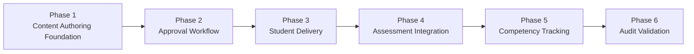

# Implementation Plan

**Status:** Draft
**Milestone:** 12 — Curriculum Delivery Vertical Slice
**Date:** 2026-08-07

## Purpose

This document breaks the slice defined in
[Content Lifecycle Workflow](./02-content-lifecycle-workflow.md) into
six sequential implementation phases for the next build milestone,
each with a clear goal, dependencies, and an exit criterion the way
[Milestone 10's own build](../../../README.md) proceeded phase by phase.
No phase here is itself implementation — this is the plan a future
Foundation Build milestone would follow.

## Phase Sequence

Phases are sequential because each depends on the previous one's data
existing: Approval has nothing to approve without Phase 1's Draft
content; Student Delivery has nothing to deliver without Phase 2's
Approved-then-Published content; Competency Tracking has no Grades to
derive progress from without Phase 4's Assessment path; Audit
Validation reviews the trail every prior phase should already be
producing, so it necessarily comes last.

## Phase 1: Content Authoring Foundation

**Goal:** Faculty can draft a Lesson and an Assessment, tagged with a
Competency, scoped to a Course they're assigned to teach.

- Extends `Lesson` and `Assessment` with a status field (defaulting to
  Draft) and, for Lesson, a Competency link — per
  [Domain Impact Review](./03-domain-impact-review.md#existing-concepts-that-require-extension).
- Introduces the minimal Competency concept, scoped to Program, with
  basic create/list capability (Admin-side, per
  [Portal Impact Review](./04-portal-impact-review.md#admin-portal)).
- Extends the Faculty Course Offering screen with draft-creation
  actions.
- No Review/Approval/Publish logic yet — content simply exists in Draft.

**Exit Criterion:** A Faculty member can create a Draft Lesson and Draft
Assessment, each visible only to Faculty/Program Director/Administrator,
never to a Student, with the Lesson carrying at least one Competency
tag.

## Phase 2: Approval Workflow

**Goal:** Draft content can move through Submitted for Review → Approved
→ Published, held by the correct authority at each step.

- Implements the state transitions in
  [Content Lifecycle Workflow](./02-content-lifecycle-workflow.md#content-status-state-machine):
  Submit (Faculty), Return/Approve (Program Director, `hasRoleForProgram`-scoped),
  Publish (Administrator, `requireAdministrator`).
- Extends the `AuditAction` union with the five `CONTENT_*` actions and
  wires each transition through the existing `recordAuditEvent()`.
- Builds the Program Director review queue and Administrator publish
  action described in
  [Portal Impact Review](./04-portal-impact-review.md).
- Content still isn't visible to Students at the end of this phase —
  Publish only changes status; Phase 3 makes Published status matter to
  Student-facing reads.

**Exit Criterion:** A Draft Lesson/Assessment can be walked through
every state to Published (including at least one Return-and-resubmit
cycle) with correct role authority enforced at each step and every
transition audit-logged.

## Phase 3: Student Delivery

**Goal:** Published content — and only Published content — reaches
enrolled Students.

- Adds the Published-only filter to Student-facing read paths, per
  [Domain Impact Review](./03-domain-impact-review.md#existing-concepts-that-require-extension).
- Adds the fail-closed direct-access check (a non-Published Lesson/
  Assessment ID is denied, not merely unlisted), per
  [PRD S-1](./01-product-requirements-document.md#student).
- Verifies `markLessonComplete` continues to work unchanged for
  Published Lessons — no change to `LessonCompletion` itself.

**Exit Criterion:** A Student sees a Lesson/Assessment appear on their
Course page at the exact moment it's Published, not before; a direct
request for its ID before Publish is denied; Lesson Completion works
identically to Milestone 10 once Published.

## Phase 4: Assessment Integration

**Goal:** A Published Assessment flows into Milestone 10's existing
Submission → Grade → Approval pipeline with zero changes to that
pipeline.

- Confirms (via testing, per
  [Testing Strategy](./06-testing-strategy.md)) that `submitAssessment`,
  `enterGrade`, `submitGradeForApproval`, and `approveGrade` require no
  modification — only that they now execute against Assessments that
  reached this point through Phase 1–3's new gate, rather than
  Milestone 10's previously ungated creation path.
- No new code beyond confirming the existing pipeline composes
  correctly with gated Assessments — this phase is primarily
  integration verification, not new construction.

**Exit Criterion:** A Student submits a Published Assessment; Faculty
grades it; Program Director approves the Grade — using entirely
Milestone 10's existing, unmodified code paths.

## Phase 5: Competency Tracking

**Goal:** An Approved Grade against a Competency-linked Assessment
updates the Student's visible Competency Progress.

- Implements the derived read described in
  [Domain Impact Review §New Concept Required: Competency](./03-domain-impact-review.md#new-concept-required-competency-minimal) —
  no new write path, no new stored entity beyond the Competency record
  and Lesson link already introduced in Phase 1.
- Builds the Student-facing Competency Progress view, per
  [Portal Impact Review](./04-portal-impact-review.md#student-portal).
- Builds the Program Director-facing Competency coverage view, per
  [PRD PD-2](./01-product-requirements-document.md#program-director).

**Exit Criterion:** Immediately after a Program Director approves a
Grade for a Competency-linked Assessment, that Competency appears on
the Student's Competency Progress view with no separate action
required.

## Phase 6: Audit Validation

**Goal:** Confirm the entire lifecycle, end to end, is independently
reconstructable from the Audit Log alone.

- No new logging code should be required by this phase if Phases 1–2
  wired `recordAuditEvent()` correctly — this phase is verification,
  the audit-trail equivalent of Phase 4's integration-only approach.
- Walks the full [PRD Success Criteria](./01-product-requirements-document.md#success-criteria)
  scenario and confirms every step (draft, submit, return, resubmit,
  approve, publish, complete, submit assessment, grade, approve grade)
  produces a matching Audit Log entry with correct actor and timestamp.
- Confirms Administrator can reconstruct the full sequence using only
  the existing Audit Log screen — no other data source.

**Exit Criterion:** The [PRD Success Criteria](./01-product-requirements-document.md#success-criteria)'s
seven-step scenario passes in full, including its final step: an
Administrator reconstructs the entire sequence from the Audit Log
alone.

## Current / Planned / Future

| Phase | Status |
|---|---|
| Phase 1: Content Authoring Foundation | **Planned** — first phase of the next implementation milestone |
| Phase 2: Approval Workflow | **Planned** |
| Phase 3: Student Delivery | **Planned** |
| Phase 4: Assessment Integration | **Planned** — primarily verification of existing Milestone 10 code |
| Phase 5: Competency Tracking | **Planned** |
| Phase 6: Audit Validation | **Planned** — primarily verification |
| Any phase beyond this slice (Module, versioning, two-step review, full Competency chain, etc.) | **Future**, per [README §Scope Boundaries](./README.md#scope-boundaries) |

## ⚠️ Needs Verification

- Whether Phases 1–2 and 3–4 could be safely parallelized by a team of
  more than one engineer (authoring/approval vs. delivery/assessment)
  rather than strictly sequenced — this document assumes strict
  sequencing for a single-engineer or tightly-coordinated build, the
  same assumption Milestone 10's own phased build made.
