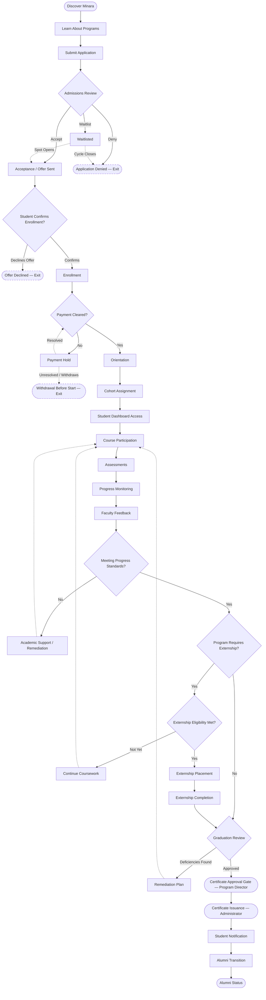

# Student Lifecycle Workflow

**Status:** Draft
**Milestone:** 3 — Student Journey & Core Platform Workflows
**Date:** 2026-08-07

This document traces the complete lifecycle of a Minara student, from
first discovering Minara through becoming an alumnus. It is the spine
that the other Milestone 3 workflow documents (Admissions, Faculty,
Externship, Certificate/Graduation, AI Assistant) each elaborate on at a
more granular level — this document shows how they connect.

## Lifecycle Diagram

*Full detail on each shaded region is in a dedicated document: Admissions
(steps C–E) in [Admissions Workflows](./03-admissions-workflows.md);
Course delivery (steps L–O) in [Faculty Workflows](./02-faculty-workflows.md);
Externship (steps S–T) in [Externship Management Workflow](./04-externship-management-workflow.md);
Graduation and certification (steps U–W) in
[Certificate & Graduation Workflow](./05-certificate-graduation-workflow.md).*

## Stage Descriptions

| Stage | Description | Primary Role(s) Involved |
|---|---|---|
| Discover Minara | Prospective student encounters Minara through public-facing content (marketing, search, referral) | Prospective student (not yet a platform role) |
| Learn About Programs | Prospective student reviews program information | Prospective student |
| Submit Application | Formal application is submitted | Prospective student, Admissions Staff |
| Admissions Review | Application is evaluated | Admissions Staff, Program Director (approval, per [Role Hierarchy](../milestone-2-user-roles-permission-architecture/03-role-hierarchy.md)) |
| Acceptance | Offer is communicated | Admissions Staff |
| Enrollment | Student formally confirms and becomes an enrolled Student | Student, Admissions Staff |
| Payment | Tuition/fee obligations are cleared or arranged | Student, Administrator (financial oversight) |
| Orientation | Student is onboarded to the platform and program expectations | Student, Program Director |
| Cohort Assignment | Student is placed into a cohort | Admissions Staff, Program Director |
| Student Dashboard | Ongoing platform access begins | Student |
| Course Participation | Student engages with curriculum delivery | Student, Faculty Instructor |
| Assessments | Student completes graded work | Student, Faculty Instructor |
| Progress Monitoring | Ongoing tracking of student standing | Student, Faculty Instructor, Program Director |
| Faculty Feedback | Faculty provides feedback on performance | Faculty Instructor |
| Externship Eligibility | Determination of readiness for placement (where applicable) | Program Director, Externship/Clinical Coordinator |
| Externship Placement | Student is placed at a site | Externship/Clinical Coordinator, Employer Partner |
| Externship Completion | Hours and evaluations are finalized | Student, Externship/Clinical Coordinator, Employer Partner |
| Graduation Review | Confirmation all program requirements are met | Program Director |
| Certificate Issuance | Formal credentialing | Program Director (approve), Administrator (issue) |
| Alumni Transition | Student status shifts to alumni | Administrator |

## Decision Points

1. **Admissions Review outcome** — Accept / Waitlist / Deny (see
   [Admissions Workflows](./03-admissions-workflows.md) for full branching).
2. **Student confirms enrollment?** — a Student may decline an offer.
3. **Payment cleared?** — unresolved payment blocks progression to
   Orientation.
4. **Meeting progress standards?** — determines whether a Student
   proceeds normally or enters academic support/remediation.
5. **Does the program require an externship?** — not all programs are
   assumed to require one; this is a program-level configuration.
   **⚠️ Needs Verification** — confirm with Minara-Curriculum/Master-Plan
   which program types require externships.
6. **Externship eligibility met?** — gates entry into placement.
7. **Graduation review outcome** — Approved, or deficiencies requiring a
   remediation plan.

## Approval Gates

Per the [Permission Framework](../milestone-2-user-roles-permission-architecture/02-permission-framework.md),
the following steps are formal approval gates, not mere status updates:

- **Admissions decision** — Admissions Staff recommends; approval
  authority per [Role Hierarchy](../milestone-2-user-roles-permission-architecture/03-role-hierarchy.md)
  §Approval Relationships (**⚠️ Needs Verification** on exact
  approver).
- **Externship placement approval** — Externship/Clinical Coordinator,
  in coordination with Program Director.
- **Graduation/completion approval** — Program Director.
- **Certificate issuance** — Administrator, following Program Director
  approval.

## Exception Paths

- **Application Denied** — exits the lifecycle at the admissions stage.
  **⚠️ Needs Verification:** whether/how a denied applicant may reapply
  in a future cycle is not yet defined.
- **Offer Declined** — Student declines an accepted offer; exits before
  enrollment.
- **Withdrawal Before Start** — unresolved payment or a Student's own
  decision leads to withdrawal before the program begins.
- **Academic Support / Remediation Loop** — a Student not meeting
  progress standards re-enters coursework with additional support rather
  than being removed from the program. **⚠️ Needs Verification:** the
  conditions under which remediation escalates to probation or dismissal
  are not yet defined and depend on Minara-Master-Plan academic policy.
- **Graduation Deficiency Loop** — a Student who does not meet
  graduation requirements enters a remediation plan rather than
  proceeding to certification.
- **Mid-Program Withdrawal** — a Student may withdraw at any point after
  enrollment. This is not drawn as a separate branch at every stage to
  keep the diagram legible; it is treated as a cross-cutting exception
  available from any "in-program" state (Course Participation through
  Externship Completion). **⚠️ Needs Verification:** the specific
  withdrawal and re-admission process is not yet detailed and may warrant
  its own workflow document in a later milestone.

## Current / Planned / Future

| Element | Status |
|---|---|
| Discover Minara → Submit Application (public-facing, pre-account) | **Planned** |
| Admissions Review → Enrollment | **Planned** |
| Payment clearance gate | **Planned** |
| Orientation → Cohort Assignment | **Planned** |
| Student Dashboard → Progress Monitoring (core course delivery loop) | **Planned** |
| Academic support/remediation loop | **Planned**, specific escalation policy **Future** pending Master-Plan input |
| Externship eligibility → completion | **Planned** (see [Externship Management Workflow](./04-externship-management-workflow.md) for detail) |
| Graduation review → Certificate issuance | **Planned** (see [Certificate & Graduation Workflow](./05-certificate-graduation-workflow.md)) |
| Alumni transition | **Future** — alumni-specific platform capabilities (e.g., alumni portal features) are not yet scoped beyond a status change |
| Automated re-application handling for denied/withdrawn applicants | **Future** |

## ⚠️ Needs Verification (Summary)

- Whether every program requires an externship, or this is
  program-specific.
- Exact approval authority for admissions decisions (Admissions Staff
  alone vs. joint with Program Director/Administrator).
- Reapplication policy for denied or withdrawn applicants.
- Escalation policy from remediation to probation/dismissal.
- Whether mid-program withdrawal warrants a dedicated workflow document.
