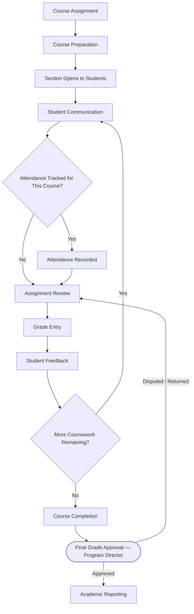

# Faculty Workflows

**Status:** Draft
**Milestone:** 3 — Student Journey & Core Platform Workflows
**Date:** 2026-08-07

This document details the workflows a Faculty Instructor moves through
in delivering a course section, from assignment through final grade
approval and reporting. It elaborates on the "Course Participation →
Faculty Feedback" span of the
[Student Lifecycle Workflow](./01-student-lifecycle-workflow.md).

## Workflow Diagram

## Stage Descriptions

| Stage | Description | Depends On |
|---|---|---|
| Course Assignment | Faculty Instructor is assigned to a section, establishing a role assignment scoped to that section (per [Multi-School and Multi-Program Access Model](../milestone-2-user-roles-permission-architecture/04-multi-school-multi-program-access-model.md)) | Program Director staffing decision; Cohort Assignment (student side, see [Student Lifecycle Workflow](./01-student-lifecycle-workflow.md)) |
| Course Preparation | Faculty reviews and configures delivery of curriculum content sourced from Minara-Curriculum | Curriculum content availability (Minara-Curriculum) |
| Section Opens to Students | Enrolled, cohort-assigned students gain access | Student Enrollment + Cohort Assignment |
| Student Communication | Ongoing messaging/announcements throughout the course | — |
| Attendance | Recorded where the course format requires it | Course delivery format (synchronous vs. self-paced) |
| Assignment Review | Faculty reviews submitted student work | Student assignment submission |
| Grade Entry | Faculty records grades for assignments/assessments | Assignment Review, Assessment completion |
| Student Feedback | Faculty communicates feedback tied to graded work | Grade Entry |
| Course Completion | All required coursework is delivered and graded | Repeated cycles of Assignment Review → Grade Entry → Feedback |
| Final Grade Approval | Formal approval gate finalizing the course grade of record | Course Completion |
| Academic Reporting | Section-level outcomes roll into program reporting | Final Grade Approval |

## Approval Points

- **Final Grade Approval** is the primary formal approval gate in this
  workflow, held by the Program Director per the
  [Permission Framework](../milestone-2-user-roles-permission-architecture/02-permission-framework.md)
  and [Role Hierarchy](../milestone-2-user-roles-permission-architecture/03-role-hierarchy.md).
  A disputed or returned grade sends the workflow back to Assignment
  Review rather than treating the grade as final.
- **Grade Change/Appeal**, when it occurs after Final Grade Approval, is
  a distinct sub-workflow already defined at the framework level in
  [Role Hierarchy §Approval Relationships](../milestone-2-user-roles-permission-architecture/03-role-hierarchy.md)
  (Faculty originates, Program Director approves); it is not re-diagrammed
  here to avoid duplicating that definition.

## Dependencies

- **Curriculum content** is authored in Minara-Curriculum and consumed,
  not created, in this workflow — see
  [Scope Boundaries](../milestone-1-product-vision-platform-strategy/09-scope-boundaries.md).
  Course Preparation depends on that content being available in a form
  the LMS can deliver; the mechanism for that hand-off is
  **⚠️ Needs Verification**, pending a later technical milestone.
- **Cohort Assignment** (from the Student Lifecycle) must occur before a
  section can open to students.
- **Role Assignment** (Faculty Instructor scoped to a specific section)
  must exist before Course Assignment can proceed, per the
  [Multi-School and Multi-Program Access Model](../milestone-2-user-roles-permission-architecture/04-multi-school-multi-program-access-model.md).
- **Externship eligibility determinations**, where a program requires
  them, depend on Faculty-entered progress data from this workflow (see
  [Externship Management Workflow](./04-externship-management-workflow.md)).

## Current / Planned / Future

| Element | Status |
|---|---|
| Course Assignment → Course Preparation | **Planned** |
| Student Communication, Assignment Review, Grade Entry, Student Feedback (core teaching loop) | **Planned** |
| Attendance tracking | **Planned** for courses that require it; **⚠️ Needs Verification** whether attendance applies uniformly or only to certain course formats/programs |
| Final Grade Approval gate | **Planned** |
| Academic Reporting | **Planned** at section/program level; institution-wide rollups are **Future** (see [Permission Framework](../milestone-2-user-roles-permission-architecture/02-permission-framework.md) analytics domain) |
| Configurable, multi-step grade-approval workflows (beyond single Program Director sign-off) | **Future** |
| Faculty-facing analytics dashboards | **Future** |

## ⚠️ Needs Verification

- Whether attendance tracking applies to all course formats or only
  specific ones (e.g., synchronous/clinical) is not yet confirmed.
- The mechanism by which curriculum content moves from Minara-Curriculum
  into a deliverable form within Minara-LMS is not yet defined.
- Whether Final Grade Approval is a single-approver gate (as modeled) or
  requires additional sign-off (e.g., Registrar-equivalent function)
  should be confirmed against Minara-Master-Plan academic policy.
