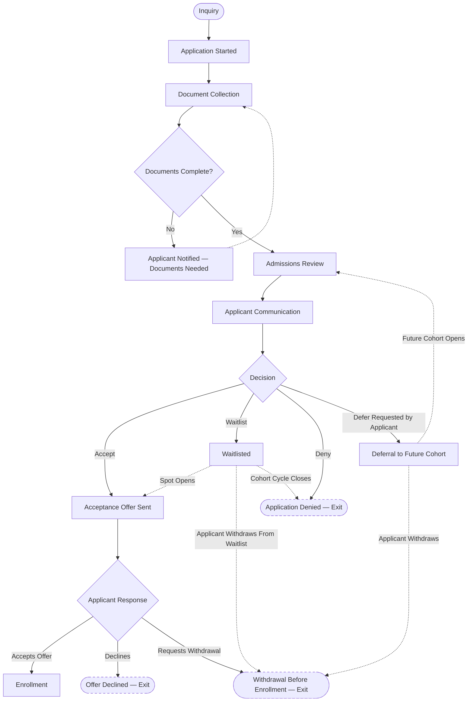

# Admissions Workflows

**Status:** Draft
**Milestone:** 3 — Student Journey & Core Platform Workflows
**Date:** 2026-08-07

This document elaborates the admissions portion of the
[Student Lifecycle Workflow](./01-student-lifecycle-workflow.md) (its
"Submit Application" through "Enrollment" span) with full decision
branching: inquiry, application, document collection, review,
communication, decision, enrollment, waitlist, deferral, and
pre-enrollment withdrawal.

## Workflow Diagram

## Stage Descriptions

| Stage | Description |
|---|---|
| Inquiry | A prospective student expresses interest, prior to a formal application |
| Application Started | The formal application is initiated |
| Document Collection | Supporting documents (transcripts, identification, prerequisites, etc.) are gathered |
| Admissions Review | Admissions Staff evaluates the completed application |
| Applicant Communication | Status updates are communicated to the applicant throughout |
| Decision | Formal outcome: Accept, Waitlist, Deny, or Defer |
| Enrollment | Applicant accepts the offer and becomes an enrolled Student |
| Waitlist | Applicant is held pending capacity |
| Deferral | Applicant's admission is postponed to a future cohort at their request |
| Withdrawal Before Enrollment | Applicant exits the pipeline before becoming an enrolled Student |

## Decision Branches

1. **Documents Complete?** — incomplete applications loop back to
   Document Collection with applicant notification rather than
   proceeding to review.
2. **Decision (Accept / Waitlist / Deny / Defer)** — the central branch
   point of this workflow.
   - **Accept** → Acceptance Offer Sent.
   - **Waitlist** → held pending capacity; may later resolve to an offer,
     to withdrawal, or to denial if the cohort cycle closes.
   - **Deny** → exits the pipeline. **⚠️ Needs Verification:**
     reapplication policy for denied applicants is not yet defined.
   - **Defer** → applicant-requested postponement to a future
     admissions cycle; re-enters Admissions Review when that cycle opens.
3. **Applicant Response to Offer** — Accepts (→ Enrollment), Declines
   (→ exit), or Requests Withdrawal (→ exit).

## Roles Involved

Per [Role Definitions](../milestone-2-user-roles-permission-architecture/01-role-definitions.md)
and the [Permission Framework](../milestone-2-user-roles-permission-architecture/02-permission-framework.md):

- **Admissions Staff** — owns Inquiry through Decision communication;
  Create/Edit authority on applications and enrollment status.
- **Program Director** — participates in or approves the Decision step
  for their program, per
  [Role Hierarchy §Approval Relationships](../milestone-2-user-roles-permission-architecture/03-role-hierarchy.md).
  **⚠️ Needs Verification:** exact division of authority between
  Admissions Staff and Program Director on the Decision step.
- **Administrator** — institution-wide oversight and reporting on
  admissions activity; approval authority per the Permission Framework.
- **Prospective Student / Applicant** — not yet a "Student" role in the
  platform sense until Enrollment; interacts through inquiry and
  application surfaces.

## Current / Planned / Future

| Element | Status |
|---|---|
| Inquiry → Document Collection | **Planned** |
| Admissions Review → Decision | **Planned** |
| Accept / Deny branches | **Planned** |
| Waitlist handling | **Planned** |
| Deferral to a future cohort | **Planned**, exact re-entry mechanics **⚠️ Needs Verification** |
| Withdrawal before enrollment | **Planned** |
| Automated document-completeness checking | **Future** |
| Applicant self-service status portal detail beyond basic status tracking | **Future** |
| Multi-program simultaneous application handling (one applicant applying to more than one program at once) | **Future**, **⚠️ Needs Verification** whether this is supported at all |

## ⚠️ Needs Verification (Summary)

- Reapplication policy after denial.
- Exact Decision approval authority (Admissions Staff vs. joint with
  Program Director/Administrator) — this document assumes Admissions
  Staff drives the process with Program Director input, consistent with
  [Role Definitions](../milestone-2-user-roles-permission-architecture/01-role-definitions.md),
  but the final approval line is not yet confirmed against
  Minara-Master-Plan.
- Deferral re-entry mechanics (does a deferred applicant re-enter at
  Admissions Review, or skip directly to a new Decision?).
- Whether an applicant can apply to multiple programs/schools
  concurrently.
