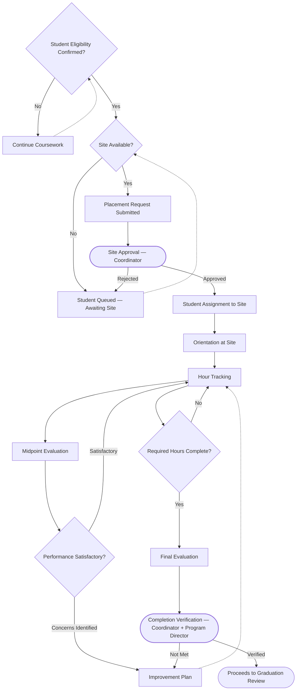

# Externship Management Workflow

**Status:** Draft
**Milestone:** 3 — Student Journey & Core Platform Workflows
**Date:** 2026-08-07

This document elaborates the externship/clinical placement portion of
the [Student Lifecycle Workflow](./01-student-lifecycle-workflow.md)
(its "Externship Eligibility" through "Externship Completion" span),
covering site management, placement, hour tracking, and evaluation.

## Workflow Diagram

*"Proceeds to Graduation Review" connects forward into the
[Certificate & Graduation Workflow](./05-certificate-graduation-workflow.md).*

## Stage Descriptions

| Stage | Description |
|---|---|
| Student Eligibility | Confirmation the student has met academic prerequisites for placement |
| Site Availability | Whether a suitable externship/clinical site currently has capacity |
| Placement Request | Formal request to place a specific student at a specific site |
| Site Approval | Formal approval that the placement is appropriate |
| Student Assignment | Student is confirmed to a specific site |
| Orientation | Student is oriented to site-specific expectations and requirements |
| Hour Tracking | Ongoing logging of clinical/externship hours |
| Midpoint Evaluation | Mid-placement performance check-in |
| Final Evaluation | End-of-placement performance assessment |
| Completion Verification | Formal confirmation that placement requirements are fully met |

## Responsibilities by Role

| Stage | Student | Clinical Coordinator | Employer (Site) | Faculty |
|---|---|---|---|---|
| Eligibility Confirmation | Provides prerequisite completion evidence (via existing coursework record) | Confirms eligibility, in coordination with Program Director | — | Supplies progress/performance data that feeds eligibility |
| Site Availability | — | Maintains and monitors site capacity | Communicates capacity/availability | — |
| Placement Request | May indicate preferences (**⚠️ Needs Verification** whether student input is formal or informal) | Initiates the request | — | — |
| Site Approval | — | Approves | Confirms willingness to host | — |
| Student Assignment | Acknowledges assignment | Confirms assignment | Receives assigned student | — |
| Orientation | Completes site orientation | Coordinates scheduling | Delivers site-specific orientation | — |
| Hour Tracking | Logs hours | Reviews/approves logged hours | Verifies hours where required | — |
| Midpoint Evaluation | Receives feedback | Facilitates and records | Provides evaluation input | May be consulted on academic standing |
| Final Evaluation | Receives feedback | Facilitates and records | Provides evaluation input | May be consulted on academic standing |
| Completion Verification | — | Verifies, jointly with Program Director | Confirms hours/evaluation are final | — |

*Faculty involvement in externship is intentionally limited — this is
primarily a Coordinator/Employer process, with Faculty as a data source
on academic standing rather than a primary actor, consistent with
[Role Definitions](../milestone-2-user-roles-permission-architecture/01-role-definitions.md).*

## Decision Points

1. **Student eligibility confirmed?** — gates entry into the placement
   pipeline; ineligible students continue coursework and re-check later.
2. **Site available?** — an eligible student without an available site
   is queued rather than blocked outright.
3. **Site approval outcome** — a rejected placement request returns the
   student to the queue rather than ending the process.
4. **Performance satisfactory (midpoint)?** — concerns trigger an
   improvement plan rather than automatic removal from placement.
5. **Required hours complete?** — gates progression to Final Evaluation.
6. **Completion verification outcome** — unmet requirements route to an
   improvement plan; verified completion proceeds to graduation review.

## Approval Gates

- **Site Approval** — Externship/Clinical Coordinator, per the
  [Permission Framework](../milestone-2-user-roles-permission-architecture/02-permission-framework.md).
- **Completion Verification** — joint Coordinator + Program Director
  sign-off, consistent with
  [Role Hierarchy §Approval Relationships](../milestone-2-user-roles-permission-architecture/03-role-hierarchy.md).

## Current / Planned / Future

| Element | Status |
|---|---|
| Eligibility confirmation → Placement request → Site approval | **Planned** |
| Student assignment → Orientation → Hour tracking | **Planned** |
| Midpoint and Final Evaluation | **Planned** |
| Completion Verification gate | **Planned** |
| Improvement plan loop | **Planned**, escalation policy beyond improvement plan **⚠️ Needs Verification** |
| Site capacity forecasting / waitlist queuing detail | **Future** |
| Employer self-service hour verification | **Future** (see [Permission Framework](../milestone-2-user-roles-permission-architecture/02-permission-framework.md) — Employer Hours Logs access) |
| Automated eligibility computation from academic record | **Future** |

## ⚠️ Needs Verification

- Whether students have any formal input into site preference/matching,
  or placement is entirely Coordinator-driven.
- What happens when a student fails to meet requirements even after an
  improvement plan (e.g., re-placement vs. program dismissal) — depends
  on Minara-Master-Plan academic/clinical policy.
- Whether externship requirements (hours, evaluation criteria) are
  uniform across programs or program-specific; this document assumes the
  latter but the actual source of truth is Minara-Curriculum.
