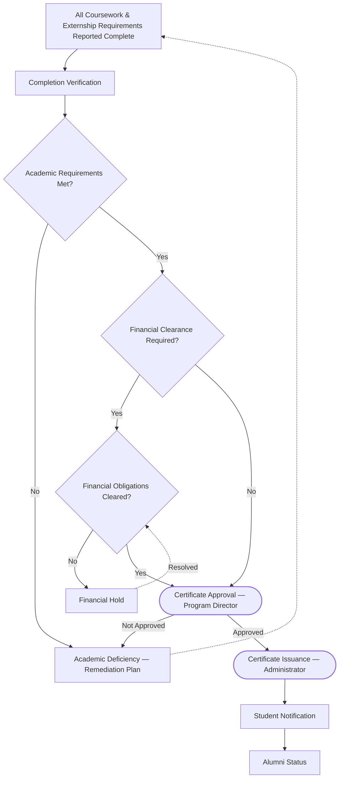

# Certificate & Graduation Workflow

**Status:** Draft
**Milestone:** 3 — Student Journey & Core Platform Workflows
**Date:** 2026-08-07

This document elaborates the final portion of the
[Student Lifecycle Workflow](./01-student-lifecycle-workflow.md) (its
"Graduation Review" through "Alumni Transition" span): how program
completion is verified, cleared, approved, and formally recognized.

## Workflow Diagram

## Stage Descriptions

| Stage | Description | Responsible Role |
|---|---|---|
| Completion Verification | Confirms all academic and (where applicable) externship requirements have been reported complete | Program Director |
| Academic Review | Formal check that academic requirements meet program standards | Program Director |
| Financial Clearance | Confirms outstanding financial obligations, where applicable, are resolved | Administrator |
| Certificate Approval | Formal approval gate for issuing a credential | Program Director |
| Certificate Issuance | Formal, institution-of-record issuance of the certificate | Administrator |
| Student Notification | Student is informed of completion and receives their certificate | Administrator/Student Portal |
| Alumni Status | Student's platform status transitions from active learner to alumnus | Administrator |

## Decision Points

1. **Academic requirements met?** — unmet requirements route to a
   remediation plan rather than proceeding toward certification.
2. **Financial clearance required?** — not assumed to apply to every
   program or every student. **⚠️ Needs Verification:** whether
   financial clearance is a universal graduation gate or program/policy
   specific.
3. **Financial obligations cleared?** — an unresolved hold blocks
   Certificate Approval until resolved, but does not itself constitute
   an academic deficiency.
4. **Certificate Approval outcome** — a not-approved outcome returns the
   student to the deficiency/remediation path, preserving a single
   source of truth for "what's blocking graduation."

## Approval Gates

- **Certificate Approval** — Program Director confirms the student has
  met all program completion requirements (academic and, where
  applicable, externship/financial), per the
  [Permission Framework](../milestone-2-user-roles-permission-architecture/02-permission-framework.md).
- **Certificate Issuance** — Administrator performs the institutional,
  system-of-record act of issuing the certificate, consistent with
  [Role Hierarchy §Approval Relationships](../milestone-2-user-roles-permission-architecture/03-role-hierarchy.md).

This two-step split (Program Director approves academic readiness;
Administrator issues the credential of record) mirrors the general
principle in Milestone 2 that academic judgment and institutional
recordkeeping are held by different roles.

## Current / Planned / Future

| Element | Status |
|---|---|
| Completion Verification → Academic Review | **Planned** |
| Financial Clearance gate | **Planned**, applicability scope **⚠️ Needs Verification** |
| Certificate Approval → Certificate Issuance | **Planned** |
| Student Notification | **Planned** |
| Alumni status transition (status change only) | **Planned** |
| Digital/verifiable credential format for certificates | **Future** — this document does not assume any particular certificate technology, per [Scope Boundaries](../milestone-1-product-vision-platform-strategy/09-scope-boundaries.md) (no vendor selection) |
| Employer-facing certificate sharing (student-initiated) | **Future**, see [Permission Framework](../milestone-2-user-roles-permission-architecture/02-permission-framework.md) |
| Alumni portal capabilities beyond status change | **Future**, see [Long-Term Platform Vision](../milestone-1-product-vision-platform-strategy/07-long-term-platform-vision.md) |
| Continuing education / re-engagement workflows for alumni | **Future** |

## ⚠️ Needs Verification

- Whether financial clearance is a hard graduation requirement for all
  programs, or configurable per program/policy.
- Whether Certificate Approval requires only Program Director sign-off,
  or additional institutional review (e.g., a Registrar-equivalent
  function or academic standards committee) per Minara-Master-Plan.
- What, concretely, "Alumni Status" grants or changes about a person's
  platform access — this document treats it as a status label; whether
  it carries ongoing portal access is not yet defined.
