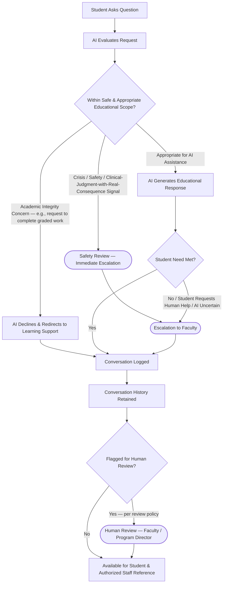

# AI Learning Assistant Workflow

**Status:** Draft
**Milestone:** 3 — Student Journey & Core Platform Workflows
**Date:** 2026-08-07

This document describes how the AI Learning Assistant is meant to
operate within Minara-LMS, operationalizing
[Guiding Principles §10 (Human-Reviewed AI Workflows)](../milestone-1-product-vision-platform-strategy/03-guiding-principles.md).
It describes a **conceptual interaction and escalation model**, not an
AI system design, model selection, or prompt architecture — those are
implementation concerns for a later, more technical milestone.

## Governing Principle

**The AI Learning Assistant supports learning. It does not replace
faculty academic judgment, does not make unsupervised decisions with
academic or clinical consequence, and does not stand in for a Faculty
Instructor, Program Director, or clinical supervisor.** Every workflow
below is a specific application of that constraint.

## Workflow Diagram

## Stage Descriptions

| Stage | Description |
|---|---|
| Student Asks Question | A Student initiates a request within the AI Learning Assistant surface of the Student Portal |
| AI Evaluates Request | The request is assessed against scope-of-assistance and safety criteria before a substantive response is generated |
| Safety Review | An immediate-escalation path for requests signaling crisis, self-harm, or a clinical-judgment question with real patient-safety consequence — these are not treated as ordinary study questions |
| Educational Response | The AI provides learning support (explanation, practice, study guidance) within its appropriate scope |
| Escalation to Faculty | Requests the AI cannot adequately or appropriately handle are routed to a human |
| Conversation History | Every interaction is retained as a record |
| Human Review | A defined subset of conversations (see below) is reviewed by a human |

## Decision Points

1. **Within safe and appropriate educational scope?** — the first and
   most important gate. Three outcomes:
   - **Academic integrity concern** (e.g., a request to complete graded
     work on the student's behalf) — the AI declines to do the work and
     redirects the student toward legitimate learning support, rather
     than silently refusing or complying.
   - **Crisis/safety/clinical-judgment signal** — routed immediately to
     Safety Review/human escalation, bypassing ordinary AI response
     generation. This includes signals of personal crisis or self-harm,
     and clinical questions where an incorrect AI answer could plausibly
     affect real patient safety (relevant given Minara's health sciences
     context).
   - **Appropriate for AI assistance** — proceeds to a normal educational
     response.
2. **Student need met?** — if the AI's response does not resolve the
   student's need, if the student explicitly asks for a human, or if the
   AI itself is uncertain, the workflow escalates to Faculty rather than
   continuing to iterate indefinitely with the AI alone.
3. **Flagged for human review?** — a policy-driven subset of
   conversations (not necessarily all of them) is routed to human review
   after the fact. **⚠️ Needs Verification:** the specific criteria for
   what gets flagged (e.g., all escalations, a random sample, all
   conversations touching clinical topics) are not yet defined.

## Escalation to Faculty

Escalation is the mechanism that keeps the AI Learning Assistant
subordinate to faculty academic judgment in practice, not just in
principle. Per [Role Definitions](../milestone-2-user-roles-permission-architecture/01-role-definitions.md)
and the [Permission Framework](../milestone-2-user-roles-permission-architecture/02-permission-framework.md),
Faculty Instructors (and, for safety-critical escalations, potentially
Program Directors or other designated staff — **⚠️ Needs Verification**)
are the human backstop. An escalation is not merely a notification the
AI generates and forgets — it is expected to surface as an actionable
item for the receiving human, though the specific mechanism (e.g.,
through Messaging, per the Permission Framework's Communication domain)
is left to a later technical milestone.

## Conversation History & Human Review Principles

- **Every conversation is retained.** Consistent with the
  [Audit and Accountability Framework](../milestone-2-user-roles-permission-architecture/05-audit-accountability-framework.md),
  AI Learning Assistant conversations are treated as records subject to
  the same attribution and retention expectations as other platform
  activity, with the Student as the account of record and the AI
  interaction logged as a system-generated event.
- **The AI is never the accountable party.** Any AI-influenced outcome
  that affects a student's academic record requires the reviewing human
  (Faculty Instructor or Program Director) to be the accountable actor
  of record, per
  [Guiding Principles §10](../milestone-1-product-vision-platform-strategy/03-guiding-principles.md).
- **Access to conversation history** follows the Permission Framework's
  Communication domain: the Student who had the conversation, and
  Administrators for audit purposes, per current conceptual scope.
  **⚠️ Needs Verification:** whether a Student's own Faculty Instructor
  or Program Director should have visibility into that student's AI
  conversation history (beyond an explicit escalation) is not yet
  resolved — this has real implications for student trust in the
  assistant and should be confirmed deliberately, not assumed.

## Current / Planned / Future

| Element | Status |
|---|---|
| Student asks question → AI generates educational response (ordinary case) | **Planned** |
| Academic-integrity-concern detection and redirect | **Planned**, specific detection approach **Future** (implementation-agnostic at this stage) |
| Crisis/safety escalation path | **Planned** — treated as a priority requirement given the stakes, though the operational detail of "who is notified and how fast" is **⚠️ Needs Verification** |
| Escalation to Faculty (general, non-crisis) | **Planned** |
| Conversation history retention | **Planned** |
| Systematic human review of a defined subset of conversations | **Planned**, exact review criteria **Future** |
| Faculty/Program Director visibility into non-escalated conversation history | **Future**, pending the trust/privacy question noted above |
| AI-assisted early-warning signals to Faculty (e.g., patterns suggesting a struggling student) | **Future** |

## ⚠️ Needs Verification (Summary)

- Exact criteria for what constitutes a "crisis/safety" signal requiring
  immediate escalation, and who receives that escalation.
- Criteria for flagging conversations for systematic human review.
- Whether Faculty/Program Directors have any standing visibility into a
  student's AI conversations absent an explicit escalation.
- Institutional policy (from Minara-Master-Plan) on acceptable AI use in
  a health sciences education context, which should ultimately govern
  the "appropriate educational scope" boundary drawn in this document.
