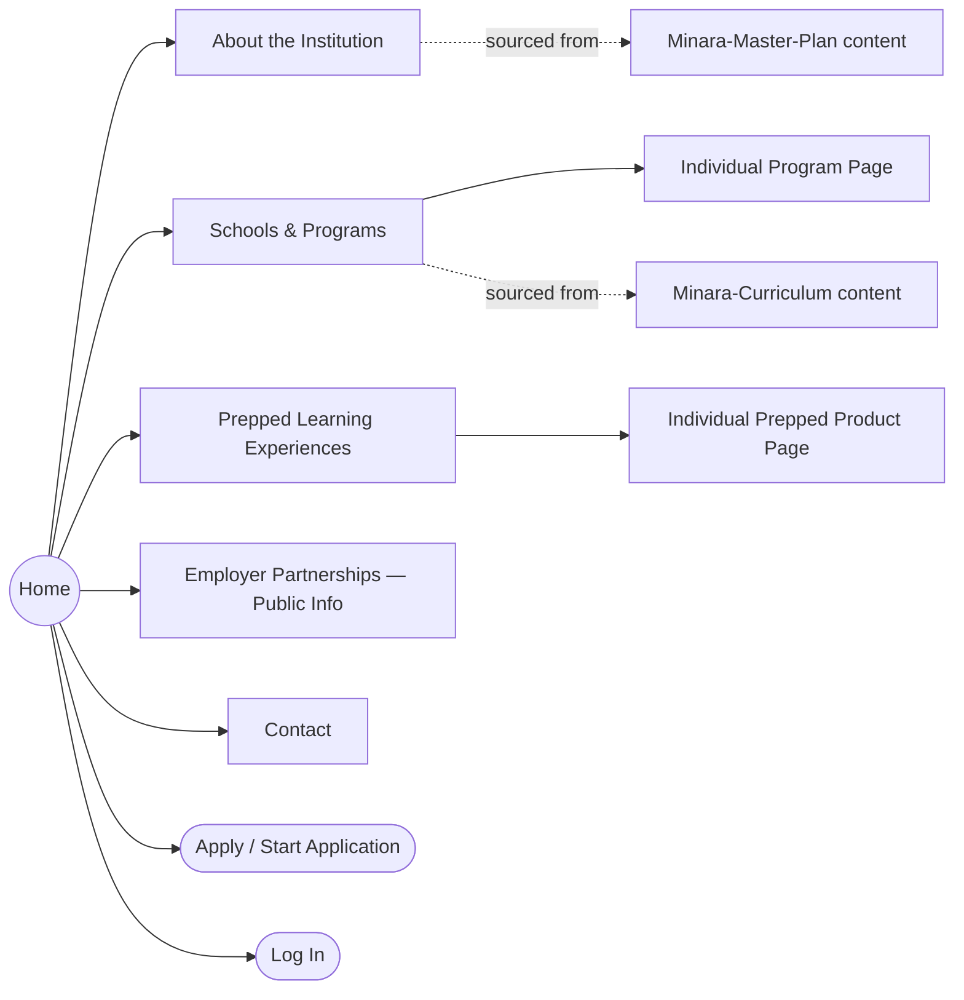
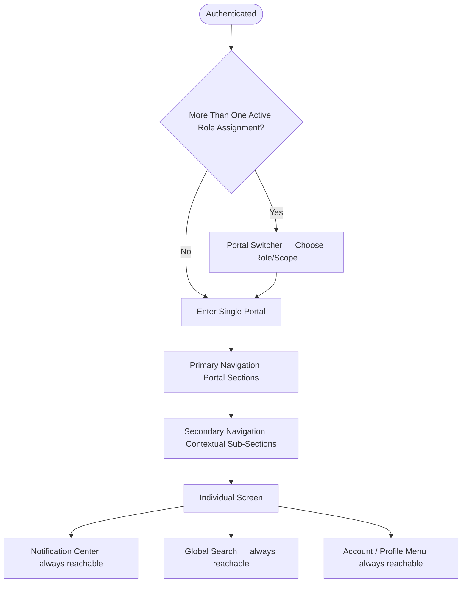

# Global Navigation Framework

**Status:** Draft
**Milestone:** 4 — Information Architecture & User Experience
**Date:** 2026-08-07

This document defines the navigational shell of Minara-LMS: the
structure every portal in this milestone is built inside of. It covers
public (unauthenticated) navigation, the authenticated shell, the
primary/secondary navigation pattern, and the platform's philosophy for
breadcrumbs, search, and notifications. It defines structure and
behavior in concept only — no visual layout, styling, or component
choices.

## 1. Public Website Navigation

The public website is the unauthenticated, SSR-oriented surface described
in [Guiding Principles §5](../milestone-1-product-vision-platform-strategy/03-guiding-principles.md).
Its job is to move a prospective student (or prospective Employer
Partner) from "discovering Minara" to "starting an application" — the
opening stretch of the
[Student Lifecycle Workflow](../milestone-3-student-journey-core-workflows/01-student-lifecycle-workflow.md).

**Notes:**
- "About the Institution" content is sourced from Minara-Master-Plan
  (vision, governance, accreditation status as publicly appropriate);
  Minara-LMS delivers it but does not author it, per
  [Scope Boundaries](../milestone-1-product-vision-platform-strategy/09-scope-boundaries.md).
- "Schools & Programs" pages are sourced from Minara-Curriculum content
  for program descriptions, but the *page itself* (structure, comparison
  across programs, calls to action) is an LMS concern, since it is the
  entry point into the Admissions workflow.
- Prepped products are represented as their own top-level entry, since
  they are learner-facing products in their own right (see
  [Supported Schools and Programs](../milestone-1-product-vision-platform-strategy/06-supported-schools-and-programs.md)),
  while remaining powered by the same platform.
- "Apply" and "Log In" are the two exits from the public site into
  authenticated territory — Apply leads into the
  [Admissions Workflows](../milestone-3-student-journey-core-workflows/03-admissions-workflows.md);
  Log In leads into the authenticated shell below.

## 2. The Authenticated Shell

Once a user authenticates, they enter a shell common to every portal:
a **Portal Switcher** (for users holding more than one role assignment,
per the
[Multi-School and Multi-Program Access Model](../milestone-2-user-roles-permission-architecture/04-multi-school-multi-program-access-model.md)),
**Primary Navigation** (the portal's top-level sections), and
**Secondary Navigation** (contextual sub-sections within whatever
primary section is active).

**Notes:**
- The **Portal Switcher** exists specifically because one platform
  identity can hold multiple role assignments (e.g., a person who is
  both Faculty Instructor in one program and Program Director in
  another). Switching portals does not require re-authentication; it
  changes which primary navigation and permission scope is active.
  **⚠️ Needs Verification:** whether switching is a deliberate,
  explicit action (as modeled) or the platform should instead present a
  single, role-merged view — this is a real UX decision with permission
  implications and should be confirmed deliberately.
- **Notifications**, **Search**, and the **Profile/Account menu** are
  modeled as always-reachable, independent of Primary/Secondary
  Navigation — they are the exceptions to the section-based navigation
  pattern.

## 3. Primary Navigation

Primary Navigation is the portal-level table of contents: the fixed set
of top-level sections for the active portal (e.g., for the Student
Portal: Dashboard, My Courses, Assignments, Grades, …, detailed in
[Student Portal](./02-student-portal.md)). Each portal document in this
milestone defines its own Primary Navigation list, but all follow the
same rules:

- Primary Navigation reflects the **role**, not the **person** — a
  person with two role assignments sees two different Primary
  Navigation sets, one per portal, never a merged list.
- Primary Navigation items map to the top-level screens catalogued in
  each portal document and in the
  [Screen Inventory](./09-screen-inventory.md).
- Primary Navigation is presented consistently regardless of the
  specific school, program, or cohort a role assignment is scoped to —
  scope narrows *what data* appears within a section, not *which
  sections exist* (see
  [Multi-School and Multi-Program Access Model](../milestone-2-user-roles-permission-architecture/04-multi-school-multi-program-access-model.md)).

## 4. Secondary Navigation

Secondary Navigation is contextual: it appears once a user is inside a
Primary Navigation section and exposes that section's own sub-structure.
For example, within a Faculty Instructor's "My Courses" primary section,
secondary navigation might move between that course's Roster, Gradebook,
and Content — all detailed in
[Faculty Portal](./03-faculty-portal.md). Secondary Navigation does not
have a fixed, platform-wide shape; each Primary Navigation section
defines its own.

## 5. Breadcrumb Philosophy

Breadcrumbs exist to answer one question at any point in the platform:
**"Where am I, structurally?"** They reflect the same structural
hierarchy defined in
[Role Hierarchy §Program-Level Structural Hierarchy](../milestone-2-user-roles-permission-architecture/03-role-hierarchy.md)
(Institution → School → Program → Cohort → Section/Course), narrowed to
whatever level is relevant to the current screen, plus the current
screen's own position within its portal's navigation.

**Principle:** a breadcrumb should let a user go back up exactly the
structure they came down — it is a navigational aid grounded in the
platform's actual data hierarchy, not a decorative trail of prior clicks.

**⚠️ Needs Verification:** whether breadcrumbs should also reflect
*navigation history* (where the user actually came from) in addition to
structural position, for cases where those two things diverge (e.g.,
reaching a student's Grade Detail screen from a search result rather
than by drilling down through Cohort → Section).

## 6. Search Philosophy

Search is scoped to what a role can legitimately see, per the
[Permission Framework](../milestone-2-user-roles-permission-architecture/02-permission-framework.md) —
it is never a way to discover data outside a role's granted access.
Beyond that constraint:

- **Student:** searches within their own courses, content, messages, and
  (conceptually) can ask the AI Learning Assistant natural-language
  questions as a parallel, distinct interaction — see
  [AI Learning Assistant Workflow](../milestone-3-student-journey-core-workflows/06-ai-learning-assistant-workflow.md).
- **Faculty / Program Director / Coordinator:** search is scoped to
  their role assignment(s) (section, program) — e.g., finding a specific
  student within their own cohort.
- **Administrator:** search can span the full institution-wide scope
  their role carries.
- **Employer Partner:** search is scoped to their own organization's
  placement/evaluation relationships.

**⚠️ Needs Verification:** whether search is a single global search
box per portal (as modeled) or section-scoped search boxes (e.g., a
separate search within Messages vs. within Course content) — this is an
open question pending further design work, not yet a technical one.

## 7. Notification Philosophy

Notifications surface events a role needs to act on or be aware of, and
are the connective tissue between the Milestone 3 workflows and the
navigation structure: an approval gate, an escalation, a status change,
or a message all generate one.

**Principles:**
- Every notification traces back to a specific event in a
  [Milestone 3 workflow](../milestone-3-student-journey-core-workflows/README.md) —
  notifications are not a separate, ungoverned communication channel.
- Notifications respect role scope: a Program Director is notified about
  events within their program, not institution-wide, unless the event is
  explicitly institution-wide (an Administrator concern).
- A **Notification Center** is always reachable from the authenticated
  shell (see §2), independent of which Primary/Secondary Navigation
  section is active.
- Notifications are logged consistently with the
  [Audit and Accountability Framework](../milestone-2-user-roles-permission-architecture/05-audit-accountability-framework.md)
  where they relate to a record of consequence (e.g., a grade approval
  notification is tied to the same audit trail as the approval itself).

**⚠️ Needs Verification:** delivery channels beyond in-app (e.g., email,
SMS, push) are not addressed here — that is a vendor/technical decision
explicitly out of scope for this milestone, and is noted as **Future** in
the [Screen Inventory](./09-screen-inventory.md)'s Notification Settings
screen.

## Current / Planned / Future

| Element | Status |
|---|---|
| Public website navigation structure | **Planned** |
| Authenticated shell: Primary + Secondary Navigation pattern | **Planned** |
| Portal Switcher for multi-role users | **Planned**, exact interaction model **⚠️ Needs Verification** |
| Breadcrumb reflecting structural hierarchy | **Planned** |
| Role-scoped search (single box per portal) | **Planned** |
| In-app Notification Center | **Planned** |
| Global, cross-portal unified search (e.g., an Administrator searching across all portals at once) | **Future** |
| Multi-channel notification delivery (email, SMS, push) | **Future** — see [Screen Inventory](./09-screen-inventory.md) |
| Navigation history-aware breadcrumbs | **Future**, pending the open question above |

## ⚠️ Needs Verification (Summary)

- Whether the Portal Switcher is an explicit user action or the platform
  should merge multi-role views.
- Whether breadcrumbs should reflect navigation history in addition to
  structural position.
- Whether search should be a single global box per portal or
  section-scoped.
- Notification delivery channels beyond in-app.
