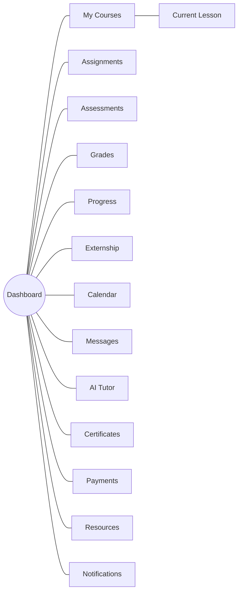

# Student Portal

**Status:** Draft
**Milestone:** 4 — Information Architecture & User Experience
**Date:** 2026-08-07

The Student Portal is the primary surface for the role defined in
[Role Definitions §1 (Student)](../milestone-2-user-roles-permission-architecture/01-role-definitions.md).
It is the portal every other portal in this milestone ultimately exists
to support — most Faculty, Program Director, Admissions, Coordinator,
Employer, and Administrator screens produce something a Student
eventually sees here.

## Primary Navigation

Dashboard · My Courses · Assignments · Assessments · Grades · Progress ·
Externship · Calendar · Messages · AI Tutor · Certificates · Payments ·
Resources · Notifications · Profile & Settings · Support

*My Courses is the only primary item with a defined secondary drill-down
(into Current Lesson); the remaining items are largely flat, consistent
with a Student's relatively narrow, self-scoped access under the
[Permission Framework](../milestone-2-user-roles-permission-architecture/02-permission-framework.md).*

---

### Dashboard

- **Purpose:** The Student's home screen — a single-glance summary of
  what needs attention across every enrolled program.
- **Navigation:** Landing screen after login; always reachable as the
  first Primary Navigation item.
- **Key Information:** Active courses and next lessons, upcoming
  deadlines, recent grades/feedback, outstanding payment items,
  unread messages/notifications, externship status (if applicable).
- **Relationships:** Aggregates content surfaced in more detail on My
  Courses, Assignments, Grades, Payments, and Notifications.
- **Future Expansion:** Personalized recommendations (e.g., AI-suggested
  study focus) — **Future**, dependent on
  [AI Learning Assistant Workflow](../milestone-3-student-journey-core-workflows/06-ai-learning-assistant-workflow.md)
  maturity.

### My Courses

- **Purpose:** Entry point into every course the Student is currently
  enrolled in, across every program/school they participate in.
- **Navigation:** Primary Navigation item; drills into per-course
  content and, further, into Current Lesson.
- **Key Information:** Enrolled courses, grouped by program where a
  Student spans more than one (per the
  [Multi-School and Multi-Program Access Model](../milestone-2-user-roles-permission-architecture/04-multi-school-multi-program-access-model.md)),
  each with overall progress and next action.
- **Relationships:** Feeds into Current Lesson, Assignments,
  Assessments, and Progress. Reflects Cohort Assignment from the
  [Student Lifecycle Workflow](../milestone-3-student-journey-core-workflows/01-student-lifecycle-workflow.md).
- **Future Expansion:** Course-level discussion/community features —
  **Future**.

### Current Lesson

- **Purpose:** The active learning surface — where a Student actually
  consumes curriculum content (delivered from Minara-Curriculum, per
  [Scope Boundaries](../milestone-1-product-vision-platform-strategy/09-scope-boundaries.md))
  and marks progress.
- **Navigation:** Reached via My Courses; secondary navigation moves
  between modules/lessons within the active course.
- **Key Information:** Lesson content, completion state, embedded
  learning objects (video, reading, interactive elements per the
  Learning Objects workflow area in the
  [Platform Workflow Catalog](../milestone-3-student-journey-core-workflows/07-platform-workflow-catalog.md)).
- **Relationships:** Completion here drives Progress and unlocks
  subsequent Assignments/Assessments.
- **Future Expansion:** Offline/downloadable lesson access — **Future**.

### Assignments

- **Purpose:** Where a Student views, completes, and submits assigned
  work.
- **Navigation:** Primary Navigation item; can also be reached
  contextually from My Courses/Current Lesson.
- **Key Information:** Assignment instructions, due dates, submission
  status, and (once graded) linkage to Grades.
- **Relationships:** Directly implements the Student-facing side of
  [Faculty Workflows §Assignment Review](../milestone-3-student-journey-core-workflows/02-faculty-workflows.md).
- **Future Expansion:** Peer-review assignment types — **Future**.

### Assessments

- **Purpose:** Where a Student takes graded assessments (quizzes, exams,
  per the [Platform Workflow Catalog](../milestone-3-student-journey-core-workflows/07-platform-workflow-catalog.md)).
- **Navigation:** Primary Navigation item; also reachable from My
  Courses.
- **Key Information:** Available/upcoming assessments, time limits or
  attempt rules where applicable, completion status.
- **Relationships:** Results feed Grades and Progress.
- **Future Expansion:** Distinct Quiz vs. Exam experiences (e.g.,
  proctoring) — **Future**, per
  [Platform Workflow Catalog](../milestone-3-student-journey-core-workflows/07-platform-workflow-catalog.md).

### Grades

- **Purpose:** The Student's own gradebook — every graded item across
  every enrolled course.
- **Navigation:** Primary Navigation item.
- **Key Information:** Per-assignment/assessment grades, course-level
  grade summary, Faculty feedback where attached.
- **Relationships:** Populated by
  [Faculty Workflows §Grade Entry](../milestone-3-student-journey-core-workflows/02-faculty-workflows.md);
  contributes to Graduation Review in the
  [Certificate & Graduation Workflow](../milestone-3-student-journey-core-workflows/05-certificate-graduation-workflow.md).
- **Future Expansion:** Grade trend visualization over time — **Future**.

### Progress

- **Purpose:** A broader view than Grades — overall completion and
  standing across a program, including non-graded milestones.
- **Navigation:** Primary Navigation item.
- **Key Information:** Program completion percentage, standing relative
  to program requirements, externship eligibility status (where
  applicable).
- **Relationships:** Directly reflects the "Progress Monitoring" stage of
  the [Student Lifecycle Workflow](../milestone-3-student-journey-core-workflows/01-student-lifecycle-workflow.md);
  feeds the "Meeting Progress Standards?" decision point there.
- **Future Expansion:** Predictive/at-risk indicators — **Future**,
  dependent on Analytics maturity (see
  [Platform Workflow Catalog](../milestone-3-student-journey-core-workflows/07-platform-workflow-catalog.md)).

### Externship

- **Purpose:** For programs that require one, the Student's window into
  their placement.
- **Navigation:** Primary Navigation item, shown conditionally — only
  for programs where the
  [Student Lifecycle Workflow](../milestone-3-student-journey-core-workflows/01-student-lifecycle-workflow.md)
  branches into externship.
- **Key Information:** Eligibility status, assigned site, orientation
  materials, logged hours, evaluation status.
- **Relationships:** Student-facing view of the
  [Externship Management Workflow](../milestone-3-student-journey-core-workflows/04-externship-management-workflow.md).
- **Future Expansion:** Student self-logging of hours with Coordinator
  verification — **Planned**, per that workflow's Hour Tracking stage.

### Calendar

- **Purpose:** Unified view of dates that matter to the Student —
  deadlines, orientation, externship milestones, cohort events.
- **Navigation:** Primary Navigation item.
- **Key Information:** Assignment/assessment due dates, orientation and
  externship dates, program milestones.
- **Relationships:** Aggregates dates from My Courses, Assignments,
  Assessments, and Externship.
- **Future Expansion:** External calendar sync — **Future** (a vendor
  concern, deliberately unaddressed here).

### Messages

- **Purpose:** Communication with Faculty, Program Director, Admissions
  Staff, or Externship/Clinical Coordinator, per the Communication
  domain of the
  [Permission Framework](../milestone-2-user-roles-permission-architecture/02-permission-framework.md).
- **Navigation:** Primary Navigation item; always reachable notification
  badge per the
  [Global Navigation Framework](./01-global-navigation-framework.md).
- **Key Information:** Conversation threads, scoped to people the
  Student has a legitimate relationship with (course, program,
  placement).
- **Relationships:** Distinct from AI Tutor conversations, which are
  logged and governed separately (see below).
- **Future Expansion:** Group/cohort-wide messaging — **Future**.

### AI Tutor

- **Purpose:** The Student-facing surface for the AI Learning Assistant.
- **Navigation:** Primary Navigation item.
- **Key Information:** Conversational interface, own conversation
  history, visible indication when a conversation has been escalated to
  Faculty.
- **Relationships:** Directly implements the
  [AI Learning Assistant Workflow](../milestone-3-student-journey-core-workflows/06-ai-learning-assistant-workflow.md) —
  this screen is the Student-facing end of that entire workflow.
- **Future Expansion:** Proactive study suggestions — **Future**, see
  that workflow's Current/Planned/Future table.

### Certificates

- **Purpose:** Where a Student views and (eventually) shares credentials
  they've earned.
- **Navigation:** Primary Navigation item.
- **Key Information:** Issued certificates, program completion date,
  issuing Administrator record.
- **Relationships:** Populated at the end of the
  [Certificate & Graduation Workflow](../milestone-3-student-journey-core-workflows/05-certificate-graduation-workflow.md).
- **Future Expansion:** Student-initiated sharing with Employer Partners
  — **Planned**, per the
  [Permission Framework](../milestone-2-user-roles-permission-architecture/02-permission-framework.md).

### Payments

- **Purpose:** Where a Student views obligations, payment history, and
  (conceptually) makes payments.
- **Navigation:** Primary Navigation item.
- **Key Information:** Balance due, payment history, any active
  financial hold (see the
  [Certificate & Graduation Workflow](../milestone-3-student-journey-core-workflows/05-certificate-graduation-workflow.md)'s
  Financial Clearance gate).
- **Relationships:** Gates progression at Enrollment and, where
  applicable, Certificate Issuance in the
  [Student Lifecycle Workflow](../milestone-3-student-journey-core-workflows/01-student-lifecycle-workflow.md).
- **Future Expansion:** Payment plans/installments — **Future**, a
  policy and vendor question out of scope here.

### Resources

- **Purpose:** A catch-all for program- and institution-provided
  reference material not tied to a specific lesson (handbooks, policies,
  support materials).
- **Navigation:** Primary Navigation item.
- **Key Information:** Institutional policy documents (sourced from
  Minara-Master-Plan, delivered not authored by the LMS), program
  handbooks, general reference material.
- **Relationships:** Supports Support (below) by housing self-service
  material.
- **Future Expansion:** Searchable knowledge base — **Future**.

### Notifications

- **Purpose:** The Student's personal notification history, beyond the
  always-reachable Notification Center defined in the
  [Global Navigation Framework](./01-global-navigation-framework.md).
- **Navigation:** Primary Navigation item; also reachable via the
  persistent notification icon in the authenticated shell.
- **Key Information:** Chronological list of platform-generated events
  relevant to the Student (grades posted, messages, approvals,
  deadlines).
- **Relationships:** Surfaces events generated across every other
  screen in this document.
- **Future Expansion:** Notification preference granularity (which event
  types generate which channel) — **Future**, see
  [Global Navigation Framework](./01-global-navigation-framework.md).

### Profile & Settings

- **Purpose:** Personal account management.
- **Navigation:** Reachable via the account/profile menu in the
  authenticated shell, not the Primary Navigation list itself (consistent
  with §2 of the
  [Global Navigation Framework](./01-global-navigation-framework.md)).
- **Key Information:** Personal/contact information, enrollment summary
  across programs, notification preferences, accessibility preferences
  (per [Guiding Principles §3](../milestone-1-product-vision-platform-strategy/03-guiding-principles.md)).
- **Relationships:** The Student's own record within
  [Permission Framework §Platform Administration — User Accounts](../milestone-2-user-roles-permission-architecture/02-permission-framework.md)
  (own-record edit rights only).
- **Future Expansion:** Guardian/delegate access management — **Future**,
  see [Permission Framework](../milestone-2-user-roles-permission-architecture/02-permission-framework.md).

### Support

- **Purpose:** Where a Student gets help — technical, academic, or
  navigational — that doesn't fit neatly into Messages or AI Tutor.
- **Navigation:** Reachable from the authenticated shell, always
  available (consistent with the always-reachable pattern in the
  [Global Navigation Framework](./01-global-navigation-framework.md)).
- **Key Information:** Help articles, contact paths to appropriate
  staff, escalation status.
- **Relationships:** A general-purpose complement to AI Tutor's
  learning-specific escalation path.
- **Future Expansion:** Live chat with support staff — **Future**.

---

## Current / Planned / Future

| Screen | Status |
|---|---|
| Dashboard | **Planned** |
| My Courses / Current Lesson | **Planned** |
| Assignments / Assessments | **Planned** |
| Grades / Progress | **Planned** |
| Externship | **Planned** (conditional on program) |
| Calendar | **Planned** |
| Messages | **Planned** |
| AI Tutor | **Planned** |
| Certificates | **Planned** |
| Payments | **Planned** |
| Resources | **Planned** |
| Notifications | **Planned** |
| Profile & Settings | **Planned** |
| Support | **Planned** |
| Personalized dashboard recommendations | **Future** |
| External calendar sync | **Future** |
| Guardian/delegate access | **Future** |

See the [Screen Inventory](./09-screen-inventory.md) for this same list
tagged Required/Planned/Future alongside every other portal.

## ⚠️ Needs Verification

- Whether Externship appears as a Primary Navigation item for every
  Student or only conditionally, based on program — this document
  assumes conditional visibility.
- Whether AI Tutor and Messages should be more tightly unified (a single
  inbox) or kept as fully separate experiences, given they have
  different accountability models (see the
  [AI Learning Assistant Workflow](../milestone-3-student-journey-core-workflows/06-ai-learning-assistant-workflow.md)).
- The degree of self-service payment functionality (e.g., whether
  Students can set up payment plans themselves) is undefined pending
  institutional financial policy.
