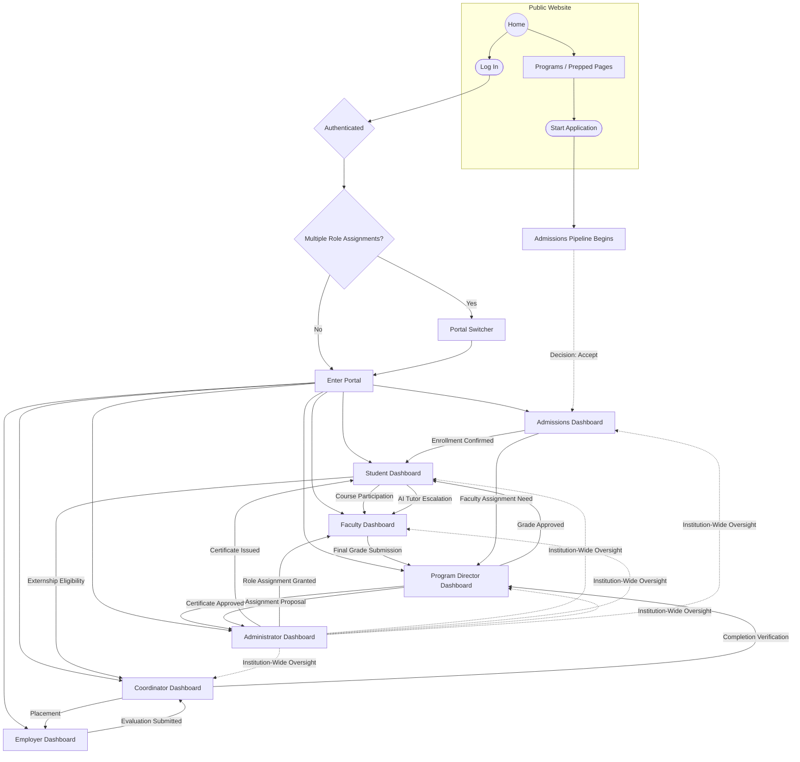

# Navigation Map

**Status:** Draft
**Milestone:** 4 — Information Architecture & User Experience
**Date:** 2026-08-07

This document is the high-level map of how a user moves through the
entire Minara-LMS system: from the public website, through
authentication, into a role's dashboard, through that role's major
workflows, and — where a workflow genuinely crosses role boundaries —
across portals. It sits above the individual portal documents
([02](./02-student-portal.md)–[08](./08-administrator-portal.md)),
which detail navigation *within* a single portal.

## System-Level Navigation Diagram

*Solid arrows represent a user actually moving between screens/portals
or a record moving forward through a workflow. Dashed arrows represent
oversight/visibility relationships (an Administrator's institution-wide
scope) rather than a literal navigation path.*

## Reading the Cross-Portal Movement

Most navigation is **within** a single portal — that's what
[Docs 02–08](./02-student-portal.md) detail. The cross-portal edges
above are the exceptions: places where completing a step in one portal
is what makes a screen in another portal meaningful. Each corresponds to
a specific handoff already defined in a Milestone 3 workflow:

| Crossing | From → To | Workflow Reference |
|---|---|---|
| Admissions decision → enrollment | Admissions Dashboard → Student Dashboard | [Admissions Workflows](../milestone-3-student-journey-core-workflows/03-admissions-workflows.md) |
| Course participation → grading | Student → Faculty | [Faculty Workflows](../milestone-3-student-journey-core-workflows/02-faculty-workflows.md) |
| Final grade submission → approval | Faculty → Program Director | [Faculty Workflows §Approval Points](../milestone-3-student-journey-core-workflows/02-faculty-workflows.md) |
| Grade approved → visible to student | Program Director → Student | [Faculty Workflows](../milestone-3-student-journey-core-workflows/02-faculty-workflows.md) |
| Externship eligibility → placement pipeline | Student → Coordinator | [Externship Management Workflow](../milestone-3-student-journey-core-workflows/04-externship-management-workflow.md) |
| Placement → evaluation | Coordinator → Employer → Coordinator | [Externship Management Workflow](../milestone-3-student-journey-core-workflows/04-externship-management-workflow.md) |
| Completion verification → graduation review | Coordinator → Program Director | [Externship Management Workflow](../milestone-3-student-journey-core-workflows/04-externship-management-workflow.md) |
| Certificate approval → issuance → student record | Program Director → Administrator → Student | [Certificate & Graduation Workflow](../milestone-3-student-journey-core-workflows/05-certificate-graduation-workflow.md) |
| AI Tutor escalation | Student → Faculty | [AI Learning Assistant Workflow](../milestone-3-student-journey-core-workflows/06-ai-learning-assistant-workflow.md) |
| Faculty staffing need → assignment proposal → approval → grant | Admissions/Program Director → Program Director → Administrator → Faculty | [Role Hierarchy](../milestone-2-user-roles-permission-architecture/03-role-hierarchy.md), [Permission Framework](../milestone-2-user-roles-permission-architecture/02-permission-framework.md) |
| Institution-wide oversight | Administrator ⇢ every portal | [Role Definitions §7](../milestone-2-user-roles-permission-architecture/01-role-definitions.md) |

## Public → Authenticated Boundary

The single most important navigational boundary in the system is the
one between the public website and everything behind login — it is the
line the [Student Lifecycle Workflow](../milestone-3-student-journey-core-workflows/01-student-lifecycle-workflow.md)
crosses at "Submit Application" (which begins a relationship with the
platform before a full Student account exists) and again at
"Enrollment" (which establishes the account proper). Applicant-stage
interaction and full Student Portal access are treated as two different
navigational contexts, consistent with
[Role Definitions §1](../milestone-2-user-roles-permission-architecture/01-role-definitions.md)
noting a prospective student is "not yet a platform role."

**⚠️ Needs Verification:** Whether an applicant has *any* authenticated
surface before formal enrollment (e.g., an "Applicant Status" mini-portal
to track their own application) or interacts purely through
Admissions-Staff-mediated communication is not yet defined. This
document assumes the latter (no applicant-facing authenticated portal),
consistent with the Admissions Portal being staff-facing only in
[Admissions Portal](./05-admissions-portal.md); this is flagged, not
settled.

## Current / Planned / Future

| Element | Status |
|---|---|
| Public → Authentication → Portal Switcher → Dashboard flow | **Planned** |
| Admissions → Student handoff | **Planned** |
| Faculty ↔ Program Director grade approval loop | **Planned** |
| Student ↔ Coordinator ↔ Employer externship loop | **Planned** (conditional on program) |
| Certificate approval → issuance → student record chain | **Planned** |
| AI Tutor → Faculty escalation | **Planned** |
| Faculty staffing/assignment chain | **Planned**, propose/approve model itself is **Planned** per Milestone 2 |
| Administrator institution-wide oversight visibility | **Planned** |
| Applicant-facing authenticated status portal | **Future**, pending the Needs Verification note above |

## ⚠️ Needs Verification (Summary)

- Whether applicants have any authenticated surface before enrollment.
- Whether the Portal Switcher (see
  [Global Navigation Framework](./01-global-navigation-framework.md))
  is the right model for users with multiple role assignments, versus a
  merged view.
- Whether additional cross-portal crossings exist that this map has not
  captured — this map should be revisited once Milestone 5+ technical
  work surfaces gaps.
