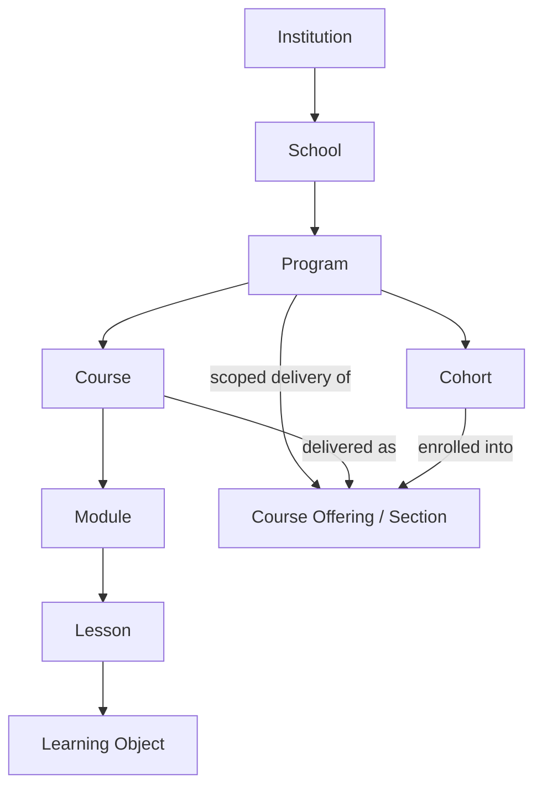
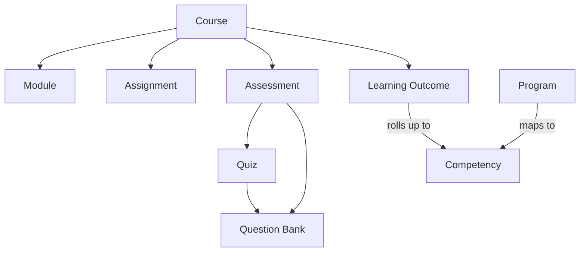
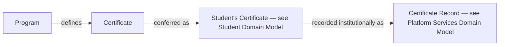

# Academic Domain Model

**Status:** Draft
**Milestone:** 5 — Domain Model & Data Architecture
**Date:** 2026-08-07

The Academic bounded context (see
[Domain-Driven Design Principles](./01-domain-driven-design-principles.md))
covers the structural and curricular concepts that give shape to
everything Minara-LMS delivers: the institution itself, down through
schools, programs, cohorts, courses, and the content within them.

## A Note on Ownership

Several entities below are **authored** in Minara-Curriculum but
**delivered and tracked** in Minara-LMS, per
[Scope Boundaries](../milestone-1-product-vision-platform-strategy/09-scope-boundaries.md).
Where that split applies, the Ownership column distinguishes **Authored
by** (the source of the entity's academic content/definition) from
**Operated by** (who holds the operational, delivery-time record).
Minara-LMS's domain model always needs *some* representation of these
entities — even purely "authored" content — because delivery, progress
tracking, and grading cannot happen against content the platform has no
record of.

## Entities

| Entity | Purpose | Key Relationships | Ownership | Lifecycle |
|---|---|---|---|---|
| **Institution** | The top of the structural hierarchy — Minara Institute of Health Sciences itself | Has many Schools | Authored by Minara-Master-Plan (identity, governance); Operated by Minara-LMS (structural/scoping record) | Effectively singleton today; conceptually: Chartered → Active |
| **School** | An administrative/academic grouping of Programs within the Institution | Belongs to Institution; has many Programs | Authored by Minara-Master-Plan (chartering decision); Operated by Minara-LMS | Proposed → Active → (Suspended / Archived) |
| **Program** | A defined course of study a Student enrolls in and completes (e.g., a Prepped product or a Minara school program) | Belongs to School; has many Cohorts; has many Courses; defines a Certificate | Authored by Minara-Curriculum (curriculum design) and Minara-Master-Plan (accreditation scope); Operated by Minara-LMS | Draft → Active → (Suspended / Retired) |
| **Cohort** | A group of Students moving through a Program together on a shared timeline | Belongs to Program; has many Students (via Enrollment, see [Student Domain Model](./03-student-domain-model.md)); associated with Course offerings | Operated by Minara-LMS (an operational/enrollment concept, not a curricular one) | Planned → Open for Enrollment → Active → Completed → Archived |
| **Course** | A defined unit of curriculum within a Program (e.g., "Pharmacology I") | Belongs to Program; has many Modules; has many Assignments/Assessments; delivered via one or more **Course Offerings** (see note below) | Authored by Minara-Curriculum; Operated by Minara-LMS (delivery record) | Authored/versioned upstream; Operated as Planned → Offered → Retired |
| **Module** | A mid-level grouping of Lessons within a Course | Belongs to Course; has many Lessons | Authored by Minara-Curriculum; Operated by Minara-LMS (delivery reference) | Authored/versioned upstream |
| **Lesson** | The smallest addressable teaching unit within a Module | Belongs to Module; has many Learning Objects | Authored by Minara-Curriculum; Operated by Minara-LMS (delivery + completion tracking) | Authored/versioned upstream; Operated per-student as Not Started → In Progress → Completed |
| **Learning Object** | An individual piece of content within a Lesson (video, reading, interactive element) | Belongs to Lesson | Authored by Minara-Curriculum; Operated by Minara-LMS (delivery) | Authored/versioned upstream |
| **Assessment** | A general graded/evaluative activity; parent concept covering Quiz and other assessment types | Belongs to Course (typically via a Module/Lesson); draws Questions from a Question Bank; produces a Grade (see [Student Domain Model](./03-student-domain-model.md)) | Authored by Minara-Curriculum (design); Operated by Minara-LMS (delivery instance + results) | Authored upstream; Operated as Scheduled → Open → Closed → Graded |
| **Assignment** | A graded activity requiring Student submission and Faculty review (as opposed to auto-gradable Assessments) | Belongs to Course; produces a Submission and a Grade | Authored by Minara-Curriculum (instructions/rubric design); Operated by Minara-LMS (delivery + review) | Authored upstream; Operated as Scheduled → Open → Submitted → Reviewed → Graded |
| **Quiz** | A subtype of Assessment, typically lower-stakes and often auto-gradable | Is a kind of Assessment; draws Questions from a Question Bank | Authored by Minara-Curriculum; Operated by Minara-LMS | Same as Assessment |
| **Question Bank** | A reusable pool of assessment questions | Supplies Questions to Quizzes and other Assessments across one or more Courses | Authored by Minara-Curriculum | Authored/versioned upstream |
| **Competency** | A defined skill or capability a Program (or a set of Courses) is designed to develop — significant for health-sciences accreditation | Program/Course maps to one or more Competencies; Student attainment is tracked (see [Student Domain Model](./03-student-domain-model.md)) | Authored by Minara-Curriculum and Minara-Master-Plan (accreditation-driven) | Authored/versioned upstream |
| **Learning Outcome** | A specific, measurable statement of what a Student should know or be able to do after a Course (or Module) | Belongs to Course; may roll up to one or more Competencies | Authored by Minara-Curriculum | Authored/versioned upstream |
| **Certificate** | The Program-level *definition* of the credential conferred upon successful completion — its name and the requirements it maps to | Defined by Program; conferred instances tracked as the Student's own Certificate (see [Student Domain Model](./03-student-domain-model.md)) and recorded institutionally as a Certificate Record (see [Platform Services Domain Model](./06-platform-services-domain-model.md)) | Authored by Minara-Curriculum/Minara-Master-Plan (what credential this Program leads to); Operated by Minara-LMS (issuance) | Defined upstream as part of Program design |

**⚠️ Needs Verification — "Course Offering" (a.k.a. "Section"):**
Milestones 3 and 4 both refer to a **Section** — the concrete, taught
instance of a Course for a specific Cohort and Faculty Instructor (e.g.,
[Faculty Portal — My Sections](../milestone-4-information-architecture/03-faculty-portal.md)).
This milestone's instructions did not list "Section" as an entity to
define, but the model is incomplete without it: a **Course** (as defined
above) is the curriculum-level concept, while a **Course Offering**
(a.k.a. Section) is the delivery-time instance of that Course — scoped
to a Cohort, taught by one or more Faculty Instructors, with its own
schedule and roster. This document introduces Course Offering as a
necessary Operated-by-Minara-LMS entity so the model reconciles with
Milestones 3–4; see this milestone's summary for other such
reconciliations.

## Structural Hierarchy Diagram

## Curriculum & Assessment Diagram

## Certificate Diagram

*This three-facet modeling of "certificate" (Program-level definition,
Student-held instance, institutional issuance record) is a deliberate
example of bounded-context thinking from
[Document 1](./01-domain-driven-design-principles.md): the same
real-world fact — a credential was earned — is represented differently
in each context because each context needs different things from it.*

## Current / Planned / Future

| Entity | Status |
|---|---|
| Institution, School, Program, Cohort | **Current** — foundational to every other milestone already produced |
| Course, Module, Lesson, Learning Object | **Current** |
| Course Offering / Section | **Current** — necessary to reconcile with Milestones 3–4 |
| Assignment, Assessment, Quiz | **Planned** |
| Question Bank | **Planned** |
| Competency, Learning Outcome | **Planned** — significant for accreditation, per [Guiding Principles §11](../milestone-1-product-vision-platform-strategy/03-guiding-principles.md), but not yet detailed beyond this conceptual definition |
| Certificate (Program-level definition) | **Planned** |
| Versioned curriculum content (multiple active versions of a Course/Module/Lesson) | **Future**, see [Future Data Architecture Considerations](./09-future-data-architecture-considerations.md) |

## ⚠️ Needs Verification

- The exact hand-off mechanism between Minara-Curriculum's authored
  content and Minara-LMS's delivery-time representation of Course,
  Module, Lesson, Learning Object, Assignment, Assessment, and Question
  Bank is not yet defined — this document assumes a conceptual
  "authored upstream, referenced downstream" relationship without
  specifying format or timing (an explicitly deferred technical
  decision).
- Whether Competency and Learning Outcome are truly two distinct levels
  of granularity across all programs, or whether some programs use only
  one, is not yet confirmed against Minara-Curriculum's actual
  curriculum design practice.
- Course Offering/Section, introduced here to reconcile Milestones 3–4,
  should be reviewed by stakeholders as part of this milestone's
  approval, since it is this document's addition rather than an explicit
  instruction.
