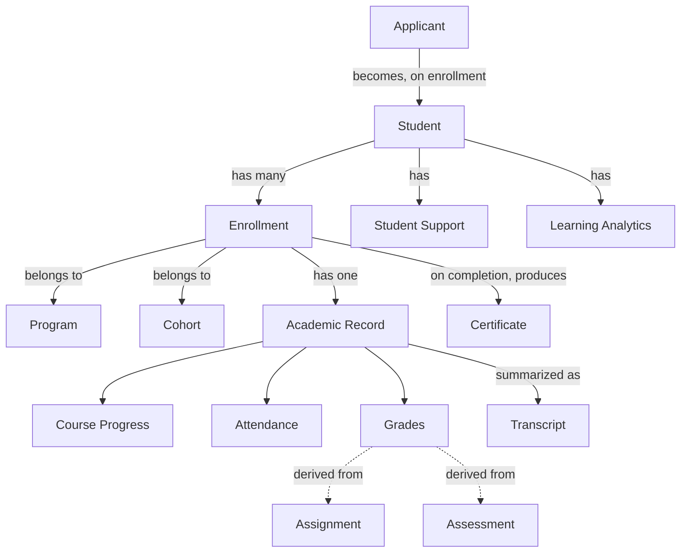
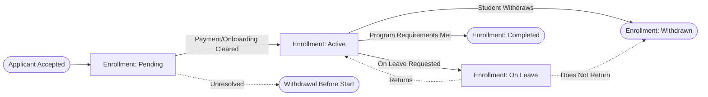

# Student Domain Model

**Status:** Draft
**Milestone:** 5 — Domain Model & Data Architecture
**Date:** 2026-08-07

The Student bounded context (see
[Domain-Driven Design Principles](./01-domain-driven-design-principles.md))
covers a learner's journey from prospective applicant through active
enrollment, academic progress, and eventual credentialing — the entity
backbone of the
[Student Lifecycle Workflow](../milestone-3-student-journey-core-workflows/01-student-lifecycle-workflow.md).

## A Note on "One Learner, Many Enrollments"

Consistent with
[Platform Philosophy](../milestone-1-product-vision-platform-strategy/04-platform-philosophy.md)'s
"one account, one profile, multiple programs," this model treats
**Student** as one record per person's "being a learner at Minara"
relationship, referencing the shared-kernel **User** identity (see
[Platform Services Domain Model](./06-platform-services-domain-model.md)).
A Student may hold **multiple Enrollments** — one per Program they
participate in, concurrently or over time — each with its **own**
Academic Record, Grades, Attendance, and Transcript. The Student is the
aggregation point; the Enrollment is where program-specific academic
history actually lives.

## Entities

| Entity | Purpose | Key Relationships | Lifecycle |
|---|---|---|---|
| **Applicant** | A prospective student's record from first inquiry through an admissions decision | References User (shared kernel, once an account exists); produced/managed by the [Admissions Workflows](../milestone-3-student-journey-core-workflows/03-admissions-workflows.md); converts into a Student upon enrollment | Inquiry → Application Started → Documents Collected → Under Review → Decision (Accepted / Waitlisted / Denied / Deferred) → converts to Student (if enrolled) or Closed |
| **Student** | The anchor record of a person's status as a Minara learner, across every Program they touch | References User (shared kernel); has many Enrollments; has Student Support records; has Learning Analytics | Created at first Enrollment; persists across the person's entire relationship with the institution, including into Alumni status (see [Certificate & Graduation Workflow](../milestone-3-student-journey-core-workflows/05-certificate-graduation-workflow.md)) |
| **Enrollment** | A Student's participation in one specific Program and Cohort | Belongs to Student; belongs to Program and Cohort (see [Academic Domain Model](./02-academic-domain-model.md)); has one Academic Record | Pending (Payment/Onboarding) → Active → (On Leave / Withdrawn) → Completed |
| **Academic Record** | The authoritative academic history for one Enrollment | Belongs to Enrollment; aggregates Course Progress, Grades, Attendance; summarized into a Transcript | Open (while Enrollment is Active) → Finalized (at completion or withdrawal) |
| **Course Progress** | Tracks a Student's completion state through a Course Offering's Modules and Lessons | Belongs to Academic Record; references Lesson completion (see [Academic Domain Model](./02-academic-domain-model.md)) | Not Started → In Progress → Completed, per Lesson, rolling up to a Course-level status |
| **Attendance** | Record of presence at scheduled sessions, where a Course Offering requires it | Belongs to Academic Record; recorded by Faculty (see [Faculty & Administration Domain Model](./04-faculty-administration-domain-model.md)) | Recorded per session; not applicable to every Course Offering |
| **Grades** | The record of scores/evaluations for graded work | Belongs to Academic Record; produced from an Assignment or Assessment (see [Academic Domain Model](./02-academic-domain-model.md)); entered by Faculty | Draft → Submitted → Approved (per [Faculty Workflows §Approval Points](../milestone-3-student-journey-core-workflows/02-faculty-workflows.md)) → (Disputed/Appealed → Revised) |
| **Transcript** | The formal, summarized academic history for an Enrollment (and, in aggregate, for a Student across Enrollments) | Derived from one or more Academic Records; referenced at Graduation Review | Continuously updated while an Enrollment is Active; Finalized upon completion or withdrawal |
| **Certificate** *(Student-held instance)* | The Student's own record of having earned a credential | References the Program's Certificate definition (see [Academic Domain Model](./02-academic-domain-model.md)); produced by the [Certificate & Graduation Workflow](../milestone-3-student-journey-core-workflows/05-certificate-graduation-workflow.md); recorded institutionally as a Certificate Record (see [Platform Services Domain Model](./06-platform-services-domain-model.md)) | Pending → Issued |
| **Student Support** | A record of academic support, remediation, or advising interaction | Belongs to Student (and typically references an Enrollment); may be opened by Faculty, Program Director, or the Student | Opened → In Progress → Resolved / Closed |
| **Learning Analytics** | Derived, aggregate insight about a Student's learning patterns and performance — a computed concept, not a raw record | Derived from Course Progress, Grades, Attendance, and (where relevant) AI Conversation engagement (see [Platform Services Domain Model](./06-platform-services-domain-model.md)) | Continuously computed/refreshed; has no independent lifecycle of its own |

## Relationship Diagram

*Program, Cohort, Assignment, and Assessment are Academic-context
entities, shown here only as relationship targets — their full
definitions live in the
[Academic Domain Model](./02-academic-domain-model.md).*

## Enrollment Lifecycle Detail

*This mirrors, at the entity level, the branching already described in
the [Student Lifecycle Workflow](../milestone-3-student-journey-core-workflows/01-student-lifecycle-workflow.md);
it is not a new decision model, only that workflow's effect on the
Enrollment entity's state.*

## Current / Planned / Future

| Entity | Status |
|---|---|
| Applicant, Student, Enrollment | **Current** — foundational |
| Academic Record, Course Progress, Grades | **Current** |
| Attendance | **Planned** (conditional on Course Offering format) |
| Transcript | **Planned** |
| Certificate (Student-held) | **Planned** |
| Student Support | **Planned** |
| Learning Analytics | **Future** — consistent with Analytics being tagged **Future** in the [Platform Workflow Catalog](../milestone-3-student-journey-core-workflows/07-platform-workflow-catalog.md) |
| "On Leave" as a distinct Enrollment state (vs. only Active/Withdrawn) | **Future** — introduced here as a reasonable real-world state but not explicitly named in Milestone 3's workflow, so flagged rather than assumed settled |

## ⚠️ Needs Verification

- Whether Academic Record is genuinely one-per-Enrollment (this
  document's model) or whether some academic history is meant to be
  visible across a Student's Enrollments (e.g., a prior program's
  completion mattering for eligibility in a new one) — the latter would
  require an additional cross-Enrollment concept not yet defined.
- Whether "On Leave" is a real, supported Enrollment state — it is not
  explicitly named in the
  [Student Lifecycle Workflow](../milestone-3-student-journey-core-workflows/01-student-lifecycle-workflow.md)
  and is introduced here as a plausible real-world necessity, not a
  confirmed requirement.
- Whether a Transcript is program-specific only, or Minara-LMS is
  expected to also produce a consolidated, cross-program transcript —
  ties to the open "SIS of record" question in
  [Scope Boundaries §Needs Verification](../milestone-1-product-vision-platform-strategy/09-scope-boundaries.md).
