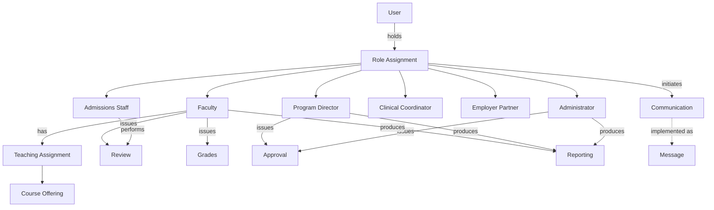

# Faculty & Administration Domain Model

**Status:** Draft
**Milestone:** 5 — Domain Model & Data Architecture
**Date:** 2026-08-07

The Faculty & Administration bounded context (see
[Domain-Driven Design Principles](./01-domain-driven-design-principles.md))
covers the staff-side roles and the recurring activity patterns —
assignment, approval, review, communication, reporting — that appear
across every staff role defined in
[Role Definitions](../milestone-2-user-roles-permission-architecture/01-role-definitions.md).

## A Note on Role Entities

This document does **not** redefine what each role is responsible for —
that is
[Role Definitions](../milestone-2-user-roles-permission-architecture/01-role-definitions.md)'s
job. Instead, it gives each role a domain-level shape: a **Role
Assignment** — the entity-level expression of Milestone 2's
`(Person, Role, Scope)` model (see
[Multi-School and Multi-Program Access Model](../milestone-2-user-roles-permission-architecture/04-multi-school-multi-program-access-model.md)) —
referencing the shared-kernel **User** (see
[Platform Services Domain Model](./06-platform-services-domain-model.md))
and a scope within the Academic hierarchy.

## Entities

| Entity | Purpose | Key Relationships | Lifecycle |
|---|---|---|---|
| **Faculty** *(Role Assignment)* | The domain-level record of a User acting as Faculty Instructor within a given scope | References User; scoped to one or more Course Offerings via Teaching Assignment; issues Grades and Reviews (see [Student Domain Model](./03-student-domain-model.md)) | Proposed → Approved → Active → (Ended/Revoked) |
| **Program Director** *(Role Assignment)* | The domain-level record of a User acting as Program Director for a Program | References User; scoped to a Program; issues Approvals; produces Reporting | Approved (by Administrator) → Active → (Ended/Revoked) |
| **Admissions Staff** *(Role Assignment)* | The domain-level record of a User acting as Admissions Staff | References User; scoped institution- or school-wide (see [Multi-School and Multi-Program Access Model §Needs Verification](../milestone-2-user-roles-permission-architecture/04-multi-school-multi-program-access-model.md)); acts on Applicant records (see [Student Domain Model](./03-student-domain-model.md)) | Approved → Active → (Ended/Revoked) |
| **Clinical Coordinator** *(Role Assignment)* | The domain-level record of a User acting as Externship/Clinical Coordinator | References User; scoped to a Program; acts on Clinical & Externship entities (see [Clinical & Externship Domain Model](./05-clinical-externship-domain-model.md)) | Approved → Active → (Ended/Revoked) |
| **Employer Partner** *(Role Assignment)* | The domain-level record of a User/organization acting as an Employer Partner | References User (organization contact); scoped to placement relationships (see [Clinical & Externship Domain Model](./05-clinical-externship-domain-model.md)) | Approved → Active → (Ended/Revoked) |
| **Administrator** *(Role Assignment)* | The domain-level record of a User acting with institution-wide authority | References User; scoped institution-wide by default; approves Role Assignments and Certificates | Approved → Active → (Ended/Revoked) |
| **Teaching Assignment** | The specific link between a Faculty Role Assignment and a Course Offering they are assigned to teach | Belongs to Faculty; belongs to a Course Offering (see [Academic Domain Model](./02-academic-domain-model.md)) | Proposed (by Program Director) → Approved (by Administrator, per the **Planned** workflow in the [Permission Framework](../milestone-2-user-roles-permission-architecture/02-permission-framework.md)) → Active → Completed |
| **Approval** | The formal record that a specific Role Assignment approved a specific transition of another entity | References the approving Role Assignment; references the entity approved (a Grade, an Enrollment decision, a Placement, a Certificate, a Role Assignment); timestamped | Issued once, immutable thereafter — see [Audit Log](./06-platform-services-domain-model.md) |
| **Review** | A generic act of evaluative examination performed by a staff Role Assignment against a submitted item, often preceding an Approval or a Grade | References the reviewing Role Assignment; references the item reviewed (an Assignment submission, an Application, a Role Assignment proposal) | Requested → In Progress → Completed |
| **Communication** | The business concept of a Role Assignment communicating within its scope; implemented at the platform level as a Message (see [Platform Services Domain Model](./06-platform-services-domain-model.md)) | References the initiating Role Assignment and the scope/recipients | Sent → (Read) |
| **Reporting** | A generated, point-in-time artifact summarizing academic, operational, or compliance data at a Role Assignment's scope | Produced by Faculty (section-level), Program Director (program-level), or Administrator (institution-level); derived from Academic Record, Enrollment, and Clinical & Externship data | Generated → (Superseded by a later Reporting instance) |

## Relationship Diagram

*Course Offering, Grades, and Message belong to other bounded contexts
([Academic](./02-academic-domain-model.md),
[Student](./03-student-domain-model.md), and
[Platform Services](./06-platform-services-domain-model.md)
respectively) and are shown here only as relationship targets.*

## Current / Planned / Future

| Entity | Status |
|---|---|
| Faculty, Program Director, Admissions Staff, Clinical Coordinator, Employer Partner, Administrator (as Role Assignments) | **Current** — foundational, direct expression of Milestone 2 |
| Teaching Assignment | **Current** |
| Approval | **Current** |
| Review | **Planned** |
| Communication | **Planned** |
| Reporting | **Planned** |
| Proposed→Approved Teaching Assignment workflow (Program Director proposes, Administrator approves) | **Planned**, per the [Permission Framework](../milestone-2-user-roles-permission-architecture/02-permission-framework.md) |
| Delegated/temporary Role Assignment authority | **Future**, per [Role Hierarchy](../milestone-2-user-roles-permission-architecture/03-role-hierarchy.md) |

## ⚠️ Needs Verification

- Whether "Review" as modeled here (a generic precursor to Approval/
  Grading) is a distinct entity worth tracking on its own, or is better
  understood as a transient state on the item being reviewed (e.g., an
  Assignment submission's own status) rather than a first-class record —
  an open modeling question for a future technical milestone.
- Whether Employer Partner's underlying User represents one individual
  contact or the organization as a whole, carried over from
  [Employer Portal §Needs Verification](../milestone-4-information-architecture/07-employer-portal.md).
