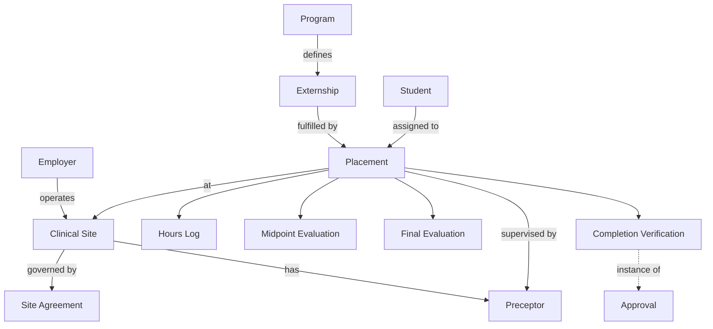

# Clinical & Externship Domain Model

**Status:** Draft
**Milestone:** 5 — Domain Model & Data Architecture
**Date:** 2026-08-07

The Clinical & Externship bounded context (see
[Domain-Driven Design Principles](./01-domain-driven-design-principles.md))
covers the real-world, off-campus training component of Minara's health
sciences programs — the entity backbone of the
[Externship Management Workflow](../milestone-3-student-journey-core-workflows/04-externship-management-workflow.md).

## A Note on Employer vs. Employer Partner

This document's **Employer** is distinct from
[Faculty & Administration](./04-faculty-administration-domain-model.md)'s
**Employer Partner**: Employer is the organizational/business entity
(the actual company or clinical operation); Employer Partner is the
**Role Assignment** — a User with platform access acting on that
Employer's behalf. One Employer may have one or more Employer Partner
Role Assignments (e.g., more than one staff contact with portal access),
consistent with
[Employer Portal §Needs Verification](../milestone-4-information-architecture/07-employer-portal.md)
on this same open question.

## Entities

| Entity | Purpose | Key Relationships | Lifecycle |
|---|---|---|---|
| **Employer** | The organizational/business entity that hosts externship placements | Has many Clinical Sites; has one or more Employer Partner Role Assignments (see [Faculty & Administration Domain Model](./04-faculty-administration-domain-model.md)) | Prospective Partner → Active Partner → (Inactive) |
| **Clinical Site** | A specific physical/operational location where placements occur | Belongs to an Employer; governed by a Site Agreement; hosts Placements | Proposed → Approved → Active → (Inactive) |
| **Preceptor** | An individual at a Clinical Site who directly supervises a Student during a Placement | Associated with a Clinical Site; supervises one or more Placements | Assigned → Active → (Reassigned/Inactive) |
| **Site Agreement** | The institutional agreement governing Minara's partnership with an Employer to host placements at a Clinical Site | Belongs to Employer and Clinical Site | Authored by Minara-Master-Plan (legal/contractual framework); Operated by Minara-LMS (status/date tracking) — Draft → Executed → Active → (Expired/Terminated) |
| **Externship** | The Program-level *requirement* that a Student complete real-world clinical training, analogous to how Certificate is a Program-level definition in the [Academic Domain Model](./02-academic-domain-model.md) | Defined by Program; fulfilled by one or more Placements | Defined upstream as part of Program design |
| **Placement** | The record of a specific Student being assigned to a specific Clinical Site to fulfill an Externship requirement | Belongs to Student (via Enrollment, see [Student Domain Model](./03-student-domain-model.md)); belongs to Clinical Site; fulfills an Externship; supervised by a Preceptor | Requested → Approved → Active → Completed (or Ended early) |
| **Hours Log** | The record of hours a Student has logged toward a Placement's requirements | Belongs to Placement | Logged (by Student) → Reviewed → Approved (by Clinical Coordinator, see [Faculty & Administration Domain Model](./04-faculty-administration-domain-model.md)) |
| **Midpoint Evaluation** | A performance evaluation recorded partway through a Placement | Belongs to Placement; recorded by Preceptor/Employer, facilitated by Clinical Coordinator | Scheduled → Completed |
| **Final Evaluation** | A performance evaluation recorded at the end of a Placement | Belongs to Placement; recorded by Preceptor/Employer, facilitated by Clinical Coordinator | Scheduled → Completed |
| **Completion Verification** | The formal record confirming a Placement (and the Externship requirement it fulfills) is fully complete | Belongs to Placement; an instance of the generic Approval entity (see [Faculty & Administration Domain Model](./04-faculty-administration-domain-model.md)), jointly issued by Clinical Coordinator and Program Director | Pending → Verified (or → Deficient, returning to an active Placement state) |

## Relationship Diagram

*Program and Student belong to the
[Academic](./02-academic-domain-model.md) and
[Student](./03-student-domain-model.md) bounded contexts respectively;
Approval belongs to
[Faculty & Administration](./04-faculty-administration-domain-model.md).
They appear here only as relationship targets.*

## Current / Planned / Future

| Entity | Status |
|---|---|
| Employer, Clinical Site | **Planned** |
| Preceptor | **Planned**, platform-access model **⚠️ Needs Verification** |
| Site Agreement | **Planned**, legal/contractual detail **Future** |
| Externship, Placement | **Planned** |
| Hours Log, Midpoint Evaluation, Final Evaluation | **Planned** |
| Completion Verification | **Planned** |
| Preceptor as a full platform User with direct portal access | **Future** — this document currently treats Preceptor as a data record associated with a Clinical Site, not necessarily a logged-in User; see Needs Verification below |

## ⚠️ Needs Verification

- Whether Preceptor is ever a platform User in their own right (with
  login access to submit evaluations directly) or is always represented
  through the Employer Partner Role Assignment on their behalf — the
  [Employer Portal](../milestone-4-information-architecture/07-employer-portal.md)
  models Evaluations as an Employer Partner action, which this document
  follows, treating Preceptor as a named data attribute of a Placement
  rather than an independent actor. This should be confirmed.
- Whether Site Agreement's legal/contractual content is meant to be
  tracked in Minara-LMS at all, or only its operational status (active/
  expired) — full agreement terms may belong more properly to
  Minara-Master-Plan or an external contract-management process.
- Whether an Employer can operate Clinical Sites across more than one
  School/Program simultaneously — this document assumes yes (an
  Employer/Clinical Site is not owned by a single Program), consistent
  with Clinical Coordinator being a Program-scoped role per
  [Faculty & Administration Domain Model](./04-faculty-administration-domain-model.md),
  but this has not been independently confirmed.
