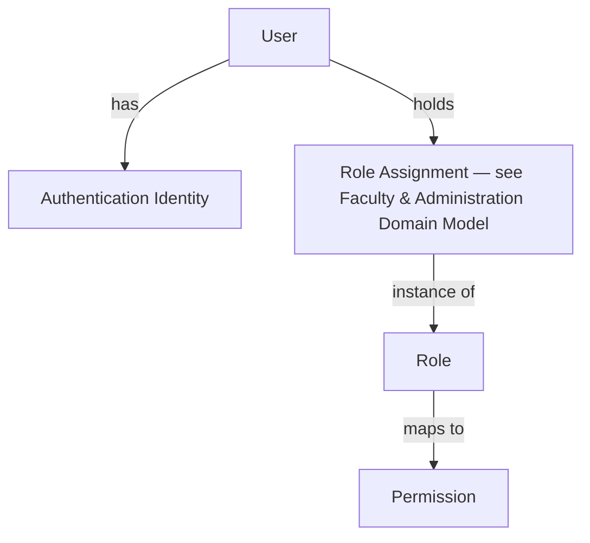
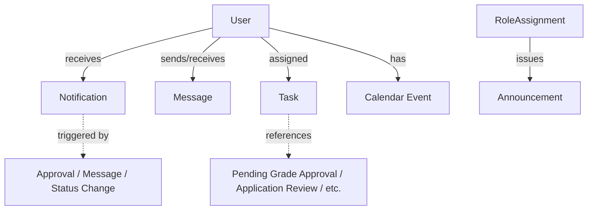
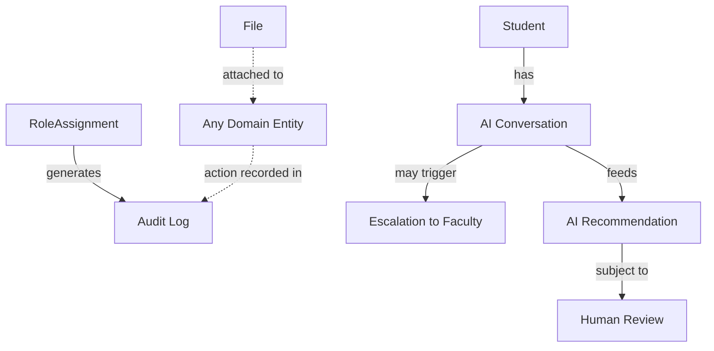
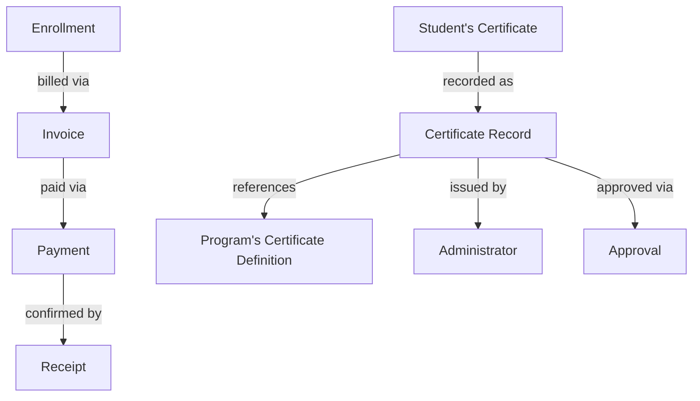

# Platform Services Domain Model

**Status:** Draft
**Milestone:** 5 — Domain Model & Data Architecture
**Date:** 2026-08-07

The Platform Services bounded context (see
[Domain-Driven Design Principles](./01-domain-driven-design-principles.md))
covers the concepts that support every other bounded context rather than
belonging to any one of them: identity, access, communication, records,
AI, and financial transactions. This is where the **User** shared kernel
lives.

## Entities

| Entity | Purpose | Key Relationships | Lifecycle |
|---|---|---|---|
| **User** | The shared-kernel identity representing one person (or Employer contact) across the entire platform | Referenced by Student, every Role Assignment (see [Faculty & Administration Domain Model](./04-faculty-administration-domain-model.md)), Messages, Notifications | Created → Active → (Suspended/Deactivated) |
| **Authentication Identity** | The credential/authentication mechanism tied to a User — deliberately technology-agnostic | Belongs to User | Provisioned → Active → (Revoked) |
| **Role** | The conceptual definition of a role type (Student, Faculty, Program Director, Admissions Staff, Clinical Coordinator, Employer Partner, Administrator), as cataloged in [Role Definitions](../milestone-2-user-roles-permission-architecture/01-role-definitions.md) | Referenced by many Role Assignments | Defined — a fairly static, institution-curated set |
| **Permission** | The conceptual unit of access (View/Create/Edit/Approve over a data domain), as cataloged in the [Permission Framework](../milestone-2-user-roles-permission-architecture/02-permission-framework.md) | Belongs to a Role | Defined |
| **Notification** | A system-generated alert delivered to a User about an event relevant to their role/scope | References the triggering entity/event (e.g., an Approval, a Message); belongs to User | Generated → Delivered → (Read/Unread) |
| **Announcement** | A broadcast communication from a Role Assignment (typically Administrator or Program Director) to a scoped audience | Issued by a Role Assignment; scoped to Institution/School/Program/Cohort (see [Academic Domain Model](./02-academic-domain-model.md)) | Drafted → Published → (Archived) |
| **Message** | The platform-level implementation of the Communication concept (see [Faculty & Administration Domain Model](./04-faculty-administration-domain-model.md)) — one piece of a conversation thread | Belongs to a conversation thread; sender/recipients are Users; scoped by the relationship context (course, program, placement) | Sent → (Read) |
| **Calendar Event** | A dated item relevant to a User or scope | May reference an Assignment/Assessment due date, an Enrollment milestone, or a Placement date | Scheduled → (Occurred / Cancelled / Rescheduled) |
| **Task** | An actionable to-do item generated for a User, distinct from a Notification in that it implies required action | References the underlying entity requiring action (e.g., Grades pending Approval, an Application pending Review) | Open → In Progress → (Completed / Dismissed) |
| **File** | A generic uploaded or generated document/artifact | Attached to various entities (Applicant Documents, an Assignment Submission, a Certificate Record) | Uploaded → (Verified) → Archived |
| **Audit Log** | The immutable record implementing the [Audit and Accountability Framework](../milestone-2-user-roles-permission-architecture/05-audit-accountability-framework.md) | References the acting Role Assignment, the action taken, and the affected entity (with before/after state where applicable) | Created — append-only, never modified or deleted |
| **AI Conversation** | The record of a Student's interaction with the AI Learning Assistant, per the [AI Learning Assistant Workflow](../milestone-3-student-journey-core-workflows/06-ai-learning-assistant-workflow.md) | Belongs to Student (via User); may reference an escalation to a Faculty Role Assignment; a flagged subset undergoes human Review (see [Faculty & Administration Domain Model](./04-faculty-administration-domain-model.md)) | Active → Closed; flagged instances → Under Human Review → Reviewed |
| **AI Recommendation** | A suggested action or insight the AI surfaces — distinct from a conversation, always subject to human review | Derived from Learning Analytics and/or AI Conversation (see [Student Domain Model](./03-student-domain-model.md)); directed at a User | Generated → Presented → (Accepted / Dismissed / Escalated for Review) |
| **Payment** | A record of a financial transaction made toward an Enrollment | Belongs to Enrollment (see [Student Domain Model](./03-student-domain-model.md)); relates to an Invoice and produces a Receipt | Initiated → (Completed / Failed) → (Refunded) |
| **Invoice** | A formal statement of amount owed for an Enrollment | Belongs to Enrollment; may result in one or more Payments | Issued → (Paid / Partially Paid / Overdue) → Closed |
| **Receipt** | The confirmation record of a completed Payment | Belongs to Payment | Generated upon Payment completion; immutable thereafter |
| **Certificate Record** | The institutional system-of-record artifact for a certificate issuance event — the Administrator-facing, audit-grade record previewed in the [Academic Domain Model](./02-academic-domain-model.md)'s Certificate diagram | References the Student's Certificate (see [Student Domain Model](./03-student-domain-model.md)), the Program's Certificate definition (see [Academic Domain Model](./02-academic-domain-model.md)), the issuing Administrator Role Assignment, and the approving Program Director's Approval | Pending Issuance → Issued → (Revoked, an exceptional case) |

## Identity & Access Diagram

## Communication & Task Diagram

## Records & AI Diagram

## Financial & Certification Diagram

*Enrollment, Student, and Program-context entities are defined in the
[Student](./03-student-domain-model.md) and
[Academic](./02-academic-domain-model.md) domain models; Approval and
Role Assignment are defined in
[Faculty & Administration](./04-faculty-administration-domain-model.md).
They appear here only as relationship targets.*

## Current / Planned / Future

| Entity | Status |
|---|---|
| User, Authentication Identity, Role, Permission | **Current** — foundational, direct expression of Milestone 2 |
| Audit Log | **Current** — direct expression of the [Audit and Accountability Framework](../milestone-2-user-roles-permission-architecture/05-audit-accountability-framework.md) |
| Notification, Message, Calendar Event | **Planned** |
| Task | **Planned** |
| File | **Planned** |
| Announcement | **Planned** |
| Payment, Invoice, Receipt | **Planned** |
| Certificate Record | **Planned** |
| AI Conversation | **Planned** — direct expression of the [AI Learning Assistant Workflow](../milestone-3-student-journey-core-workflows/06-ai-learning-assistant-workflow.md) |
| AI Recommendation | **Future** — depends on Learning Analytics maturity, itself tagged **Future** in the [Student Domain Model](./03-student-domain-model.md) |

## ⚠️ Needs Verification

- Whether Authentication Identity should support multiple identities per
  User (e.g., more than one login method) is intentionally left open —
  this is adjacent to, but distinct from, a vendor/technology decision
  and is noted for a future technical milestone.
- Whether Task is a genuinely separate entity from Notification, or
  should be modeled as a Notification subtype — both are plausible, and
  this document keeps them distinct because they imply different UI
  treatment (see the always-reachable Notification Center vs.
  action-required items in the
  [Global Navigation Framework](../milestone-4-information-architecture/01-global-navigation-framework.md)),
  but this is a judgment call, not a settled decision.
- The relationship between File and virus/content scanning, retention
  policy, and storage — all deliberately out of scope here as
  implementation concerns.
