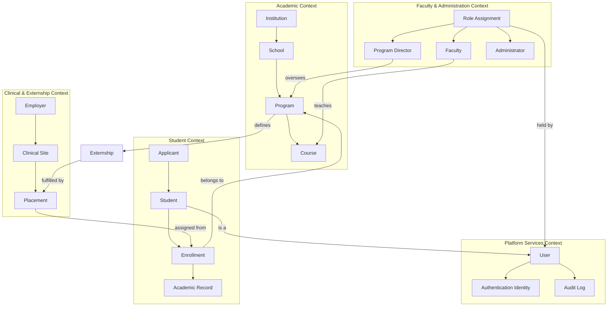

# Domain Relationship Catalog

**Status:** Draft
**Milestone:** 5 — Domain Model & Data Architecture
**Date:** 2026-08-07

This document is the **master catalog** of relationships across all five
bounded contexts defined in this milestone
([Academic](./02-academic-domain-model.md),
[Student](./03-student-domain-model.md),
[Faculty & Administration](./04-faculty-administration-domain-model.md),
[Clinical & Externship](./05-clinical-externship-domain-model.md),
[Platform Services](./06-platform-services-domain-model.md)). Each
individual domain document already diagrams its own internal
relationships; this document's value is in showing relationships **as a
whole**, including the cross-context ones that make the platform
coherent.

## Academic Structure Relationships

| Source | Relationship | Target | Cardinality |
|---|---|---|---|
| Institution | has | School | one-to-many |
| School | has | Program | one-to-many |
| Program | has | Cohort | one-to-many |
| Program | has | Course | one-to-many |
| Course | delivered as | Course Offering | one-to-many |
| Course | has | Module | one-to-many |
| Module | has | Lesson | one-to-many |
| Lesson | has | Learning Object | one-to-many |
| Course | has | Assignment | one-to-many |
| Course | has | Assessment | one-to-many |
| Assessment | includes | Quiz | one-to-many |
| Quiz / Assessment | draws from | Question Bank | many-to-one |
| Course | has | Learning Outcome | one-to-many |
| Learning Outcome | rolls up to | Competency | many-to-one |
| Program | maps to | Competency | many-to-many |
| Program | defines | Certificate | one-to-one |

*Full definitions: [Academic Domain Model](./02-academic-domain-model.md).*

## Student Structure Relationships

| Source | Relationship | Target | Cardinality |
|---|---|---|---|
| Applicant | becomes (on enrollment) | Student | one-to-one |
| Student | has | Enrollment | one-to-many |
| Enrollment | belongs to | Program | many-to-one |
| Enrollment | belongs to | Cohort | many-to-one |
| Enrollment | has | Academic Record | one-to-one |
| Academic Record | has | Course Progress | one-to-many |
| Academic Record | has | Attendance | one-to-many |
| Academic Record | has | Grades | one-to-many |
| Academic Record | summarized as | Transcript | one-to-one |
| Enrollment | produces (on completion) | Certificate (Student-held) | one-to-one |
| Student | has | Student Support | one-to-many |
| Student | has | Learning Analytics | one-to-one (derived) |

*Full definitions: [Student Domain Model](./03-student-domain-model.md).*

## Staff Structure Relationships

| Source | Relationship | Target | Cardinality |
|---|---|---|---|
| User | holds | Role Assignment | one-to-many |
| Role Assignment | instance of | Role | many-to-one |
| Role Assignment | scoped to | Institution / School / Program / Cohort / Course Offering | many-to-one |
| Faculty | has | Teaching Assignment | one-to-many |
| Teaching Assignment | assigned to | Course Offering | many-to-one |
| Program Director | oversees | Program | one-to-one (per assignment) |
| Administrator | oversees | Institution | one-to-one (per assignment; institution-wide by default) |
| Role Assignment | issues | Approval | one-to-many |
| Role Assignment | performs | Review | one-to-many |
| Role Assignment | initiates | Communication | one-to-many |
| Role Assignment | produces | Reporting | one-to-many |

*Full definitions:
[Faculty & Administration Domain Model](./04-faculty-administration-domain-model.md).*

## Clinical & Externship Structure Relationships

| Source | Relationship | Target | Cardinality |
|---|---|---|---|
| Employer | operates | Clinical Site | one-to-many |
| Clinical Site | governed by | Site Agreement | one-to-one |
| Clinical Site | has | Preceptor | one-to-many |
| Program | defines | Externship | one-to-one |
| Externship | fulfilled by | Placement | one-to-many |
| Student | assigned to | Placement | one-to-many |
| Placement | at | Clinical Site | many-to-one |
| Placement | supervised by | Preceptor | many-to-one |
| Placement | has | Hours Log | one-to-many |
| Placement | has | Midpoint Evaluation | one-to-one |
| Placement | has | Final Evaluation | one-to-one |
| Placement | has | Completion Verification | one-to-one |
| Employer | (indirectly, via Clinical Sites) hosts | Externship / Placement | one-to-many |

*Full definitions:
[Clinical & Externship Domain Model](./05-clinical-externship-domain-model.md).*

## Platform Services Relationships

| Source | Relationship | Target | Cardinality |
|---|---|---|---|
| User | has | Authentication Identity | one-to-many |
| User | receives | Notification | one-to-many |
| User | sends/receives | Message | one-to-many |
| Role Assignment | issues | Announcement | one-to-many |
| User | assigned | Task | one-to-many |
| User | has | Calendar Event | one-to-many |
| Any Domain Entity | attaches | File | one-to-many |
| Any Action of Consequence | recorded in | Audit Log | one-to-one |
| Student | has | AI Conversation | one-to-many |
| AI Conversation / Learning Analytics | feeds | AI Recommendation | one-to-many |
| Enrollment | billed via | Invoice | one-to-many |
| Invoice | paid via | Payment | one-to-many |
| Payment | confirmed by | Receipt | one-to-one |
| Certificate (Student-held) | recorded as | Certificate Record | one-to-one |

*Full definitions:
[Platform Services Domain Model](./06-platform-services-domain-model.md).*

## Cross-Context Relationships

These are the relationships that make the five bounded contexts one
coherent platform rather than five unconnected models — most already
noted in individual domain documents, gathered here for visibility:

| Relationship | Contexts Bridged |
|---|---|
| Student, every Role Assignment → User (shared kernel) | All five contexts → Platform Services |
| Enrollment → Program, Cohort | Student → Academic |
| Grades → Assignment, Assessment | Student → Academic |
| Course Progress → Lesson | Student → Academic |
| Teaching Assignment → Course Offering | Faculty & Administration → Academic |
| Placement → Student (via Enrollment) | Clinical & Externship → Student |
| Externship → Program | Clinical & Externship → Academic |
| Completion Verification → Approval | Clinical & Externship → Faculty & Administration |
| Certificate (three facets: Program definition, Student-held, Certificate Record) | Academic ↔ Student ↔ Platform Services |
| AI Conversation escalation → Faculty (Role Assignment) | Platform Services → Faculty & Administration |
| Payment/Invoice → Enrollment | Platform Services → Student |
| Audit Log → any Role Assignment action across any context | Platform Services ← All |

## Domain Map Diagram

*This diagram is deliberately high-level — it shows how the five
bounded contexts connect, not every entity within each. Each context's
own document contains the full internal detail.*

## Current / Planned / Future

| Element | Status |
|---|---|
| All relationships tagged **Current** in their source domain document | **Current** |
| All relationships tagged **Planned** in their source domain document | **Planned** |
| All relationships tagged **Future** in their source domain document | **Future** |
| This catalog as a consolidated cross-reference | **Current** — a documentation aid, not a new architectural commitment |

*This table intentionally does not re-derive status per relationship —
see each entity's own Current/Planned/Future table in its source
document ([02](./02-academic-domain-model.md)–[06](./06-platform-services-domain-model.md))
for the authoritative status of the entities a given relationship
connects.*

## ⚠️ Needs Verification

- This catalog is only as complete as the five source documents; any
  entity or relationship flagged **⚠️ Needs Verification** in
  [02](./02-academic-domain-model.md)–[06](./06-platform-services-domain-model.md)
  carries that same uncertainty into the relationships listed here.
- As with every relationship catalog, some relationships not yet
  identified will likely surface once Milestone 6+ (technical
  architecture) works through concrete scenarios — this document should
  be revisited at that point, not treated as final and complete.
