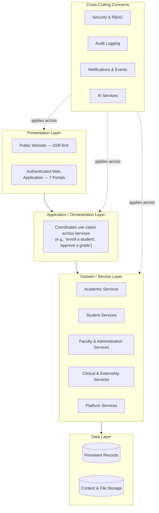
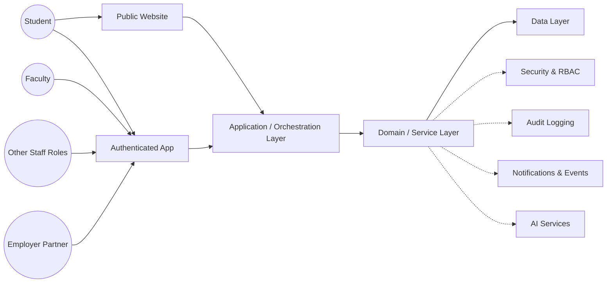

# System Architecture

**Status:** Draft
**Milestone:** 6 — Technical Architecture & System Design
**Date:** 2026-08-07

This document defines the overall shape of Minara-LMS as a system: its
major layers, how they separate concerns, and the modular philosophy
that lets it support multiple schools, multiple programs, and future
growth without repeated redesign, per this milestone's objective.

## Architectural Style: Modular, Boundary-Aligned Platform

**Decision:** Minara-LMS is architected as a **modular platform whose
internal module boundaries mirror the bounded contexts** established in
[Milestone 5](../milestone-5-domain-model-data-architecture/01-domain-driven-design-principles.md) —
Academic, Student, Faculty & Administration, Clinical & Externship, and
Platform Services — further decomposed into the logical services defined
in [Service Boundaries](./03-service-boundaries.md).

This document deliberately does **not** decide whether those modules are
deployed as one unit or as independently deployable services — that is a
technology/operations decision explicitly out of scope here. What it
does decide is that **module boundaries are drawn now, at the logical
level, so that decision can be made later without redrawing the map**:
if the platform starts as a single, internally modular deployment and
later needs to split a high-load module (e.g., Learning or AI) out
independently, the boundary it splits along is already the right one,
because it was designed as a boundary from day one.

**⚠️ Needs Verification:** Whether to begin implementation as a single
deployable unit (modules within one codebase/runtime) or as genuinely
separate services from day one is a real trade-off — simplicity and
lower operational overhead early on, versus independent scalability and
deployment later — that this milestone intentionally leaves for a
technology-selection milestone to decide with fuller information about
team size, expected load, and operational capacity.

## Platform Layers

### Presentation Layer

Two distinct surfaces, consistent with the
[Global Navigation Framework](../milestone-4-information-architecture/01-global-navigation-framework.md):

- **Public Website** — SSR-first, per
  [Guiding Principles §5](../milestone-1-product-vision-platform-strategy/03-guiding-principles.md),
  serving prospective students and Employer Partners before
  authentication.
- **Authenticated Web Application** — the seven portals defined in
  [Milestone 4](../milestone-4-information-architecture/README.md),
  sharing one authenticated shell (Portal Switcher, Primary/Secondary
  Navigation).

Both are mobile-first, per
[Guiding Principles §4](../milestone-1-product-vision-platform-strategy/03-guiding-principles.md).

### Application / Orchestration Layer

Coordinates multi-service use cases — a single user action (e.g.,
"approve this grade," per
[Faculty Workflows](../milestone-3-student-journey-core-workflows/02-faculty-workflows.md))
often touches more than one Service Boundary (Gradebook, Audit,
Notifications). This layer is where that coordination happens, so that
individual services stay focused on their own domain and don't need to
know about each other's internals.

### Domain / Service Layer

The logical services defined in
[Service Boundaries](./03-service-boundaries.md), each owning the
entities assigned to it in
[Milestone 5](../milestone-5-domain-model-data-architecture/README.md).
This is where business rules from the
[Business Rules Catalog](../milestone-5-domain-model-data-architecture/08-business-rules-catalog.md)
are actually enforced.

### Cross-Cutting Concerns

Four concerns apply horizontally across every layer above them, rather
than belonging to any one module:

- **Security & RBAC** — detailed in
  [Security Architecture](./04-security-architecture.md).
- **Audit Logging** — implements the
  [Audit and Accountability Framework](../milestone-2-user-roles-permission-architecture/05-audit-accountability-framework.md).
- **Notifications & Events** — detailed in
  [Notification & Event Architecture](./08-notification-event-architecture.md).
- **AI Services** — detailed in
  [AI Platform Architecture](./06-ai-platform-architecture.md).

### Data Layer

Two conceptually distinct categories of stored data, elaborated in
[File Storage & Content Architecture](./05-file-storage-content-architecture.md):

- **Persistent Records** — the structured, transactional data behind
  every Milestone 5 entity (Enrollments, Grades, Placements, etc.).
- **Content & File Storage** — larger, less structured assets (learning
  content, uploaded documents, generated certificates).

Neither is tied to a specific storage technology in this document.

## High-Level Component Diagram

## Separation of Concerns

| Concern | Lives In | Does Not Live In |
|---|---|---|
| What a user sees and how they navigate to it | Presentation Layer (implements [Milestone 4](../milestone-4-information-architecture/README.md)) | Domain / Service Layer |
| Business rules and entity lifecycle | Domain / Service Layer (implements [Milestone 5](../milestone-5-domain-model-data-architecture/README.md)) | Presentation Layer |
| Coordinating a multi-step use case | Application / Orchestration Layer | Any single Domain Service |
| Who is allowed to do what | Security & RBAC (cross-cutting) | Scattered checks inside individual services |
| What happened, when, and by whom | Audit Logging (cross-cutting) | Individual service logs alone |
| How raw data becomes structured records vs. stored files | Data Layer | Domain / Service Layer |

This separation is what lets Milestone 4's screens change without
touching business rules, and lets Milestone 5's business rules change
without touching how they're displayed — each layer has one job.

## Modular Architecture Philosophy

Directly implementing
[Guiding Principles §7](../milestone-1-product-vision-platform-strategy/03-guiding-principles.md)
and the bounded-context philosophy from
[Milestone 5, Doc 1](../milestone-5-domain-model-data-architecture/01-domain-driven-design-principles.md):

- **A module's boundary is its business meaning, not its expected
  size.** Small, low-traffic modules (e.g., Certificates) and
  potentially large, high-traffic ones (e.g., Learning) are drawn along
  the same principle: what they mean to the business, not how much load
  they'll carry.
- **Modules communicate through defined interactions, never by reaching
  into each other's data.** (What those interactions look like
  technically — direct calls, events, or something else — is a decision
  for [Service Boundaries](./03-service-boundaries.md) and later
  milestones, not this one.)
- **New schools and programs are configuration, not new modules.**
  Consistent with
  [Platform Philosophy](../milestone-1-product-vision-platform-strategy/04-platform-philosophy.md),
  adding a school or program does not mean adding a new architectural
  component — it means new data within the existing Academic services.
- **A module can be extracted or re-scoped without redesigning its
  neighbors**, because its boundary was never dependent on
  implementation convenience in the first place.

## Current / Planned / Future

| Element | Status |
|---|---|
| Layered architecture (Presentation / Application / Domain / Cross-Cutting / Data) | **Current** — this milestone's foundational decision |
| Module boundaries aligned to Milestone 5 bounded contexts | **Current** |
| Single-deployment vs. independently-deployed services | **Future** — explicitly deferred, see Needs Verification above |
| Public Website SSR-first delivery | **Planned** |
| Authenticated shell serving all seven portals | **Planned** |
| Formal inter-module communication contracts | **Future** — depends on the deployment-shape decision above |

## ⚠️ Needs Verification

- Single-deployment vs. independently-deployed services (see above) —
  the highest-impact open decision in this document.
- Whether all five Domain Service groupings warrant equal architectural
  weight at launch, or whether (for example) AI Services should be
  isolated earlier than the others given its distinct safety/escalation
  requirements (see
  [AI Platform Architecture](./06-ai-platform-architecture.md)).
