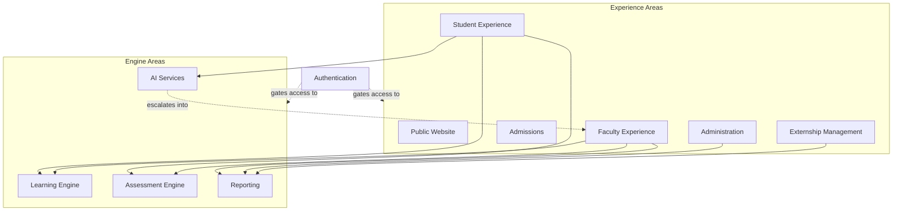

# Application Architecture

**Status:** Draft
**Milestone:** 6 — Technical Architecture & System Design
**Date:** 2026-08-07

This document defines the platform's **conceptual application
structure**: the named areas of functionality a person (or another
system) actually interacts with, and what each is responsible for. It
sits one level above
[Service Boundaries](./03-service-boundaries.md) — an Application Area
is what a user experiences; a Service is what owns the data and rules
behind it. One Application Area typically draws on several Services.

## Two Kinds of Application Area

- **Experience Areas** map closely to the seven portals in
  [Milestone 4](../milestone-4-information-architecture/README.md) —
  they are what a specific role actually opens and navigates.
- **Engine Areas** are shared logic consumed by more than one Experience
  Area — no role "opens" the Learning Engine directly; Students and
  Faculty both rely on it through their respective Experience Areas.

**Authentication** underlies every Application Area and is documented
separately because it isn't really "an experience" so much as the gate
every experience passes through.

## Experience Areas

| Area | Responsibility | Serves (Milestone 4) | Draws On (Milestone 6, Doc 3) |
|---|---|---|---|
| **Public Website** | Present institutional, program, and Prepped-product information to prospective students and Employer Partners; initiate the Admissions pipeline; SSR-first per [Guiding Principles §5](../milestone-1-product-vision-platform-strategy/03-guiding-principles.md) | [Global Navigation Framework §1](../milestone-4-information-architecture/01-global-navigation-framework.md) | Academic (read-only program info), Admissions (start application) |
| **Student Experience** | Every Student-facing capability: courses, assignments, assessments, grades, progress, externship, payments, certificates, messaging, AI Tutor | [Student Portal](../milestone-4-information-architecture/02-student-portal.md) | Learning Engine, Assessment Engine, AI Services, Certificates, Payments, Externships, Messaging, Notifications |
| **Faculty Experience** | Course delivery, grading, feedback, section-level reporting | [Faculty Portal](../milestone-4-information-architecture/03-faculty-portal.md) | Learning Engine, Assessment Engine, Reporting, Messaging, Notifications |
| **Admissions** | The inquiry-to-enrollment pipeline; converts an Applicant into a Student (see [Student Domain Model](../milestone-5-domain-model-data-architecture/03-student-domain-model.md)) | [Admissions Portal](../milestone-4-information-architecture/05-admissions-portal.md) | Admissions, Identity, Payments, Notifications |
| **Administration** | Program-level oversight (Program Director) and institution-wide oversight (Administrator): approvals, cohort/faculty coordination, financial and audit oversight | [Program Director Portal](../milestone-4-information-architecture/04-program-director-portal.md), [Administrator Portal](../milestone-4-information-architecture/08-administrator-portal.md) | Identity, Gradebook, Certificates, Payments, Audit, Reporting |
| **Externship Management** | Site management, placement, hours, and evaluation — the shared operational space for Clinical Coordinators and Employer Partners | [Clinical/Externship Coordinator Portal](../milestone-4-information-architecture/06-clinical-coordinator-portal.md), [Employer Portal](../milestone-4-information-architecture/07-employer-portal.md) | Externships, Messaging, Notifications, Reporting |

## Engine Areas

| Area | Responsibility | Consumed By | Draws On (Milestone 6, Doc 3) |
|---|---|---|---|
| **Learning Engine** | Delivers curriculum content (authored in Minara-Curriculum) and tracks Course Progress, per the ownership split in the [Academic Domain Model](../milestone-5-domain-model-data-architecture/02-academic-domain-model.md) | Student Experience, Faculty Experience | Learning |
| **Assessment Engine** | Delivers Assignments/Assessments/Quizzes, collects submissions, and supports Grade entry | Student Experience, Faculty Experience | Assessments, Gradebook |
| **AI Services** | Powers the AI Learning Assistant and any future faculty/administrative AI assistance, bounded by safety and escalation rules — see [AI Platform Architecture](./06-ai-platform-architecture.md) | Student Experience (Current); Faculty/Administration Experiences (Future) | AI, Audit |
| **Reporting** | Generates the point-in-time reporting artifacts defined in the [Faculty & Administration Domain Model](../milestone-5-domain-model-data-architecture/04-faculty-administration-domain-model.md) at section, program, or institution scope | Faculty Experience, Administration, Externship Management | Analytics, Audit |

## Why This Split Matters

Without distinguishing Experience Areas from Engine Areas, it would be
easy to accidentally build the Learning Engine *inside* the Student
Experience and then duplicate it inside the Faculty Experience when
Faculty also need to interact with course content. Naming the Engine
Areas separately means both Experience Areas can depend on **one**
Learning Engine, consistent with
[Guiding Principles §7 (Modular Architecture)](../milestone-1-product-vision-platform-strategy/03-guiding-principles.md).

## Current / Planned / Future

| Application Area | Status |
|---|---|
| Public Website, Authentication | **Planned** |
| Student Experience, Faculty Experience | **Planned** |
| Admissions | **Planned** |
| Administration | **Planned** |
| Learning Engine, Assessment Engine | **Planned** |
| Externship Management | **Planned** |
| Reporting | **Planned** |
| AI Services (Student-facing Learning Support) | **Planned** |
| AI Services (Faculty/Administrative assistance) | **Future** — see [AI Platform Architecture](./06-ai-platform-architecture.md) |

## ⚠️ Needs Verification

- Whether Program Director and Administrator truly share one
  "Administration" Application Area, or whether Program Director's
  program-scoped concerns and Administrator's institution-wide concerns
  are different enough to warrant separating them at this layer — this
  document follows the grouping implied by this milestone's own
  instructions but flags it for review.
- Whether Externship Management should eventually split into two
  Experience Areas (one for Coordinators, one for Employers) as Employer
  self-service functionality matures — see
  [Employer Portal §Needs Verification](../milestone-4-information-architecture/07-employer-portal.md).
