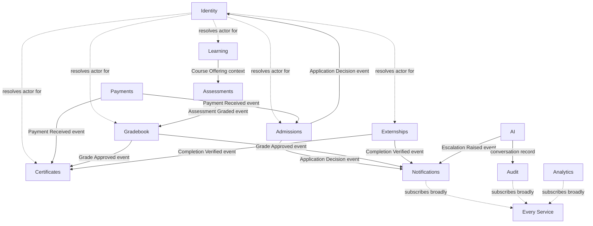

# Service Boundaries

**Status:** Draft
**Milestone:** 6 — Technical Architecture & System Design
**Date:** 2026-08-07

This document identifies **logical service boundaries** — who owns
which [Milestone 5](../milestone-5-domain-model-data-architecture/README.md)
entities, and how services relate to one another. It defines ownership
and interaction, deliberately **not** API contracts, endpoints, or
protocols — that is out of scope for this milestone.

## Two Interaction Styles

Services relate to each other in one of two conceptual ways:

- **Direct Interaction** — a service needs specific reference data from
  another service to complete its own operation (e.g., Gradebook needs
  to know which Course Offering a grade belongs to). The dependency is
  explicit and the calling service can't proceed without an answer.
- **Event-Driven Interaction** — a service publishes a record of
  something significant that happened; other services react to it
  without the publisher needing to know who's listening (e.g.,
  Admissions publishes "Application Approved"; Notifications reacts by
  informing the applicant, Identity reacts by preparing to provision a
  Student). This style is detailed further in
  [Notification & Event Architecture](./08-notification-event-architecture.md).

Neither style implies a specific technology (a function call vs. a
message queue, for example) — that remains a later, technology-selection
decision.

## Services

| Service | Owns (from Milestone 5) | Primary Interactions |
|---|---|---|
| **Identity** | User, Authentication Identity, Role, Permission, Role Assignment (all six staff roles + Student's User-level identity) | Direct: every other service resolves "who is acting" through Identity. Event: publishes Role Assignment changes for Audit. |
| **Admissions** | Applicant, and the admissions-stage portion of Enrollment | Direct: reads Learning for Program/Cohort capacity. Event: publishes Application Decision events consumed by Identity (provisions Student), Notifications, Payments (initiates Invoice on acceptance). |
| **Learning** | Institution, School, Program, Cohort, Course, Course Offering, Module, Lesson, Learning Object, Course Progress, Competency, Learning Outcome — plus each Program's Certificate and Externship *requirement definitions* (see Ownership Note below) | Direct: supplies Assessments and Externships with Program/Course Offering context. Event: publishes Course Offering and Cohort changes. |
| **Assessments** | Assignment, Assessment, Quiz, Question Bank, and Student submissions | Direct: reads Learning for Course Offering context. Event: publishes "Assessment Graded" consumed by Gradebook. |
| **Gradebook** | Grades, Academic Record (grade aggregation), Final Grade Approval state | Direct: reads Assessments for gradable items, Identity for Faculty/Program Director authority. Event: publishes "Grade Approved" consumed by Notifications, Audit, and (at program completion) Certificates. |
| **Payments** | Invoice, Payment, Receipt | Direct: reads Admissions/Student for what's owed. Event: publishes "Payment Received"/"Payment Overdue" consumed by Admissions (unblocks Enrollment), Notifications, Certificates (financial clearance gate). |
| **Messaging** | Message (the Communication concept) | Direct: reads Identity for participant identity/scope validation. |
| **Notifications** | Notification, Announcement, Task, Calendar Event | Event: subscribes to events from every other service; the platform's primary event *consumer*, per [Notification & Event Architecture](./08-notification-event-architecture.md). |
| **Certificates** | Certificate (Student-held instance), Certificate Record | Direct: reads Gradebook (academic completion), Externships (externship completion, where applicable), Payments (financial clearance). Event: publishes "Certificate Issued" consumed by Notifications, Audit. |
| **Externships** | Employer, Clinical Site, Preceptor, Site Agreement, Placement, Hours Log, Midpoint/Final Evaluation, Completion Verification | Direct: reads Identity (Clinical Coordinator/Employer Partner authority), Learning (Program's Externship requirement, Student eligibility signals). Event: publishes "Completion Verified" consumed by Certificates, Notifications. |
| **Analytics** | Learning Analytics | Event: subscribes broadly to compute derived insight; supplies data to the Reporting Engine Area (see [Application Architecture](./02-application-architecture.md)). |
| **AI** | AI Conversation, AI Recommendation | Direct: reads Learning for tutoring context, Identity for Student identity. Event: publishes "Escalation Raised" consumed by Notifications/Messaging (reaches Faculty); publishes conversation records consumed by Audit. |
| **Audit** | Audit Log | Event: subscribes to every consequential event platform-wide, per the [Audit and Accountability Framework](../milestone-2-user-roles-permission-architecture/05-audit-accountability-framework.md); the platform's second broad event *consumer*, alongside Notifications. |

## Ownership Note: Definitions vs. Instances

Consistent with the "three-facet Certificate" pattern already
established in the
[Academic Domain Model](../milestone-5-domain-model-data-architecture/02-academic-domain-model.md),
this document splits ownership between a Program's *definition* of a
requirement and the *fulfillment* of that requirement:

- A Program's Certificate **definition** (what credential it confers)
  and Externship **requirement** (whether one is required, and its
  parameters) are part of Program design — owned by **Learning**.
- The **instances** that fulfill those definitions — an issued
  Certificate Record, a completed Placement — are owned by
  **Certificates** and **Externships** respectively.

This keeps "what a Program requires" in one place (Learning, alongside
the rest of Program structure) while keeping "what actually happened for
this Student" in the service responsible for making it happen.

## Service Interaction Diagram

## Current / Planned / Future

| Service | Status |
|---|---|
| Identity | **Current** — foundational to every other service |
| Admissions, Learning, Assessments, Gradebook | **Planned** |
| Payments, Messaging, Notifications | **Planned** |
| Certificates, Externships | **Planned** |
| Audit | **Current** — direct expression of an already-approved principle |
| AI | **Planned** — Student-facing Learning Support only; see [AI Platform Architecture](./06-ai-platform-architecture.md) |
| Analytics | **Future** — consistent with Learning Analytics being tagged **Future** in [Milestone 5](../milestone-5-domain-model-data-architecture/03-student-domain-model.md) |

## ⚠️ Needs Verification

- Whether this 13-service decomposition is the right long-term
  granularity, or whether some services (e.g., Messaging and
  Notifications) should merge, is a judgment call for this milestone's
  documentation purposes — to be revisited once real load and team
  boundaries are known.
- The Direct vs. Event-Driven interaction style is assigned per this
  document's best judgment about which relationships are time-critical
  (Direct) vs. reactive (Event-Driven); this should be revisited once
  concrete performance requirements are known.
