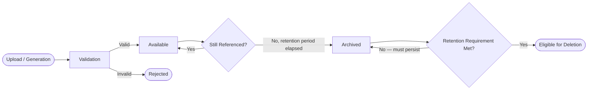

# File Storage & Content Architecture

**Status:** Draft
**Milestone:** 6 — Technical Architecture & System Design
**Date:** 2026-08-07

This document defines the conceptual handling of files and content
across Minara-LMS — how different kinds of stored material are
categorized, versioned, retained, and moved through their lifecycle. It
does not name a storage technology, format, or vendor.

## Two Categories, Restated

Per [System Architecture §Data Layer](./01-system-architecture.md), the
platform distinguishes **Persistent Records** (structured, transactional
data behind Milestone 5 entities) from **Content & File Storage**
(larger, less structured assets). This document is about the second
category, anchored by the **File** entity defined in the
[Platform Services Domain Model](../milestone-5-domain-model-data-architecture/06-platform-services-domain-model.md):
every stored file has a corresponding File record that carries its
metadata (what it is, who it belongs to, its status), while the file's
actual bytes live in whatever content storage mechanism is eventually
selected.

## Content Types

| Content Type | Description | Ownership (per [Academic Domain Model](../milestone-5-domain-model-data-architecture/02-academic-domain-model.md)) | Retention Posture |
|---|---|---|---|
| **Learning Content** (video, readings, interactive Learning Objects) | Authored in Minara-Curriculum, delivered by the Learning Engine (see [Application Architecture](./02-application-architecture.md)) | Authored by Minara-Curriculum; Operated by Minara-LMS | Retained for the life of the content's active use; versioning implications below |
| **Applicant Documents** | Uploaded during Admissions (transcripts, identification, prerequisites) | Operated by Minara-LMS | Retained per institutional policy — **⚠️ Needs Verification** on duration |
| **Assignment Submissions** | Student-submitted work | Operated by Minara-LMS | Retained at least as long as the Academic Record it's part of, per the [Audit and Accountability Framework](../milestone-2-user-roles-permission-architecture/05-audit-accountability-framework.md) |
| **Certificates** (as documents) | The rendered, shareable form of an issued Certificate Record | Operated by Minara-LMS | Retained indefinitely — a Certificate's validity should never depend on the platform's general retention window |
| **Images** | Profile images, program imagery, institutional branding assets | Operated by Minara-LMS (user-uploaded) or Minara-Master-Plan (institutional branding, delivered not authored) | Retained while actively referenced |
| **Videos** | Learning Content videos, and potentially recorded sessions (**Future**) | Same as Learning Content | Same as Learning Content |
| **Generated Assets** | System-generated documents: Certificates (rendered), Transcripts (rendered), Reports | Operated by Minara-LMS | Retained per the retaining record's own policy (e.g., a generated Transcript follows Academic Record retention) |

## Versioning

Curriculum content changes over time in Minara-Curriculum. This
document takes the position that Minara-LMS's File records for Learning
Content should be able to reference **which version** of a piece of
content was delivered to a given Student at a given time — directly
supporting the **Future** "Versioning" and "Content Revisions"
considerations already flagged in the
[Future Data Architecture Considerations](../milestone-5-domain-model-data-architecture/09-future-data-architecture-considerations.md).
This document does not design the versioning mechanism itself (that
remains **Future**), only confirms that the File entity's design should
not preclude it.

## Retention

Retention is not one-size-fits-all across content types (see the table
above). The general architectural posture:

- **Records of academic and clinical consequence** (Assignment
  Submissions, Certificates, generated Transcripts) follow the same
  durability expectations as the Audit Log itself — they should not be
  casually deletable.
- **Working/operational content** (in-progress uploads, superseded
  drafts) may have shorter, more permissive retention.
- **Concrete retention durations** are explicitly **⚠️ Needs
  Verification** across the board — this mirrors the same open question
  already flagged in the
  [Audit and Accountability Framework](../milestone-2-user-roles-permission-architecture/05-audit-accountability-framework.md)
  and is not resolved by this document; it depends on institutional and
  accreditation policy this milestone does not have access to.

## Lifecycle

**Notes:**
- **Validation** covers whatever business-level checks apply (e.g., a
  required Applicant Document type, a submission arriving before a
  deadline) — not technical scanning/processing, which is an
  implementation concern.
- Deletion is modeled as a distinct final state, reachable only after
  retention requirements are confirmed met — content is never deleted
  simply because it is old, only because its retention obligation has
  been satisfied.

## Delivery Considerations (Conceptual)

- **Learning Content**, especially video, benefits from delivery
  patterns optimized for streaming and progressive access rather than
  full-file download — named here as a **principle**, not a specific
  content-delivery technology.
- **Generated Assets** (Certificates, Transcripts, Reports) are
  typically produced on demand or at a specific workflow trigger (e.g.,
  Certificate Issuance, per the
  [Certificate & Graduation Workflow](../milestone-3-student-journey-core-workflows/05-certificate-graduation-workflow.md)),
  not continuously regenerated.

## Current / Planned / Future

| Element | Status |
|---|---|
| File entity as metadata anchor for all stored content | **Current** — direct expression of Milestone 5 |
| Content type categorization and retention posture (conceptual) | **Planned** |
| Lifecycle states (Upload → Validation → Available → Archived → Deletion-eligible) | **Planned** |
| Concrete retention durations per content type | **Future**, pending institutional/accreditation policy |
| Curriculum content versioning mechanism | **Future** |
| Streaming-optimized delivery for video | **Planned** as a principle; **Future** as an implementation |

## ⚠️ Needs Verification

- Concrete retention durations for every content type — this is a
  policy gap this milestone repeatedly surfaces but cannot resolve on
  its own.
- Whether Applicant Documents for denied/withdrawn applicants have a
  different (likely shorter) retention posture than for enrolled
  Students — plausible but unconfirmed.
- Whether institutional branding assets are meant to be delivered by
  Minara-LMS at all, or are a Public Website content concern belonging
  more properly to Minara-Master-Plan's domain.
