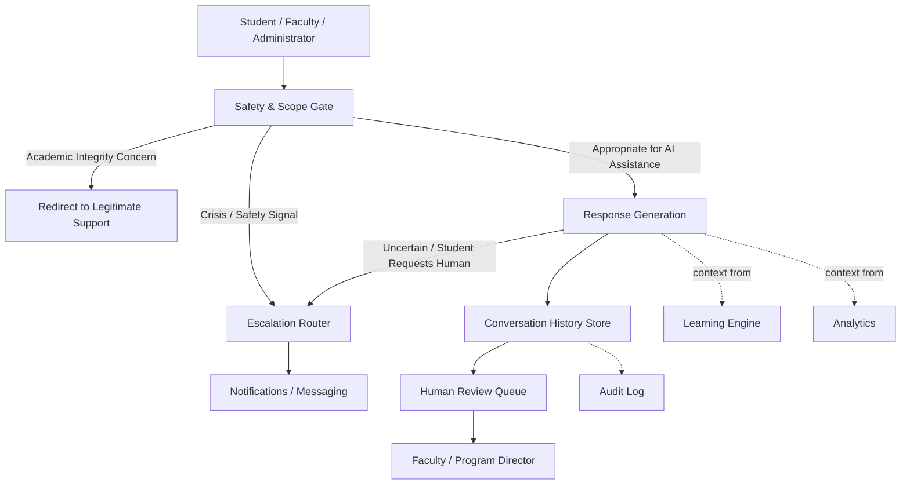

# AI Platform Architecture

**Status:** Draft
**Milestone:** 6 — Technical Architecture & System Design
**Date:** 2026-08-07

This document defines the technical-conceptual architecture of the
**AI** service (see [Service Boundaries](./03-service-boundaries.md))
that powers the AI Learning Assistant and any future AI-assisted
capability. It gives architectural shape to the
[AI Learning Assistant Workflow](../milestone-3-student-journey-core-workflows/06-ai-learning-assistant-workflow.md)
and the AI Conversation / AI Recommendation entities from the
[Platform Services Domain Model](../milestone-5-domain-model-data-architecture/06-platform-services-domain-model.md) —
it does not redefine either, and it selects no AI model, vendor, or
technology.

## Governing Principle, Restated

**AI never replaces institutional decision-making.** Every component in
this architecture exists to make that principle enforceable in system
design, not just stated in policy — carried forward unchanged from
[Guiding Principles §10](../milestone-1-product-vision-platform-strategy/03-guiding-principles.md)
and the
[Business Rules Catalog](../milestone-5-domain-model-data-architecture/08-business-rules-catalog.md)'s
AI & Human Oversight Rules.

## Architectural Components

### Safety & Scope Gate

The mandatory first stop for every request, implementing the "AI
Evaluates Request" decision point from the
[AI Learning Assistant Workflow](../milestone-3-student-journey-core-workflows/06-ai-learning-assistant-workflow.md).
Architecturally, this component's job is to classify a request into one
of three paths **before** any substantive response is generated:
appropriate for AI assistance, an academic-integrity concern, or a
crisis/safety signal. This gate exists as a distinct, non-bypassable
architectural step — not a property of the response generation itself —
specifically so that a flawed or manipulated response cannot skip safety
classification.

### Escalation Router

Routes a request or an in-progress conversation to a human, per the
workflow's escalation logic. Two triggers reach it: an immediate
crisis/safety signal from the Gate, or a standard escalation from
Response Generation (student need unmet, student requests a human, or
AI uncertainty). The router's responsibility is to get the right
human — Faculty for standard escalations; the
[AI Learning Assistant Workflow §Escalation to Faculty](../milestone-3-student-journey-core-workflows/06-ai-learning-assistant-workflow.md)
notes crisis routing may involve additional staff, still
**⚠️ Needs Verification** — notified through Notifications/Messaging,
not merely logged.

### Response Generation

Produces the actual educational response for requests the Gate has
classified as appropriate. This is the one component in the diagram
where a specific AI technology would eventually plug in — this document
deliberately treats it as a black box with a defined contract (bounded
input from the Gate, bounded output to Conversation History and,
conditionally, Escalation) rather than designing its internals.

### Conversation History Store

Persists every AI Conversation, implementing the entity of the same name
from the
[Platform Services Domain Model](../milestone-5-domain-model-data-architecture/06-platform-services-domain-model.md).
Every conversation — not just escalated ones — is retained, per the
workflow's Conversation History & Human Review Principles.

### Human Review Queue

Implements the workflow's "flagged for human review?" decision: a
policy-driven subset of Conversation History is routed here for a
Faculty Instructor or Program Director to review after the fact,
distinct from real-time Escalation. **⚠️ Needs Verification:** the exact
flagging criteria remain undefined, carried over unresolved from the
[AI Learning Assistant Workflow](../milestone-3-student-journey-core-workflows/06-ai-learning-assistant-workflow.md).

## AI Capability Areas

| Capability | Description | Status |
|---|---|---|
| **Learning Support** | The Student-facing AI Tutor: answering questions, explaining concepts, guiding study — the core, already-detailed capability from [Milestone 3, Doc 6](../milestone-3-student-journey-core-workflows/06-ai-learning-assistant-workflow.md) | **Planned** |
| **Content Assistance** | AI helping with curriculum-adjacent content tasks | **Future** — must be scoped carefully against [Scope Boundaries](../milestone-1-product-vision-platform-strategy/09-scope-boundaries.md): the LMS delivers curriculum, it does not author it, so any Content Assistance capability would need to operate on the delivery side (e.g., helping a Faculty Instructor draft supplementary section-level material) rather than authoring Minara-Curriculum content itself |
| **Faculty Assistance** | Surfacing insight to Faculty (e.g., early-warning signals about a struggling Student, derived from Learning Analytics) | **Future** — depends on Learning Analytics, itself **Future** per [Milestone 5](../milestone-5-domain-model-data-architecture/03-student-domain-model.md) |
| **Administrative Assistance** | AI-assisted drafting or summarization for Administrator/Program Director reporting tasks | **Future** |

Every capability area, present or future, routes through the same
Safety & Scope Gate and is subject to the same human-review and
non-decision-making constraints — there is no "trusted" AI capability
exempt from these architectural safeguards.

## Safety

- The Safety & Scope Gate classification (crisis/safety,
  academic-integrity, or appropriate) happens **before** any response is
  generated, never after.
- A crisis/safety classification bypasses ordinary response generation
  entirely and routes directly to human escalation.
- Safety classification failures should fail closed — an uncertain
  classification is treated as requiring escalation, not as
  defaulting to a normal AI response.

## Escalation

- Escalation is a first-class architectural path, not an edge case
  handled inside Response Generation.
- An escalation is actionable, not merely informational — it reaches a
  specific human through Notifications/Messaging (see
  [Service Boundaries](./03-service-boundaries.md)), consistent with the
  workflow's requirement that escalation "surface as an actionable item
  for the receiving human."

## Human Review

- Human Review (the after-the-fact queue) is architecturally distinct
  from Escalation (real-time routing to a human) — they serve different
  purposes and have different urgency, and this architecture keeps them
  as separate components rather than merging them.
- Human Review outcomes may themselves generate Audit Log entries and,
  where they reveal a need, escalate further (e.g., to a Program
  Director), per the Human Review Queue's connection to Escalation
  patterns.

## Conversation History

- Every AI Conversation is retained, full stop — not a policy-selected
  subset. What varies is which conversations additionally enter the
  Human Review Queue.
- Conversation History access follows the same Role-Assignment-scoped
  model as everything else in the platform (see
  [Security Architecture](./04-security-architecture.md)): the Student
  who had the conversation, and Administrators for audit purposes,
  under current conceptual scope — the open question about Faculty/
  Program Director visibility remains exactly as flagged in the
  [AI Learning Assistant Workflow](../milestone-3-student-journey-core-workflows/06-ai-learning-assistant-workflow.md).

## Future AI Capabilities

Beyond the four Capability Areas above, explicitly **Future** and
unscoped:

- Proactive, AI-initiated study suggestions (rather than purely
  reactive question-answering).
- AI-assisted early-warning analytics feeding Faculty/Program Director
  dashboards.
- Any AI capability that touches grading, admissions decisions,
  externship placement decisions, or certificate issuance —
  **permanently out of scope**, not merely deferred, per the
  governing principle restated at the top of this document.

## Current / Planned / Future

| Element | Status |
|---|---|
| Safety & Scope Gate as a mandatory, non-bypassable first step | **Current** — architectural enforcement of an already-approved principle |
| Escalation Router, Conversation History Store | **Planned** |
| Human Review Queue | **Planned**, flagging criteria **Future** |
| Learning Support capability | **Planned** |
| Content Assistance, Faculty Assistance, Administrative Assistance | **Future** |
| AI touching grading/admissions/placement/certification decisions | **Out of scope, permanently** |

## ⚠️ Needs Verification

- Exact crisis/safety escalation staffing (Faculty only, or additional
  designated staff) — carried over from Milestone 3, still unresolved.
- Human Review flagging criteria.
- Faculty/Program Director visibility into non-escalated Conversation
  History.
- The technical boundary of "Content Assistance" relative to
  Minara-Curriculum's authoring authority needs explicit confirmation
  before this capability is designed further, even at a conceptual
  level.
