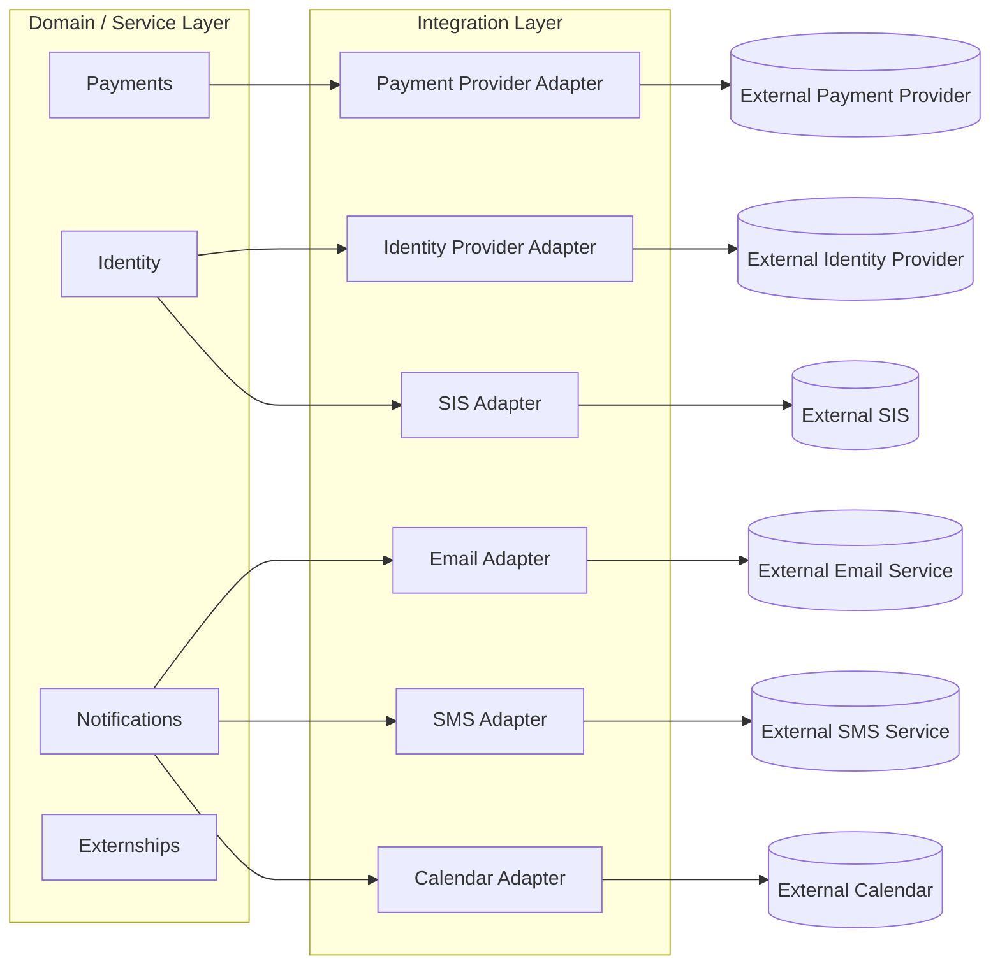

# Integration Architecture

**Status:** Draft
**Milestone:** 6 — Technical Architecture & System Design
**Date:** 2026-08-07

This document identifies where Minara-LMS will eventually need to
integrate with systems outside itself, and the architectural pattern
for doing so — without selecting any specific external product,
provider, or vendor. Every integration named here is explicitly
forward-looking; this milestone does not implement or select any of
them.

## The Integration Layer Pattern

**Decision:** every external integration is mediated through a
dedicated **Integration Layer** sitting at the edge of the relevant
Service (see [Service Boundaries](./03-service-boundaries.md)), rather
than allowing external systems to be called directly from deep inside
domain logic. This is the same protective instinct as
[Milestone 5's shared-kernel/bounded-context thinking](../milestone-5-domain-model-data-architecture/01-domain-driven-design-principles.md)
applied to the platform's outer edge: an external provider's data shapes,
quirks, and failure modes stay contained at the boundary, so a future
provider swap doesn't ripple into core domain logic.

## Integration Areas

| Area | Purpose | Owning Service (Milestone 6, Doc 3) | Status |
|---|---|---|---|
| **Payment Providers** | Processing tuition/fee payments | Payments | **Future** |
| **Identity Providers** | Supporting institutional single sign-on or external credential verification for login | Identity | **Future** |
| **Email** | Delivering notifications outside the platform | Notifications | **Future** |
| **SMS** | Delivering time-sensitive notifications outside the platform | Notifications | **Future** |
| **Video Conferencing** | Supporting synchronous course sessions or orientation, where a program requires them | Learning (via Application Architecture's Learning Engine) | **Future** |
| **Calendar** | Syncing platform deadlines/events to a User's external calendar | Notifications | **Future**, see [Global Navigation Framework](../milestone-4-information-architecture/01-global-navigation-framework.md) |
| **Student Information Systems (SIS)** | Exchanging enrollment/academic data with an external SIS, if Minara-LMS is not the sole system of record | Identity / Admissions | **Future**, directly tied to the still-open [Scope Boundaries §Needs Verification](../milestone-1-product-vision-platform-strategy/09-scope-boundaries.md) on whether Minara-LMS is the SIS of record |
| **Credential Verification** | Allowing third parties (e.g., Employer Partners, licensing bodies) to verify an issued Certificate's authenticity | Certificates | **Future** |
| **Learning Tools** | Supporting external learning tools/content types beyond what's natively modeled (e.g., specialized simulation software for health sciences training) | Learning | **Future** |
| **Analytics** | Exporting operational data to external analytics/business-intelligence tooling | Analytics | **Future** |
| **Future APIs** | Exposing Minara-LMS's own capabilities to external consumers (e.g., a future mobile app, or third-party tools per [Long-Term Platform Vision](../milestone-1-product-vision-platform-strategy/07-long-term-platform-vision.md)) | Cross-cutting | **Future** |

## Principles for Future Integration Work

- **No integration is assumed necessary for initial launch.** Every item
  above is named because it is foreseeable, not because it is required —
  see the [Implementation Roadmap](./10-implementation-roadmap.md) for
  how (and whether) these enter scope over time.
- **Integrations should degrade gracefully.** A Service's core domain
  logic should not fail simply because an external integration is
  unavailable — e.g., Payments' core Invoice/Payment/Receipt logic
  should not depend on a specific payment provider being reachable to
  remain internally consistent.
- **Data ownership stays internal.** An external integration provides or
  receives data; it does not become the authoritative source for a
  Milestone 5 entity Minara-LMS itself owns (e.g., an external SIS
  integration exchanges Enrollment data but does not make the external
  SIS the owner of the Enrollment entity, unless a future scope decision
  explicitly says otherwise).

## Current / Planned / Future

| Element | Status |
|---|---|
| Integration Layer as an architectural pattern | **Current** — the pattern is decided now, even though every integration it will carry is Future |
| All eleven Integration Areas listed above | **Future** |
| Graceful degradation principle | **Current** |
| Data ownership principle | **Current** |

## ⚠️ Needs Verification

- Whether Minara-LMS is the system of record for enrollment/academic
  data or integrates with an external SIS remains the single largest
  open question shaping this document, carried forward unresolved from
  [Scope Boundaries](../milestone-1-product-vision-platform-strategy/09-scope-boundaries.md).
- Whether video conferencing integration is required at all depends on
  whether any Minara program includes synchronous delivery — not yet
  confirmed (see
  [Faculty Portal §Needs Verification](../milestone-4-information-architecture/03-faculty-portal.md)
  on Attendance/course format).
