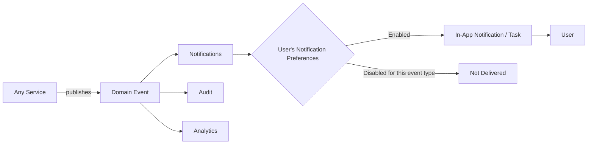

# Notification & Event Architecture

**Status:** Draft
**Milestone:** 6 — Technical Architecture & System Design
**Date:** 2026-08-07

This document defines the platform's conceptual event-driven behavior:
the catalog of significant events services publish, and how the
**Notifications** service (see
[Service Boundaries](./03-service-boundaries.md)) turns those events into
something a User actually sees, per the
[Global Navigation Framework §7 (Notification Philosophy)](../milestone-4-information-architecture/01-global-navigation-framework.md).

## Event-Driven Flow

Every event that reaches Notifications is evaluated against the
receiving User's preferences (see below) before becoming a visible
Notification — publishing an event is not the same as guaranteeing
delivery.

## Event Catalog

| Event | Publishing Service | Description | Notified Roles | Workflow Reference |
|---|---|---|---|---|
| **Application Submitted** | Admissions | An Applicant completes and submits their application | Admissions Staff | [Admissions Workflows](../milestone-3-student-journey-core-workflows/03-admissions-workflows.md) |
| **Admission Decision Made** | Admissions | Accept/Waitlist/Deny/Defer recorded | Applicant, Admissions Staff, Program Director | [Admissions Workflows](../milestone-3-student-journey-core-workflows/03-admissions-workflows.md) |
| **Payment Received** | Payments | A Payment is completed against an Invoice | Student, Admissions Staff (if enrollment-blocking), Administrator | [Student Lifecycle Workflow](../milestone-3-student-journey-core-workflows/01-student-lifecycle-workflow.md) |
| **Course Offering Assigned** *(a.k.a. "Course Assigned")* | Learning | A Faculty Teaching Assignment is approved and active | Faculty, Program Director | [Faculty Workflows](../milestone-3-student-journey-core-workflows/02-faculty-workflows.md) |
| **Assignment/Assessment Due Soon** | Assessments | A deadline is approaching for an open Assignment/Assessment | Student | [Faculty Workflows](../milestone-3-student-journey-core-workflows/02-faculty-workflows.md) |
| **Assessment Graded** | Gradebook | A Grade is entered (draft) or approved (final) | Student (on approval), Faculty (on submission) | [Faculty Workflows](../milestone-3-student-journey-core-workflows/02-faculty-workflows.md) |
| **Externship Placement Assigned** | Externships | A Student is confirmed to a Clinical Site | Student, Clinical Coordinator, Employer Partner | [Externship Management Workflow](../milestone-3-student-journey-core-workflows/04-externship-management-workflow.md) |
| **Certificate Issued** | Certificates | A Certificate Record is created | Student, Program Director, Administrator | [Certificate & Graduation Workflow](../milestone-3-student-journey-core-workflows/05-certificate-graduation-workflow.md) |
| **AI Escalation Raised** | AI | An AI Conversation is escalated to a human | Faculty (or designated staff, per [AI Platform Architecture §Needs Verification](./06-ai-platform-architecture.md)) | [AI Learning Assistant Workflow](../milestone-3-student-journey-core-workflows/06-ai-learning-assistant-workflow.md) |
| **Grade Approval Requested** | Gradebook | Faculty submits final grades for Program Director approval | Program Director | [Faculty Workflows](../milestone-3-student-journey-core-workflows/02-faculty-workflows.md) |
| **Completion Verified** | Externships | Joint Coordinator/Program Director sign-off on a Placement | Student, Program Director | [Externship Management Workflow](../milestone-3-student-journey-core-workflows/04-externship-management-workflow.md) |
| **Role Assignment Granted/Revoked** | Identity | A Role Assignment changes | The affected User, Administrator | [Permission Framework](../milestone-2-user-roles-permission-architecture/02-permission-framework.md) |
| **System Announcement Published** | Notifications (Announcement) | An Administrator/Program Director broadcasts to a scoped audience | Every User within scope | [Administrator Portal](../milestone-4-information-architecture/08-administrator-portal.md) |

*This catalog is representative, not exhaustive — every Approval,
Escalation, and status transition named across
[Milestone 3](../milestone-3-student-journey-core-workflows/README.md)'s
workflows is a candidate event. New events are added as new workflow
steps are detailed, not designed exhaustively in advance.*

## Notification Preferences

- Preferences are set per User, per event *type* (not globally on/off) —
  a Student might want Assessment Graded notifications but suppress
  Course Offering Assigned notifications, for example.
- Preferences never override role-scoped visibility — a User cannot
  opt into seeing an event outside what their Role Assignment would
  already permit them to view, per the
  [Permission Framework](../milestone-2-user-roles-permission-architecture/02-permission-framework.md).
- Some events are **not preference-suppressible** — specifically, those
  tied to approval gates or compliance-relevant status changes (e.g.,
  Certificate Issued) are always delivered, consistent with the
  [Audit and Accountability Framework](../milestone-2-user-roles-permission-architecture/05-audit-accountability-framework.md)'s
  expectation that consequential changes are visible to the people
  accountable for them.
- **Delivery channel** preference (in-app only, vs. also email/SMS) is
  conceptually separate from event-type preference and depends on the
  Integration Architecture's Email/SMS integrations, both **Future** —
  see [Integration Architecture](./07-integration-architecture.md).

## Current / Planned / Future

| Element | Status |
|---|---|
| Event-driven flow: Service publishes → Notifications/Audit/Analytics subscribe | **Current** — direct expression of [Service Boundaries](./03-service-boundaries.md) |
| Event Catalog (as listed) | **Planned** |
| Per-event-type notification preferences | **Planned** |
| Non-suppressible events for compliance-relevant changes | **Current** — principle-level decision |
| Multi-channel delivery (email/SMS) | **Future**, depends on [Integration Architecture](./07-integration-architecture.md) |
| Digest/batched notifications (vs. immediate) | **Future** |

## ⚠️ Needs Verification

- The complete event catalog will grow as later milestones or
  implementation work surface more workflow steps — this document
  should be treated as a living reference, not a final list.
- Which events, beyond Certificate Issued, should be non-suppressible is
  a policy judgment this document has only partially made (grade
  approvals and role changes are reasonable candidates but not yet
  confirmed).
