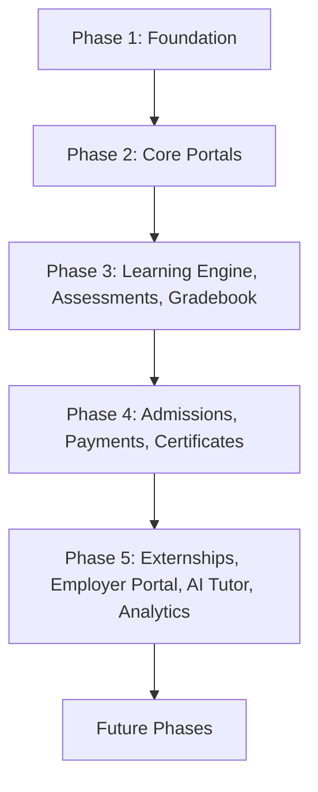

# Implementation Roadmap

**Status:** Draft
**Milestone:** 6 — Technical Architecture & System Design
**Date:** 2026-08-07

This document proposes a **phased build sequence** for Minara-LMS,
translating the Required/Planned/Future screen tagging from the
[Screen Inventory](../milestone-4-information-architecture/09-screen-inventory.md)
and the service structure from
[Service Boundaries](./03-service-boundaries.md) into an order of
delivery. It is a **draft sequencing proposal**, not a committed
schedule — no dates, durations, or staffing are specified, consistent
with this milestone remaining architecture, not project planning.

## Sequencing Rationale

Each phase is scoped so that what it delivers is genuinely usable on its
own, and so that later phases build on working, real functionality
rather than placeholders. The one deliberate tension worth naming
up front: **Phase 2 delivers the Student and Faculty Portals before
Phase 4 delivers self-service Admissions.** This is intentional — the
core teaching/learning loop (Phase 2–3) can be exercised with a small,
manually provisioned pilot cohort (Administrator-created Enrollments,
per the [Administrator Portal](../milestone-4-information-architecture/08-administrator-portal.md)'s
User & Role Management screens) before the full self-service Admissions
pipeline is built. **⚠️ Needs Verification:** this sequencing assumption
should be confirmed with stakeholders — an alternative, equally valid
sequencing would build Admissions earlier if a real (non-pilot) student
population needs to self-enroll from day one.

## Roadmap Diagram

## Phase 1 — Foundation

**Goal:** Establish identity, access, and institutional structure — the
prerequisites for everything else.

| Delivers | Source |
|---|---|
| Identity service (Authentication, Role, Permission, Role Assignment) | [Service Boundaries](./03-service-boundaries.md) |
| RBAC enforcement at the Application/Orchestration Layer | [Security Architecture](./04-security-architecture.md) |
| Institution / School / Program / Cohort structure (Learning service, structural portion) | [Academic Domain Model](../milestone-5-domain-model-data-architecture/02-academic-domain-model.md) |
| Audit service (foundational, event-subscribed) | [Audit and Accountability Framework](../milestone-2-user-roles-permission-architecture/05-audit-accountability-framework.md) |
| Public Website (Home, Programs/Prepped pages, About) | [Global Navigation Framework §1](../milestone-4-information-architecture/01-global-navigation-framework.md) |
| Administrator Portal core (Institution Structure, User Accounts, Role Assignments) | [Screen Inventory — Administrator Portal](../milestone-4-information-architecture/09-screen-inventory.md) |

## Phase 2 — Core Portals

**Goal:** Deliver the core teaching/learning loop for a pilot population.

| Delivers | Source |
|---|---|
| Student Portal: Dashboard, My Courses, Current Lesson, Assignments, Assessments, Grades, Progress, Notifications, Profile & Settings | [Student Portal — Required screens](../milestone-4-information-architecture/09-screen-inventory.md) |
| Faculty Portal: Dashboard, My Sections, Roster, Content & Preparation, Assignments & Assessments, Gradebook, Feedback, Final Grade Submission, Profile & Settings | [Faculty Portal — Required screens](../milestone-4-information-architecture/09-screen-inventory.md) |
| Manual/Administrator-provisioned Enrollment (pilot-cohort workaround, pending Phase 4's self-service Admissions) | See Sequencing Rationale above |

## Phase 3 — Learning Engine, Assessments, Gradebook

**Goal:** Deepen the core delivery and evaluation capability into full
services rather than portal-only functionality.

| Delivers | Source |
|---|---|
| Learning Engine as a full service (Course/Module/Lesson/Learning Object delivery, Course Progress) | [Application Architecture](./02-application-architecture.md) |
| Assessment Engine (Assignment/Assessment/Quiz/Question Bank) | [Service Boundaries](./03-service-boundaries.md) |
| Gradebook service, including Final Grade Approval workflow | [Faculty Workflows §Approval Points](../milestone-3-student-journey-core-workflows/02-faculty-workflows.md) |
| Messaging and Notifications services (cross-cutting) | [Notification & Event Architecture](./08-notification-event-architecture.md) |
| Calendar | [Student Portal](../milestone-4-information-architecture/02-student-portal.md), [Faculty Portal](../milestone-4-information-architecture/03-faculty-portal.md) |
| Program Director Portal: Grade Approvals, Cohort Management, Curriculum Oversight | [Program Director Portal — Required screens](../milestone-4-information-architecture/09-screen-inventory.md) |

## Phase 4 — Admissions, Payments, Certificates

**Goal:** Open self-service enrollment and close the loop on program
completion.

| Delivers | Source |
|---|---|
| Admissions service and full Admissions Portal | [Admissions Workflows](../milestone-3-student-journey-core-workflows/03-admissions-workflows.md) |
| Payments service (Invoice, Payment, Receipt) and Student Payments screen | [Certificate & Graduation Workflow](../milestone-3-student-journey-core-workflows/05-certificate-graduation-workflow.md) |
| Certificates service and Certificate & Graduation Workflow support | [Certificate & Graduation Workflow](../milestone-3-student-journey-core-workflows/05-certificate-graduation-workflow.md) |
| Program Director Portal: Graduation & Certificate Approvals | [Program Director Portal](../milestone-4-information-architecture/04-program-director-portal.md) |
| Administrator Portal: Enrollment Oversight, Financial Oversight, Certificates | [Administrator Portal](../milestone-4-information-architecture/08-administrator-portal.md) |

## Phase 5 — Externships, Employer Portal, AI Tutor, Analytics

**Goal:** Complete the full student journey for programs requiring
externships, and introduce AI-assisted learning support.

| Delivers | Source |
|---|---|
| Externships service, Clinical/Externship Coordinator Portal, Employer Portal | [Externship Management Workflow](../milestone-3-student-journey-core-workflows/04-externship-management-workflow.md) |
| AI service: Safety & Scope Gate, Response Generation, Escalation Router, Conversation History Store — Student-facing Learning Support only | [AI Platform Architecture](./06-ai-platform-architecture.md) |
| Analytics service (initial) and Reporting Engine Area | [Application Architecture](./02-application-architecture.md) |
| Audit Log Viewer (Administrator Portal) | [Administrator Portal](../milestone-4-information-architecture/08-administrator-portal.md) |

## Future Phases

Explicitly **Future**, unscoped beyond naming:

| Item | Source |
|---|---|
| Continuing Education | [Future Data Architecture Considerations](../milestone-5-domain-model-data-architecture/09-future-data-architecture-considerations.md) |
| Additional Schools / multi-campus support | [Future Data Architecture Considerations](../milestone-5-domain-model-data-architecture/09-future-data-architecture-considerations.md) |
| Mobile App | Not previously scoped in Milestones 1–5; named here for the first time as a plausible future delivery surface, distinct from the mobile-first *web* experience already required by [Guiding Principles §4](../milestone-1-product-vision-platform-strategy/03-guiding-principles.md) |
| API Platform (external-facing APIs) | [Integration Architecture — Future APIs](./07-integration-architecture.md) |
| Content Assistance, Faculty Assistance, Administrative Assistance (AI) | [AI Platform Architecture](./06-ai-platform-architecture.md) |
| Formal external integrations (payment providers, SIS, credential verification, etc.) | [Integration Architecture](./07-integration-architecture.md) |
| Future Licensing (platform offered beyond the Minara ecosystem) | [Long-Term Platform Vision](../milestone-1-product-vision-platform-strategy/07-long-term-platform-vision.md) |

## Current / Planned / Future

| Phase | Status |
|---|---|
| Phase 1 — Foundation | **Planned** |
| Phase 2 — Core Portals | **Planned** |
| Phase 3 — Learning Engine, Assessments, Gradebook | **Planned** |
| Phase 4 — Admissions, Payments, Certificates | **Planned** |
| Phase 5 — Externships, Employer Portal, AI Tutor, Analytics | **Planned** |
| Future Phases (all items) | **Future** |

## ⚠️ Needs Verification

- The Phase 2-before-Phase-4 sequencing (core portals before self-service
  Admissions) — the single largest open sequencing question in this
  document; see Sequencing Rationale above.
- Whether Phase 5's scope (three fairly distinct capability areas —
  Externships, AI Tutor, Analytics) is too large for a single phase in
  practice; this document groups them because they share a "completes
  the full journey" theme, not because they are technically
  interdependent.
- No phase in this document has been validated against actual team
  size, capacity, or timeline — this is a dependency-ordered sequence,
  not a scheduled plan.
