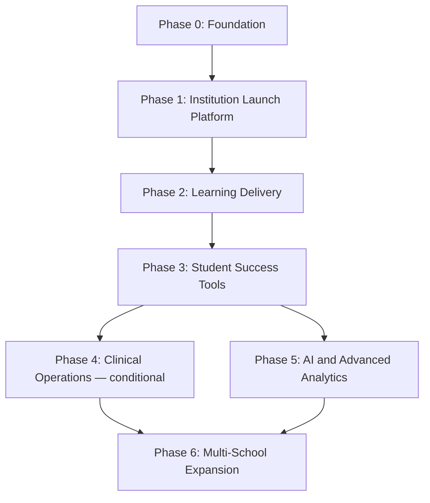

# Implementation Phases

**Status:** Draft
**Milestone:** 7 — MVP Definition & Implementation Planning
**Date:** 2026-08-07

This document is the **product-facing** phased roadmap for
Minara-LMS — Phase 0 through Phase 6, named around business outcomes
rather than technical layers. It is a companion to, not a replacement
for, the
[Implementation Roadmap](../milestone-6-technical-architecture/10-implementation-roadmap.md)
in Milestone 6, which sequences the same underlying work by service and
layer. Where the two differ in emphasis, this document is the one to
use for stakeholder communication; Milestone 6's is the one to use for
technical sequencing. Neither contradicts the other — they are two views
of one plan, cross-referenced throughout.

## Phase Sequence

*Phase 4 branches in parallel with Phase 5 rather than strictly after
it — Clinical Operations (if the launch Program requires it) does not
depend on AI/Analytics, and vice versa. Both feed into Phase 6.*

## Phase 0 — Foundation

- **Purpose:** Establish the non-negotiable technical and structural
  base everything else depends on.
- **Features:** Identity (Authentication, RBAC, Role Assignment), Audit
  Logging, Institution/School/Program/Cohort structure, minimal Public
  Website (Home, launch Program page, Apply entry point).
- **Users Affected:** Administrator only — no Student, Faculty, or other
  role has anything to do yet.
- **Dependencies:** None — this is the first phase.
- **Success Criteria:** An Administrator can create the institution's
  structure, grant Role Assignments, and the Audit Log captures both
  actions correctly.

## Phase 1 — Institution Launch Platform

- **Purpose:** Get one real cohort enrolled and financially onboarded.
- **Features:** Manual/Administrator-provisioned Enrollment, basic
  Payments (Invoice, Payment, Receipt), Cohort creation for the launch
  Program.
- **Users Affected:** Administrator, Admissions Staff (manual mode),
  Student (enrollment confirmation only — no course access yet).
- **Dependencies:** Phase 0.
- **Success Criteria:** A real cohort of Students holds Active
  Enrollments with cleared (or explicitly tracked) payment status.

## Phase 2 — Learning Delivery

- **Purpose:** Deliver the actual teaching and learning experience —
  the platform's core value.
- **Features:** Student Portal core (Dashboard, My Courses, Current
  Lesson, Assignments, Assessments, Grades, Progress); Faculty Portal
  core (My Sections, Roster, Content & Preparation, Assignments &
  Assessments, Gradebook, Feedback, Final Grade Submission); Program
  Director Grade Approvals.
- **Users Affected:** Student, Faculty, Program Director.
- **Dependencies:** Phase 0 (structure/identity), Phase 1 (an enrolled
  cohort to teach).
- **Success Criteria:** A full course is taught, graded by Faculty, and
  approved by a Program Director, end to end, for the launch cohort.

## Phase 3 — Student Success Tools

- **Purpose:** Round out what it takes to carry the first cohort all the
  way to completion, and enable self-service recruitment of the next
  cohort.
- **Features:** Notifications (critical events), Messaging, Calendar,
  Student Support screen, the full
  [Certificate & Graduation Workflow](../milestone-3-student-journey-core-workflows/05-certificate-graduation-workflow.md)
  (Completion Verification → Academic Review → Certificate Approval →
  Issuance), **and** the self-service Admissions pipeline (SHOULD HAVE,
  per [MVP Scope Definition](./02-mvp-scope-definition.md)) — timed here
  because by the point cohort one is finishing, recruiting cohort two
  matters.
- **Users Affected:** Student, Faculty, Program Director, Administrator,
  Admissions Staff, prospective applicants.
- **Dependencies:** Phase 2 (a completing cohort to certify; a working
  teaching loop to build communication tools around).
- **Success Criteria:** The first cohort successfully completes the
  program and receives certificates; a second cohort can begin applying
  through self-service Admissions without manual data entry.

## Phase 4 — Clinical Operations *(Conditional)*

- **Purpose:** Support programs requiring real-world clinical training.
- **Features:** Full
  [Externship Management Workflow](../milestone-3-student-journey-core-workflows/04-externship-management-workflow.md) —
  Sites, Placements, Hours, Evaluations, Completion Verification;
  Clinical/Externship Coordinator Portal; Employer Portal.
- **Users Affected:** Student, Clinical Coordinator, Employer Partner,
  Program Director.
- **Dependencies:** Phase 2 (externship eligibility depends on academic
  progress).
- **Success Criteria:** A Student completes a full placement cycle with
  verified completion, feeding into Phase 3's Certificate workflow.
- **⚠️ Needs Verification:** this entire phase is conditional on whether
  the launch Program requires an externship — see
  [MVP Scope Definition](./02-mvp-scope-definition.md). If it does not,
  this phase moves later in sequence, timed to whichever future Program
  first requires it.

## Phase 5 — AI and Advanced Analytics

- **Purpose:** Introduce AI-assisted learning support and data-driven
  insight, now that real usage exists to learn from.
- **Features:** AI Tutor (Safety & Scope Gate, Response Generation,
  Escalation Router, Human Review Queue, per
  [AI Platform Architecture](../milestone-6-technical-architecture/06-ai-platform-architecture.md));
  Analytics service; Reporting Engine Area screens.
- **Users Affected:** Student (AI Tutor); Faculty, Program Director,
  Administrator (Reporting/Analytics).
- **Dependencies:** Phase 2–3 — meaningful AI tutoring and analytics both
  depend on a stable core loop and real usage data existing first.
- **Success Criteria:** AI Tutor operates within its full safety/
  escalation bounds (no partial safety implementation, per
  [MVP Scope Definition](./02-mvp-scope-definition.md)); the first
  Learning Analytics/reporting output is produced from real cohort data.

## Phase 6 — Multi-School Expansion

- **Purpose:** Extend beyond the single launch Program to the full
  multi-school, multi-program vision.
- **Features:** Additional School/Program setup; Prepped product
  onboarding; School-level administrative delegation, if confirmed
  needed (see
  [Multi-School and Multi-Program Access Model §Needs Verification](../milestone-2-user-roles-permission-architecture/04-multi-school-multi-program-access-model.md)).
- **Users Affected:** All roles, at expanded scale.
- **Dependencies:** Phases 0–5 proven end-to-end with the first Program.
- **Success Criteria:** A second School or Program launches on the same
  platform without any architectural rework — the definitive test of
  whether Milestones 1–6's "launch narrow, build for scale" premise
  actually held.

## Current / Planned / Future

| Phase | Status |
|---|---|
| Phase 0 — Foundation | **Planned** — MVP |
| Phase 1 — Institution Launch Platform | **Planned** — MVP |
| Phase 2 — Learning Delivery | **Planned** — MVP |
| Phase 3 — Student Success Tools | **Planned** — MVP + near-term follow-on |
| Phase 4 — Clinical Operations | **Planned**, conditional on launch Program |
| Phase 5 — AI and Advanced Analytics | **Planned**, near-term follow-on |
| Phase 6 — Multi-School Expansion | **Future** |

## ⚠️ Needs Verification

- The launch Program's externship requirement (repeated here because it
  materially reorders Phase 4).
- Whether Phase 3's dual scope (Student Success Tools *and*
  self-service Admissions) is too large for one phase in practice — they
  are grouped by timing rationale, not technical dependency, and could
  be split if capacity requires it.
- This roadmap assumes Phases 0–3 constitute the MVP proper, with Phases
  4–6 as near-term-to-long-term follow-on — this boundary should be
  explicitly confirmed by stakeholders, not inferred from phase
  numbering alone.
