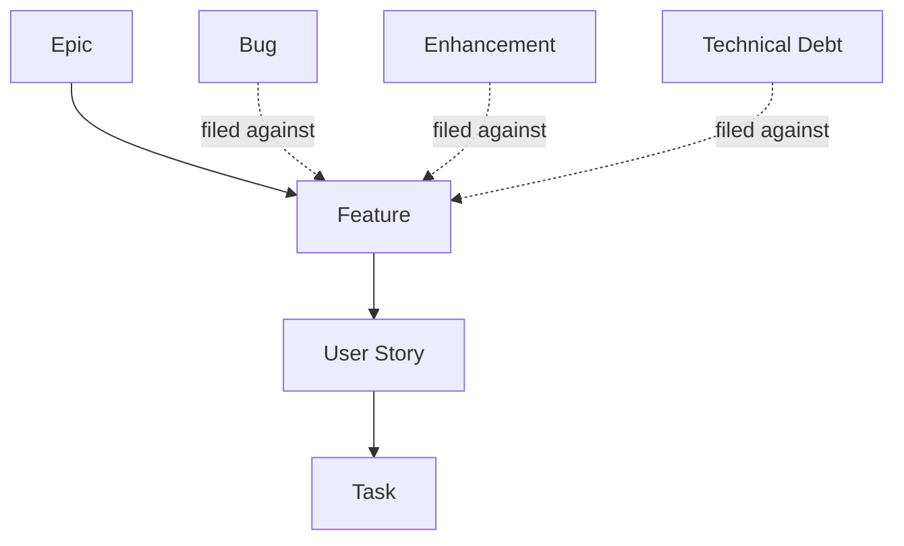

# Development Backlog Framework

**Status:** Draft
**Milestone:** 7 — MVP Definition & Implementation Planning
**Date:** 2026-08-07

This document defines **how future development work should be
organized** once implementation begins — the vocabulary and hierarchy a
future backlog should use, so that work stays traceable back to this
documentation set instead of drifting into its own, disconnected
language. It defines no actual tickets; per this milestone's
instructions, that begins only once implementation planning starts.

## The Hierarchy

| Level | Definition | Traces Back To |
|---|---|---|
| **Epic** | A large body of work aligned to one [Implementation Phase](./05-implementation-phases.md) or one major capability area from [MVP Scope Definition](./02-mvp-scope-definition.md); too large to complete in a single release, and decomposed into multiple Features. | A Phase (Doc 5) or a Platform Area (Doc 2) |
| **Feature** | A discrete, shippable capability within an Epic — typically one [Milestone 4](../milestone-4-information-architecture/README.md) screen or one [Milestone 6](../milestone-6-technical-architecture/README.md) service capability. | A screen ([Milestone 4](../milestone-4-information-architecture/README.md)) or a service ([Milestone 6, Doc 3](../milestone-6-technical-architecture/03-service-boundaries.md)) |
| **User Story** | A single user-facing need within a Feature, in the "As a / I want / So that" format established in [MVP User Stories](./03-mvp-user-stories.md), with conceptual acceptance criteria. | A story in Doc 3, or a new one written in the same format |
| **Task** | The granular engineering work needed to implement one User Story. **Not created in this milestone** — Tasks are written once real implementation planning begins, against real technical decisions this documentation set deliberately hasn't made. | A User Story |

## Cross-Cutting Classifications

Three additional classifications apply *across* the hierarchy above,
typically attached at the Feature level, rather than being their own
tier of planned work:

- **Bug** — a defect where actual behavior doesn't match the behavior a
  User Story's acceptance criteria describe. A Bug is only ever filed
  against something that was already specified — if the "correct"
  behavior was never defined, the gap is a missing User Story, not a
  Bug.
- **Enhancement** — an improvement to a Feature that goes beyond its
  original acceptance criteria. Distinguished from a new Feature by
  scope: an Enhancement extends something that already shipped; a new
  Feature stands on its own within an Epic.
- **Technical Debt** — work that improves the implementation's alignment
  with the architecture defined in
  [Milestone 6](../milestone-6-technical-architecture/README.md), without
  changing user-facing behavior (e.g., a module that grew tangled
  dependencies gets its boundary restored to match
  [Service Boundaries](../milestone-6-technical-architecture/03-service-boundaries.md)).
  Every Technical Debt item should name the specific architectural
  principle it's restoring alignment with — undirected "cleanup" is not
  Technical Debt in this framework, it's just unscoped work.

## How Work Should Be Organized

1. **Every Epic maps to exactly one Phase or Platform Area.** This keeps
   the backlog's shape legible against
   [Implementation Phases](./05-implementation-phases.md) at a glance —
   anyone should be able to answer "what Phase does this Epic belong to"
   without digging.
2. **Every Feature traces to a screen or a service, never invented from
   scratch.** If a proposed Feature doesn't map to anything in
   [Milestone 4](../milestone-4-information-architecture/README.md) or
   [Milestone 6](../milestone-6-technical-architecture/README.md), that's
   a signal the architecture needs updating first — not that the
   Feature should be built untethered from it.
3. **Every User Story traces to a workflow step.** Per
   [Master Traceability Framework](./08-master-traceability-framework.md),
   a User Story that can't be traced to a
   [Milestone 3](../milestone-3-student-journey-core-workflows/README.md)
   workflow step is either missing context or represents scope this
   documentation hasn't yet accounted for.
4. **Tasks are the only tier this milestone deliberately leaves empty.**
   Everything above Task can be populated directly from Milestones 1–7;
   Tasks require the technology decisions this project has consistently
   deferred (see every prior milestone's "no vendor selection"
   instruction) and so belong to implementation planning proper, not to
   this architecture phase.
5. **Bugs, Enhancements, and Technical Debt are always filed against a
   Feature**, never floating free — this keeps them traceable to the
   same chain everything else in this framework follows.

## Current / Planned / Future

| Element | Status |
|---|---|
| The Epic → Feature → User Story → Task hierarchy | **Current** — this milestone's organizing decision |
| Bug / Enhancement / Technical Debt as Feature-level cross-cutting classifications | **Current** |
| Actual Epics, Features, and Tasks populated from this framework | **Future** — belongs to implementation planning, not this milestone |

## ⚠️ Needs Verification

- Whether this four-tier hierarchy (Epic/Feature/User Story/Task) matches
  whatever project-management tooling is eventually selected is
  explicitly not addressed here — this framework is tooling-agnostic by
  design, and mapping it onto a specific tool's terminology is a later,
  implementation-adjacent decision.
