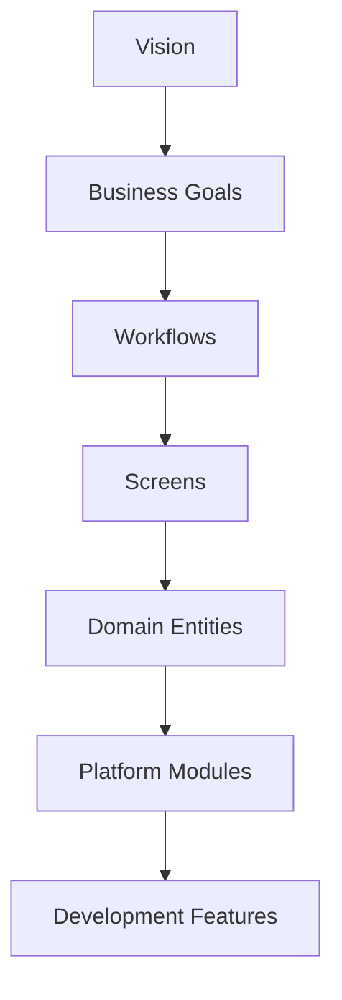

# Master Traceability Framework

**Status:** Draft
**Milestone:** 7 — MVP Definition & Implementation Planning
**Date:** 2026-08-07

This document is the **master reference** connecting every layer of
this project, from the Product Vision in Milestone 1 down to a
Development Feature in this milestone. Its purpose is simple but
important: **nothing in Minara-LMS should exist that can't be traced
upward to a reason it should exist, and nothing in the vision should
exist that can't be traced downward to something concrete that realizes
it.**

## The Seven-Layer Chain

| Layer | Authoritative Source |
|---|---|
| **Vision** | [Milestone 1, Doc 1 — Product Vision](../milestone-1-product-vision-platform-strategy/01-product-vision.md) |
| **Business Goals** | [Milestone 1, Doc 2 — Product Mission](../milestone-1-product-vision-platform-strategy/02-product-mission.md) and [Doc 8 — Success Principles](../milestone-1-product-vision-platform-strategy/08-success-principles.md) |
| **Workflows** | [Milestone 3](../milestone-3-student-journey-core-workflows/README.md) |
| **Screens** | [Milestone 4](../milestone-4-information-architecture/README.md) |
| **Domain Entities** | [Milestone 5](../milestone-5-domain-model-data-architecture/README.md) |
| **Platform Modules** | [Milestone 6, Doc 2 — Application Architecture](../milestone-6-technical-architecture/02-application-architecture.md) and [Doc 3 — Service Boundaries](../milestone-6-technical-architecture/03-service-boundaries.md) |
| **Development Features** | [Milestone 7, Doc 2](./02-mvp-scope-definition.md), [Doc 4](./04-mvp-feature-prioritization.md), [Doc 6](./06-development-backlog-framework.md) |

This document does not restate any layer's content — every cell in the
worked examples below is a pointer, not a duplicate definition.

## Worked Example 1: Certificate Issuance

| Layer | Concrete Instance |
|---|---|
| **Vision** | "Future accreditation readiness" and a platform built for trustworthy institutional operation — [Product Vision](../milestone-1-product-vision-platform-strategy/01-product-vision.md) |
| **Business Goal** | "Trustworthy Records" and "One Learner, Coherently Represented" — [Success Principles](../milestone-1-product-vision-platform-strategy/08-success-principles.md) |
| **Workflow** | [Certificate & Graduation Workflow](../milestone-3-student-journey-core-workflows/05-certificate-graduation-workflow.md) |
| **Screens** | Student [Certificates](../milestone-4-information-architecture/02-student-portal.md); Program Director [Graduation & Certificate Approvals](../milestone-4-information-architecture/04-program-director-portal.md); Administrator [Certificates](../milestone-4-information-architecture/08-administrator-portal.md) |
| **Domain Entities** | Certificate (Program definition) — [Academic Domain Model](../milestone-5-domain-model-data-architecture/02-academic-domain-model.md); Certificate (Student-held) — [Student Domain Model](../milestone-5-domain-model-data-architecture/03-student-domain-model.md); Certificate Record, Approval — [Platform Services](../milestone-5-domain-model-data-architecture/06-platform-services-domain-model.md) and [Faculty & Administration](../milestone-5-domain-model-data-architecture/04-faculty-administration-domain-model.md) Domain Models |
| **Platform Module** | Certificates service — [Service Boundaries](../milestone-6-technical-architecture/03-service-boundaries.md) |
| **Development Feature** | "Certificate Issuance," a MUST HAVE Feature under the Phase 1–3 Epic span — [MVP Feature Prioritization](./04-mvp-feature-prioritization.md) |

## Worked Example 2: AI Tutor Escalation

| Layer | Concrete Instance |
|---|---|
| **Vision** | "AI-assisted learning at scale," bounded by human-reviewed workflows — [Long-Term Platform Vision](../milestone-1-product-vision-platform-strategy/07-long-term-platform-vision.md) |
| **Business Goal** | "AI That Helps Without Overreaching" — [Success Principles](../milestone-1-product-vision-platform-strategy/08-success-principles.md) |
| **Workflow** | [AI Learning Assistant Workflow](../milestone-3-student-journey-core-workflows/06-ai-learning-assistant-workflow.md) |
| **Screen** | Student [AI Tutor](../milestone-4-information-architecture/02-student-portal.md) |
| **Domain Entities** | AI Conversation, AI Recommendation — [Platform Services Domain Model](../milestone-5-domain-model-data-architecture/06-platform-services-domain-model.md) |
| **Platform Module** | AI service (Safety & Scope Gate, Escalation Router) — [AI Platform Architecture](../milestone-6-technical-architecture/06-ai-platform-architecture.md) |
| **Development Feature** | "AI Tutor (Learning Support)," a COULD HAVE Feature — [MVP Feature Prioritization](./04-mvp-feature-prioritization.md) |

## Worked Example 3: Final Grade Approval

| Layer | Concrete Instance |
|---|---|
| **Vision** | A platform that reliably delivers and manages the educational experience — [Product Vision](../milestone-1-product-vision-platform-strategy/01-product-vision.md) |
| **Business Goal** | "Every Role Gets What It Needs, and Only What It Needs" — [Success Principles](../milestone-1-product-vision-platform-strategy/08-success-principles.md) |
| **Workflow** | [Faculty Workflows §Approval Points](../milestone-3-student-journey-core-workflows/02-faculty-workflows.md) |
| **Screens** | Faculty [Final Grade Submission](../milestone-4-information-architecture/03-faculty-portal.md); Program Director [Grade Approvals](../milestone-4-information-architecture/04-program-director-portal.md) |
| **Domain Entities** | Grades — [Student Domain Model](../milestone-5-domain-model-data-architecture/03-student-domain-model.md); Approval — [Faculty & Administration Domain Model](../milestone-5-domain-model-data-architecture/04-faculty-administration-domain-model.md) |
| **Platform Module** | Gradebook service — [Service Boundaries](../milestone-6-technical-architecture/03-service-boundaries.md) |
| **Development Feature** | "Final Grade Approval," a MUST HAVE Feature — [MVP Feature Prioritization](./04-mvp-feature-prioritization.md) |

## How to Use This Framework Going Forward

- **Adding a new Feature:** trace it upward first. If it can't be
  connected to an existing Workflow, Screen, or Entity, that's a signal
  the architecture (Milestones 3–5) needs to be extended *before* the
  Feature is built — not that the Feature should be built against
  nothing.
- **Questioning an existing Feature's priority:** trace it upward to the
  Business Goal and Vision layers. A Feature that can't be connected to
  a stated goal is a candidate for re-evaluation, not an assumed
  necessity.
- **Onboarding someone new to the project:** this document, plus the
  three worked examples, is the fastest path to understanding how the
  seven milestones fit together as one coherent system rather than
  seven separate documents.

## Current / Planned / Future

| Element | Status |
|---|---|
| The seven-layer chain and its authoritative sources | **Current** |
| The three worked examples | **Current** |
| A complete, exhaustive trace of every Feature (not just the three examples) | **Future** — to be built out incrementally as [Development Backlog Framework](./06-development-backlog-framework.md)'s Epics and Features are actually populated during implementation planning |

## ⚠️ Needs Verification

- This document deliberately traces only three representative examples
  rather than every Feature in the platform — attempting full coverage
  here would duplicate, at large scale, content already spread across
  Milestones 3–7. Whether a fuller, systematically complete traceability
  matrix is worth building as its own artifact (likely tooling-supported
  rather than hand-maintained) is a decision for implementation
  planning, not this milestone.
