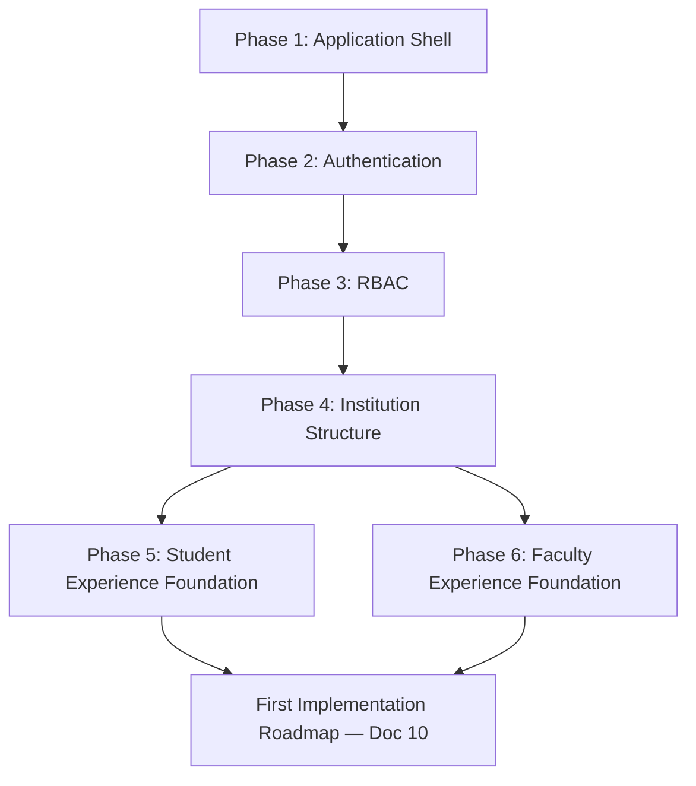

# Application Foundation Plan

**Status:** Draft
**Milestone:** 9 — Engineering Foundation & Development Setup
**Date:** 2026-08-07

This document sequences the **first six build phases** — narrower and
more granular than
[Milestone 6's Implementation Roadmap](../milestone-6-technical-architecture/10-implementation-roadmap.md)
or
[Milestone 7's Implementation Phases](../milestone-7-mvp-definition-implementation-planning/05-implementation-phases.md).
Where those documents sequence entire product/technical phases, this
one sequences the literal first weeks of engineering work: what gets
scaffolded first so every later phase has something real to build on.

## Phase 1 — Application Shell

- **Builds:** the `apps/platform` and `apps/public-website` skeletons
  from [Repository Structure](./02-repository-structure.md) — routing,
  the authenticated shell (Portal Switcher, Primary/Secondary Navigation
  per the
  [Global Navigation Framework](../milestone-4-information-architecture/01-global-navigation-framework.md)),
  and the shared UI component package, with no real functionality behind
  any of it yet.
- **Why first:** every other phase needs somewhere to render into;
  building the shell first means Phases 2–6 are additive, never
  restructuring.

## Phase 2 — Authentication

- **Builds:** the Identity service's authentication capability, per
  [Authentication & Authorization Architecture](../milestone-8-technology-stack-development-architecture/05-authentication-authorization-architecture.md) —
  login, server-side session establishment, and the User entity from the
  [Platform Services Domain Model](../milestone-5-domain-model-data-architecture/06-platform-services-domain-model.md).
- **Why second:** nothing behind the shell can be meaningfully built or
  tested without a real, authenticated User to build it for.

## Phase 3 — RBAC

- **Builds:** the Role Assignment model — `(Person, Role, Scope)` per
  the
  [Multi-School and Multi-Program Access Model](../milestone-2-user-roles-permission-architecture/04-multi-school-multi-program-access-model.md) —
  and the centralized, fail-closed permission-enforcement component from
  [Authentication & Authorization Architecture](../milestone-8-technology-stack-development-architecture/05-authentication-authorization-architecture.md).
- **Why third:** every subsequent feature needs to be built *inside*
  the authorization model, not have it bolted on afterward — building
  RBAC before any role-specific feature exists is what keeps
  least-privilege genuinely enforced from the start, per
  [Engineering Philosophy §Security-First Development](./01-engineering-philosophy.md).

## Phase 4 — Institution Structure

- **Builds:** Institution, School, Program, Cohort from the
  [Academic Domain Model](../milestone-5-domain-model-data-architecture/02-academic-domain-model.md),
  and the Administrator Portal screens needed to create them (per
  [Administrator Portal](../milestone-4-information-architecture/08-administrator-portal.md)).
- **Why fourth:** every later entity (Enrollment, Course Offering,
  Placement) needs a structural hierarchy to belong to — this phase
  gives Phases 5–6 something real to attach to instead of placeholder
  data.

## Phase 5 — Student Experience Foundation

- **Builds:** the core, MUST HAVE Student Portal screens from
  [MVP Scope Definition](../milestone-7-mvp-definition-implementation-planning/02-mvp-scope-definition.md) —
  Dashboard, My Courses, Current Lesson — reading real (if still
  minimal) data from Phases 2–4.
- **Why fifth:** this is the first phase that produces something a real
  Student-facing demo can show, and the first proof that the shell
  (Phase 1), identity (Phase 2), and RBAC (Phase 3) actually compose
  correctly under a real screen.

## Phase 6 — Faculty Experience Foundation

- **Builds:** the core, MUST HAVE Faculty Portal screens — My Sections,
  Roster, Content & Preparation.
- **Why sixth:** completes the minimum pairing needed to exercise a
  two-sided interaction (Faculty teaching, Student learning) — the
  precondition for
  [First Implementation Roadmap](./10-first-implementation-roadmap.md)'s
  full vertical slice, which this plan feeds directly into.

## Sequencing Diagram

## Relationship to Other Roadmaps

| Document | Granularity |
|---|---|
| [Milestone 6, Doc 10 — Implementation Roadmap](../milestone-6-technical-architecture/10-implementation-roadmap.md) | Technical, service-by-service, whole-project horizon |
| [Milestone 7, Doc 5 — Implementation Phases](../milestone-7-mvp-definition-implementation-planning/05-implementation-phases.md) | Product/business-outcome phases, MVP-through-expansion horizon |
| **This document** | Engineering, week-by-week, first-six-phases horizon |
| [Doc 10 — First Implementation Roadmap](./10-first-implementation-roadmap.md) | The single vertical slice that proves the foundation this document builds |

None of these contradict each other — they are progressively narrower
views of the same plan, consistent with the traceability model in
[Master Traceability Framework](../milestone-7-mvp-definition-implementation-planning/08-master-traceability-framework.md).

## Current / Planned / Future

| Phase | Status |
|---|---|
| Phase 1 — Application Shell | **Planned** — first engineering work |
| Phase 2 — Authentication | **Planned** |
| Phase 3 — RBAC | **Planned** |
| Phase 4 — Institution Structure | **Planned** |
| Phase 5 — Student Experience Foundation | **Planned** |
| Phase 6 — Faculty Experience Foundation | **Planned** |

## ⚠️ Needs Verification

- This sequence assumes a single engineering workstream building phases
  serially; a larger team might parallelize Phases 5 and 6 (as the
  diagram already allows) or others — team composition should confirm
  this before treating the sequence as fixed.
