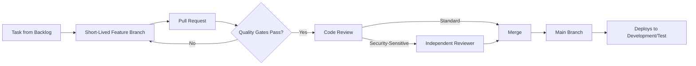

# Version Control & Development Workflow

**Status:** Draft
**Milestone:** 9 — Engineering Foundation & Development Setup
**Date:** 2026-08-07

This document defines how a change moves from an idea to merged code —
branching, commits, pull requests, review, releases, and how change
stays traceable back to this documentation set.

## Branch Strategy

**Recommendation: a protected main branch with short-lived feature
branches**, one per Task (per the
[Development Backlog Framework](../milestone-7-mvp-definition-implementation-planning/06-development-backlog-framework.md)),
merged via reviewed pull requests. No long-lived parallel branches per
environment — Development/Test, Staging, and Production are all
deployed *from* the same main branch history (per
[Development Environment Strategy](./03-development-environment-strategy.md)),
not from divergent branches.

**Rationale:** consistent with
[Deployment & Infrastructure Strategy §Deployment Philosophy](../milestone-8-technology-stack-development-architecture/08-deployment-and-infrastructure-strategy.md)'s
"frequent, small, reversible" releases — short-lived branches keep
changes small and reduce merge risk, which matters more for this
platform's stakes than the flexibility a more complex branching model
would offer.

## Commit Standards

- Every commit references the Task, User Story, or Feature it
  implements (per the
  [Development Backlog Framework](../milestone-7-mvp-definition-implementation-planning/06-development-backlog-framework.md)) —
  commit history should make it possible to answer "why does this line
  exist" without leaving version control.
- Commits are scoped to one logical change — a commit that touches
  unrelated modules is a signal the change should have been split,
  consistent with the module-boundary discipline in
  [Engineering Philosophy](./01-engineering-philosophy.md).

## Pull Request Expectations

Every pull request:

1. Links to the User Story or Task it implements, per the
   [Development Backlog Framework](../milestone-7-mvp-definition-implementation-planning/06-development-backlog-framework.md).
2. States which
   [Business Rules Catalog](../milestone-5-domain-model-data-architecture/08-business-rules-catalog.md)
   entries it implements or affects, if any.
3. Passes every applicable quality gate from
   [Testing Strategy Implementation](./06-testing-strategy-implementation.md)
   before it's eligible for review.
4. Includes any documentation updates required by
   [Engineering Philosophy §Documentation Expectations](./01-engineering-philosophy.md).

## Code Review Process

- **At least one reviewer**, for every change.
- **Independent review required for security-sensitive changes** —
  anything touching RBAC/permission enforcement, the AI Safety & Scope
  Gate, or an approval gate from the
  [Business Rules Catalog](../milestone-5-domain-model-data-architecture/08-business-rules-catalog.md)
  is reviewed by someone other than the author with specific attention
  to those stakes, not just general code quality — a direct consequence
  of the "favor quality and caution" areas named in
  [Engineering Philosophy §Quality Over Speed Balance](./01-engineering-philosophy.md).
- Reviewers check against
  [Coding Standards Framework](./05-coding-standards-framework.md)
  explicitly, not just for general correctness.

## Release Tagging

Releases are tagged against the naming already established in
[Release Roadmap](../milestone-7-mvp-definition-implementation-planning/07-release-roadmap.md) —
MVP Release, Version 1.1, Version 1.2, Version 2.0, and beyond — so a
release tag in version control maps directly to a named milestone
stakeholders already recognize, rather than an arbitrary internal build
number.

## Documentation Updates

Per
[Engineering Philosophy](./01-engineering-philosophy.md) and
[Repository & Code Organization](../milestone-8-technology-stack-development-architecture/06-repository-and-code-organization.md),
documentation lives in the same repository as the code and is updated
in the same pull request as the behavior change it describes — a pull
request that changes a workflow, screen, or business rule without a
corresponding update to the relevant Milestone document is treated as
incomplete, not merge-ready.

## Change Tracking

Every merged change should be traceable, end to end, through the chain
established in
[Master Traceability Framework](../milestone-7-mvp-definition-implementation-planning/08-master-traceability-framework.md):
a commit → a Task → a User Story → a Feature → an Epic → a Phase. This
is what keeps the eventual, real backlog connected to the architecture
documented across Milestones 1–8, rather than drifting into its own,
disconnected history.

## Workflow Diagram

## Current / Planned / Future

| Element | Status |
|---|---|
| Protected main branch, short-lived feature branches | **Planned** |
| PR linkage to User Stories/Tasks and Business Rules | **Planned** |
| Independent review for security-sensitive changes | **Current** — a firm principle |
| Release tagging aligned to [Release Roadmap](../milestone-7-mvp-definition-implementation-planning/07-release-roadmap.md) naming | **Planned** |
| Documentation-in-the-same-PR requirement | **Current** — a firm principle |
| Automated enforcement of these rules (e.g., PR templates, required checks) | **Future** — belongs to actual repository setup |

## ⚠️ Needs Verification

- The exact list of "security-sensitive" change categories requiring
  independent review should be finalized once real modules exist to
  enumerate against, beyond the illustrative list above.
