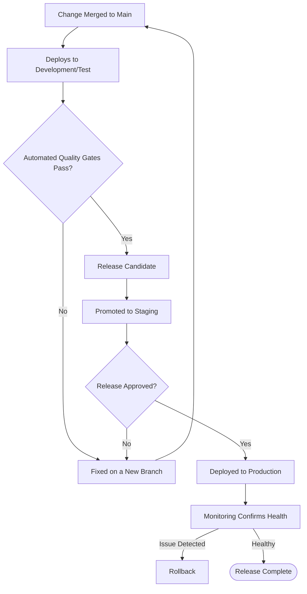

# Deployment Workflow Foundation

**Status:** Draft
**Milestone:** 9 — Engineering Foundation & Development Setup
**Date:** 2026-08-07

This document defines the conceptual path a change takes from merged
code to real Users — the workflow, not the infrastructure or vendor
configuration that eventually implements it (explicitly out of scope,
per this milestone's instructions).

## The Path from Change to Production

## Development

Every change merged to the main branch (per
[Version Control & Development Workflow](./07-version-control-development-workflow.md))
deploys automatically to Development/Test
([Development Environment Strategy](./03-development-environment-strategy.md)),
where the automated quality gates from
[Testing Strategy Implementation](./06-testing-strategy-implementation.md)
run.

## Testing

Passing Development/Test's automated gates makes a build a **release
candidate** — a specific, identified version eligible for promotion, not
every commit automatically becoming a release.

## Approval

- A release candidate is promoted to Staging for final verification.
- Formal approval to release to Production is a deliberate step, not
  automatic — who approves is tied to the release's scope: a routine
  release affecting SHOULD/COULD HAVE features may need only engineering
  sign-off, while a release touching a MUST HAVE workflow, RBAC, or the
  AI module follows the independent-review expectation already
  established in
  [Version Control & Development Workflow §Code Review Process](./07-version-control-development-workflow.md).
- **⚠️ Needs Verification:** the exact approval authority (who,
  specifically, signs off on a Production release) is not defined here
  and should be settled once a real engineering/product organization
  exists to assign it to.

## Production Release

- Deployed only from an approved release candidate that has passed
  Staging verification — never a direct deploy from a feature branch or
  an unreviewed change, consistent with
  [Development Environment Strategy §Production](./03-development-environment-strategy.md).
- Released in small increments, per
  [Deployment & Infrastructure Strategy §Deployment Philosophy](../milestone-8-technology-stack-development-architecture/08-deployment-and-infrastructure-strategy.md) —
  frequent, small releases are easier to verify and easier to roll back
  than large, infrequent ones.

## Rollback Philosophy

- **Every Production release is reversible**, restated as a firm
  requirement from
  [Deployment & Infrastructure Strategy](../milestone-8-technology-stack-development-architecture/08-deployment-and-infrastructure-strategy.md) —
  a release that can't be rolled back is not release-ready, regardless
  of how well it passed earlier gates.
- **Database migrations deploy ahead of, and separately from, dependent
  application code** (per
  [Database Architecture Strategy §Data Migrations](../milestone-8-technology-stack-development-architecture/04-database-architecture-strategy.md)),
  so that rolling back application code never leaves the database in a
  state the previous version can't operate against.
- A rollback is not treated as a failure of process — it is the process
  working as intended when Monitoring detects an issue.

## Monitoring Expectations

- Every Production release is watched against both system health and
  business health signals, per
  [Deployment & Infrastructure Strategy §Monitoring](../milestone-8-technology-stack-development-architecture/08-deployment-and-infrastructure-strategy.md) —
  a release "succeeding" technically but breaking, say, Grade Approval
  events is still treated as a failed release.
- Monitoring continues past the immediate post-release window — per
  [Scalability & Reliability Framework](../milestone-6-technical-architecture/09-scalability-reliability-framework.md),
  observability is an ongoing property of the running system, not a
  one-time release check.

## Current / Planned / Future

| Element | Status |
|---|---|
| Automatic deploy to Development/Test on merge | **Planned** |
| Release-candidate promotion through Staging | **Planned**, pending Staging's existence per [Development Environment Strategy](./03-development-environment-strategy.md) |
| Deliberate, scope-appropriate release approval | **Current** — a firm principle; specific authority **⚠️ Needs Verification** |
| Reversible Production releases, migrations deployed ahead of dependent code | **Current** — a firm principle |
| Post-release monitoring against system and business health | **Planned** |

## ⚠️ Needs Verification

- Specific Production release approval authority (who signs off) — not
  yet assignable without a real organization structure.
- Whether Staging exists as a distinct step (carried forward from
  [Development Environment Strategy](./03-development-environment-strategy.md))
  directly affects how many steps this workflow actually has in
  practice.
