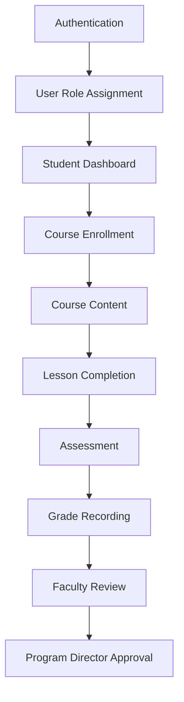

# First Implementation Roadmap

**Status:** Draft
**Milestone:** 9 — Engineering Foundation & Development Setup
**Date:** 2026-08-07

This document defines the **first working product slice** — a single,
narrow, end-to-end path through the platform, smaller even than the MVP
itself. Its job is not to be useful to a real Student yet; its job is to
**prove the architecture actually works**, top to bottom, before any
broader effort is invested in building it out.

## The Vertical Slice

This sequence deliberately mirrors
[Application Foundation Plan](./04-application-foundation-plan.md)'s
Phases 1–6, extended one step further — through a single complete
Faculty/Program-Director-approved grading cycle — rather than stopping
at "the Student can see a Dashboard."

## Step-by-Step

| Step | What It Proves | Traces To |
|---|---|---|
| **Authentication** | A real User can log in and establish a session | [Authentication & Authorization Architecture](../milestone-8-technology-stack-development-architecture/05-authentication-authorization-architecture.md) |
| **User Role Assignment** | The `(Person, Role, Scope)` model actually resolves to real access | [Multi-School and Multi-Program Access Model](../milestone-2-user-roles-permission-architecture/04-multi-school-multi-program-access-model.md) |
| **Student Dashboard** | The authenticated shell renders real, role-scoped data — not a static mockup | [Student Portal](../milestone-4-information-architecture/02-student-portal.md) |
| **Course Enrollment** | The Academic and Student domain models connect correctly — a real Enrollment linking a real Student to a real Program and Cohort | [Student Domain Model](../milestone-5-domain-model-data-architecture/03-student-domain-model.md) |
| **Course Content** | The Learning module delivers real curriculum content against a real Course Offering | [Learning Engine](../milestone-6-technical-architecture/02-application-architecture.md) |
| **Lesson Completion** | Course Progress updates correctly and is visible back on the Dashboard | [Course Progress](../milestone-5-domain-model-data-architecture/03-student-domain-model.md) |
| **Assessment** | The Assessments module accepts and records a real submission | [Faculty Workflows §Assignment Review](../milestone-3-student-journey-core-workflows/02-faculty-workflows.md) |
| **Grade Recording** | The Gradebook module records a Grade tied to that submission | [Business Rules Catalog — Faculty & Staffing Rules](../milestone-5-domain-model-data-architecture/08-business-rules-catalog.md) |
| **Faculty Review** | A second, distinct Role Assignment (Faculty Instructor) interacts with the same data the Student produced — proving cross-role data flow works | [Faculty Portal](../milestone-4-information-architecture/03-faculty-portal.md) |
| **Program Director Approval** | The full approval-gate pattern works end to end: Faculty submits, Program Director approves, the Grade becomes official, and the action is Audit Logged | [Faculty Workflows §Approval Points](../milestone-3-student-journey-core-workflows/02-faculty-workflows.md), [Audit and Accountability Framework](../milestone-2-user-roles-permission-architecture/05-audit-accountability-framework.md) |

## Why This Vertical Slice Validates the Platform

This is not an arbitrary first feature — it is chosen specifically
because it is the **smallest path that exercises every architectural
layer at once**:

- **It proves the Modular Monolith's boundaries actually work**, not
  just on paper. This slice alone touches Identity, Learning,
  Assessments, Gradebook, and Audit — five of the thirteen
  [Service Boundaries](../milestone-6-technical-architecture/03-service-boundaries.md) —
  interacting through the Direct and Event-Driven patterns that document
  defines. If those boundaries don't hold up here, they won't hold up
  anywhere.
- **It proves RBAC works across roles, not just within one.** A
  Student's data becomes visible to a Faculty Instructor, and a Faculty
  Instructor's submitted Grade becomes actionable by a Program Director —
  three different Role Assignments, three different scopes, interacting
  correctly is a much stronger proof than any one role working in
  isolation.
- **It proves the approval-gate pattern**, the single most repeated
  structural idea across
  [Milestone 3](../milestone-3-student-journey-core-workflows/README.md)'s
  workflows (grade approval, certificate approval, externship
  completion verification all share the same shape) — getting this
  pattern right once, here, de-risks every other approval gate the
  platform will need later.
- **It proves the Audit Log captures a real, multi-actor sequence
  correctly** — not just a single action, but a chain of actions across
  three different Users, which is the harder and more realistic case.
- **It is smaller than the MVP, deliberately.** It excludes Payments,
  Certificates, Admissions, and Externships — everything
  [MVP Scope Definition](../milestone-7-mvp-definition-implementation-planning/02-mvp-scope-definition.md)
  also classifies MUST HAVE, but not needed to prove the architecture
  itself works. This slice is the **walking skeleton** underneath the
  MVP, not the MVP itself — once it works, building out the rest of the
  MVP's MUST HAVE scope is a matter of repeating a proven pattern, not
  discovering whether the pattern works at all.

## Relationship to Other Roadmaps

| Document | What It Answers |
|---|---|
| [Milestone 7, Doc 5 — Implementation Phases](../milestone-7-mvp-definition-implementation-planning/05-implementation-phases.md) | What ships, in what business-facing order, through Multi-School Expansion |
| [Milestone 9, Doc 4 — Application Foundation Plan](./04-application-foundation-plan.md) | What gets scaffolded first, engineering-wise |
| **This document** | What single path, built first, proves the whole architecture is sound |

## Current / Planned / Future

| Step | Status |
|---|---|
| Every step in the vertical slice above | **Planned** — the recommended first working software this project produces |
| Broader MUST HAVE scope beyond this slice | **Planned**, sequenced after this slice succeeds |

## ⚠️ Needs Verification

- This slice assumes the launch Program does *not* require an
  externship for its very first proof-of-concept — a reasonable
  assumption since Externships is explicitly excluded here regardless of
  the launch Program's actual requirements (that question matters for
  the MVP, per
  [MVP Scope Definition](../milestone-7-mvp-definition-implementation-planning/02-mvp-scope-definition.md),
  but not for this narrower architectural proof).
- Whether this slice should include a minimal AI Tutor touchpoint to
  also prove the AI module's Safety Gate integration early is a
  reasonable extension not included here — left out to keep the first
  slice as small as possible, per
  [Engineering Philosophy §Avoiding Premature Complexity](./01-engineering-philosophy.md).
